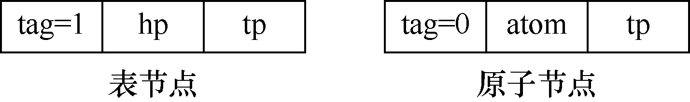
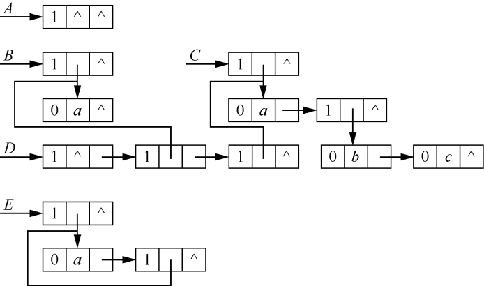

### 6.2　扩展线性链表表示的广义表及其应用

**【节点结构】**

用扩展线性链表表示广义表时，广义表也包含两种节点——表节点和原子节点。这两种节点都包含3个域。其中，表节点由标志域tag、表头指针域hp和表尾指针域tp构成；原子节点由标志域tag、原子的值域atom和表尾指针域tp构成。

标志域tag用来区分当前节点是表节点还是原子节点，当tag=0时为原子节点，tag=1时为表节点；hp和tp分别指向广义表的开头与结尾；atom用来存储原子节点的值。扩展线性链表的节点存储结构如图6.4所示。


<center class="my_markdown"><b class="my_markdown">图6.4　扩展线性链表的节点存储结构</b></center>

例如，A=()，B=(a)，C=(a,(b,c))，D=(A,B,C)，E=(a,E)，则广义表A、B、C、D、E的扩展线性链表存储结构如图6.5所示。


<center class="my_markdown"><b class="my_markdown">图6.5　广义表的扩展线性链表存储结构</b></center>

**【存储结构】**

```c
typedef enum{ATOM,LIST}ElemTag;  /*ATOM=0表示原子，LIST=1表示子表*/
typedef struct
{
    ElemTag tag;                 /*标志域tag用于区分元素是原子还是子表*/
    union
    {
        AtomType atom;           /*AtomType是用户自定义类型，atom是原子节点的值域*/
        struct GLNode *hp;       /*hp指向表头*/
    }ptr;
    struct GLNode *tp;           /*tp指向表尾*/
}*GList,GLNode;
```

