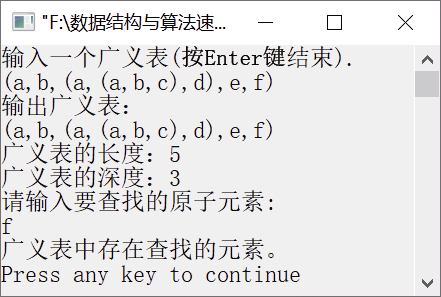

### 创建广义表并求其长度和深度


**问题描述**


实现算法，利用扩展线性链表表示法创建广义表，要求在输入广义表的同时实现创建广义表，设广义表按(a,b,(a,(a,b,c),d),e,f )的形式输入，并求广义表的深度和长度。


**【分析】**

该题是北京工业大学考研试题。广义表中的元素有原子和子表，在读入输入的字符串时，遇到左括号“(”就递归构创建表；若遇到原子，就建立原子节点；若读入逗号“,”，就递归创建后序子表；若n为0，就创建含空格字符的空表，直到遇到输入结束符“\n”为止。


第6章\实例6-02.cpp

```c
/********************************************
*实例说明：创建和输出广义表并求其长度和深度
*********************************************/
#include<stdio.h>
#include<stdlib.h>
#include<iostream.h>
typedef char AtomType;                    //元素类型为字符型
typedef enum{ATOM,LIST}ElemTag;/*ATOM=0表示原子，LIST=1表示子表*/
//广义表的存储结构
struct GNode
{
    ElemTag tag;                          //标志域
    union
    {    
        AtomType atom;                    //值域
        struct GNode *hp;                 //表头指针
    };
    struct GNode *tp;
};
int LengthGList(struct GNode *GL);        //求广义表的长度
int DepthGList(struct GNode *GL);         //求广义表的深度
void CreateGList(struct GNode **GL);      //建立广义表的存储结构
void PrintGList(struct GNode *GL);        //输出广义表
int SearchGList(struct GNode *GL, AtomType e);
void main()
{
    int flag;
    AtomType e;
    struct GNode *GL;
    cout<<"输入一个广义表(按Enter键结束)."<<endl;
    CreateGList(&GL);
    cout<<"输出广义表："<<endl;
    PrintGList(GL);
    cout<<endl;
    cout<<"广义表的长度：";
    cout<<LengthGList(GL->hp)<<endl;
    cout<<"广义表的深度：";
    cout<<DepthGList(GL->hp)<<endl;
    cout<<"请输入要查找的元素:"<<endl;
    cin>>e;
    flag=SearchGList(GL,e);
    if(flag)
        cout<<"广义表中存在查找的元素。"<<endl;
    else
        cout<<"要查找的元素不存在。"<<endl;
}
void CreateGList(struct GNode **GL)
//建立扩展线性链表表示的广义表的存储结构
{
    char ch;
    scanf("%c", &ch);          
    if(ch=='#')                
        *GL = NULL;            
    else if(ch=='(')           
    {
        *GL = (struct GNode*)malloc(sizeof(struct GNode));
        (*GL)->tag = LIST;
        CreateGList(&((*GL)->hp)); 
    }
    else
    {
        *GL = (struct GNode*)malloc(sizeof(struct GNode));
        (*GL)->tag = ATOM;
        (*GL)->atom = ch;
    }
    scanf("%c", &ch);                    //输入的字符可以是逗号、右括号或分号
    if(*GL==NULL)                         
        ;                                 
    else if(ch==',')                      
        CreateGList(&((*GL)->tp));        
    else if((ch==')') || (ch=='\n'))      
        (*GL)->tp = NULL;                 
}
void PrintGList(struct GNode *GL)
//输出广义表
{
    if(GL->tag==LIST)                     
    {
        printf("(");                     
        if(GL->hp==NULL)                
            printf("#");                
        else                            
            PrintGList(GL->hp);         
        printf(")");                    
    }
    else                                 
        printf("%c", GL->atom);          
    if(GL->tp!=NULL)                     
    {
        printf(",");                    
        PrintGList(GL->tp);             
    }
}
int SearchGList(struct GNode *GL, AtomType e)
//查找等于e的原子节点
{
    while(GL!=NULL)
    {
        if(GL->tag == LIST)        
        {
            if(SearchGList(GL->hp, e)) 
                return 1;
        }
        else           
        {
            if(GL->atom == e)
                return 1;    
        }
        GL = GL->tp;          
    }
    return 0;                
}
int LengthGList(struct GNode *GL)
//求广义表的长度
{
    if(GL!=NULL)
        return(1 + LengthGList(GL->tp));
    else
        return(0);
}
int DepthGList(struct GNode *GL)
//求广义表的深度
{
    int dep,max=0;
    while(GL!=NULL)                        //遍历表中每一个节点，求出所有子表的最大深度
    {
        if(GL->tag==LIST)
        {
            dep = DepthGList(GL->hp);      //递归调用求一个子表的深度
            if(dep > max)
                max = dep;                 //max为同一层子表中深度的最大值
        }
        GL = GL->tp;                       //使GL指向同一层的下一个节点
    }
    return max + 1;                        //返回表的深度
}
```

运行结果如图6.6所示。


<center class="my_markdown"><b class="my_markdown">图6.6　运行结果</b></center>

