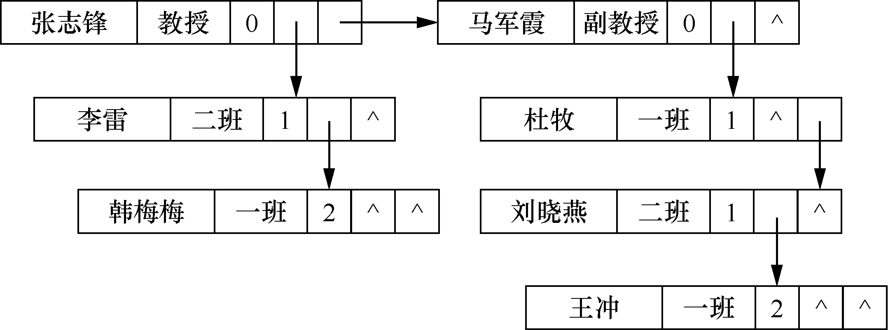
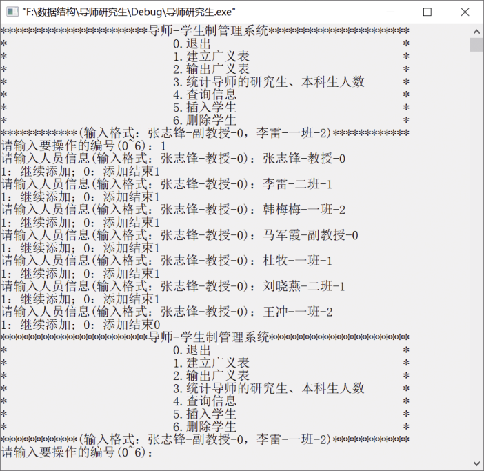
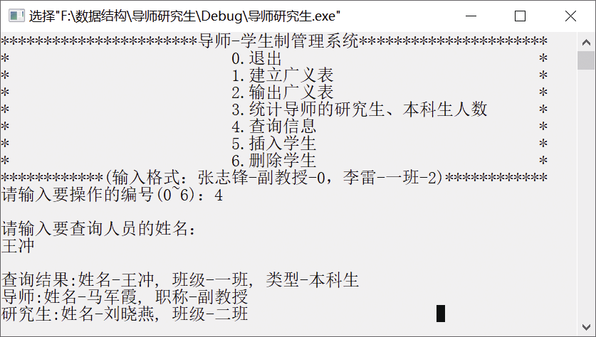
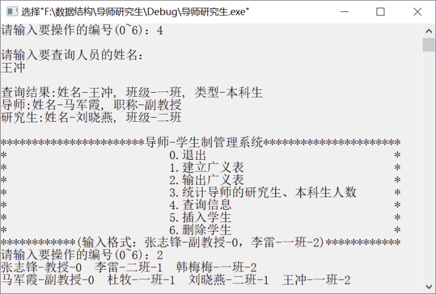

### 6.3　广义表的综合应用——导师-学生制管理

随着高校教学改革的不断深入，本科生和研究生的培养质量日益受到重视。为了提高本科生的培养质量，体现因材施教和个性化培养，很多学校实行了导师-学生制管理。一个班级的学生被分给若干名导师管理，每位导师指导n名学生，若该导师同时还指导研究生，那么其研究生也可直接指导本科生。导师-学生制管理问题中的数据元素具有如下形式。

（1）导师指导研究生和本科生：(导师,((研究生1,(本科生1,…,本科生m<sub class="my_markdown">1</sub>)),(研究生2,(本科生1,…,本科生m<sub>2</sub>))…))。

（2）导师不指导研究生，直接指导本科生：(导师,(本科生1,…,本科生m))。

其中，导师信息包括姓名、职称，研究生和本科生信息包括姓名、班级。要求完成以下功能。

+ 建立：建立导师-研究生-本科生广义表。
+ 插入：将某位本科生或研究生信息插入广义表的相应位置。
+ 删除：将某位本科生或研究生信息从广义表中删除。
+ 查询：查询导师指导研究生、本科生的情况。
+ 统计：某导师带了多少名研究生和本科生。
+ 输出：将某导师所指导的学生信息输出。
+ 退出：程序结束。

要求利用头尾链表存储结构的广义表实现导师-学生制管理的广义表。

定义导师、学生节点结构如下。

```c
typedef struct GLNode
{
    char name[100];         /*导师或学生的姓名*/
    char position[100];     /*导师节点表示职称，学生节点表示班级*/
    int type;               /*节点类型：0代表导师，1代表研究生，2代表本科生*/
struct ptr
{
    struct GLNode *hp;      /*hp指向表头，即指向下级的首节点*/
    struct GLNode *tp;      /*tp指向表尾，即同级的下一节点*/
}ptr;
}GList;
```

广义表中的人员信息由3部分组成，分别是姓名、职称（或班级）和人员类型。例如：张志锋-教授-0、李雷-一班-1、韩梅梅-一班-2。姓名、职称（或班级）、人员类型用“-”分隔开，如张志锋-教授-0，“张志锋”表示姓名，“教授”表示职称，“0”表示人员的类型是导师；李雷-二班-1，“李雷”表示姓名，“二班”表示班级，“1”表示人员的类型是研究生；韩梅梅-一班-2，“韩梅梅”表示姓名，“一班”表示班级，“2”表示人员的类型是本科生。

导师-本科生制管理的广义表((张志锋-教授-0,(李雷-二班-1,韩梅梅-一班-2)),(马军霞-副教授-0,(杜牧-一班-1,刘晓燕-二班-1,(王冲-一班-2)))如图6.7所示。


<center class="my_markdown"><b class="my_markdown">图6.7　导师-本科生制管理的广义表</b></center>

部分代码如下。完整的代码参见本书配套的源代码。

```c
#include<stdio.h>
#include<stdlib.h>
#include<string.h>
#define YES 1
#define NO 0
typedef struct GLNode          //定义存储中缀表达式的节点类型
{
    char name[100];
    char position[100];
    int type;
    struct 
    {
        struct GLNode *hp;    /*hp指向同级的下一个节点*/
        struct GLNode *tp;    /*tp指向下级的首节点*/
    }ptr;  
}GList; 
GList *CreateGList()   
/*建立广义表*/
{
    GList *L,*p,*q,*r,*s;     /*L指向头节点，p指向导师节点，q指向研究生节点，r指向本科生节点*/
    int i,j,flag;
    char ch[100];
    flag=1;
    L=p=q=r=s=NULL;
    while(flag)
    {
        printf("请输入人员信息(输入格式：张志锋-教授-0)：");
        scanf("%s",ch);
        s =(GList *)malloc(sizeof(GList));
        if(!s) 
            printf("内存空间分配失败！");
        /*将字符串中的导师（或学生）信息转换为学生节点*/ 
        for(j=0,i=0;ch[i] != '-';j++,i++)        
            s->name[j] = ch[i];
        s->name[j] = '\0';
        i=i+1;
        for(j=0;ch[i] != '-';j++,i++)
            s->position[j] = ch[i];
        s->position[j] = '\0';
        i=i+1;
        s->type = ch[i] - 48;
        s->ptr.hp=NULL;
        s->ptr.tp=NULL;
        switch(s->type)
        {
            case 0:
                if(L)              /*若s为导师信息的非首节点*/
                    p->ptr.hp=s;       
                else               /*若s为导师信息的首节点*/ 
                    L=s;
                p=s;
                r=q=s;
                break;
            case 1: 
                if(p->ptr.tp)      /*若s为研究生信息的非首节点*/
                    q->ptr.hp=s;  
                else               /*若s为研究生信息的首节点*/ 
                    q->ptr.tp=s;  
                q=s;
                r=s;
                break;
            case 2: 
                if(q->ptr.tp)      /*若s为本科生信息的非首节点*/
                    r->ptr.hp=s;   
                else               /*若s为本科生信息的首节点*/
                    r->ptr.tp=s;  
                r=s;
                break;
            default:
                printf("节点有误");
                break;
            }
            printf("1：继续添加；0：添加结束");
            scanf("%d",&flag);
    }
    return L;
}
void QueryInfo(GList *L) 
/*查询信息*/
{
    GList *p,*q,*r;
    char name[100];
    int find=NO;
    p = L;
    printf("\n请输入要查询人员的姓名：\n");
    scanf("%s",name);
    while(p != NULL&&find==NO)
    {
        q=p->ptr.tp;         /*q指向下一级首节点*/
        if(!strcmp(p->name,name))
        {
            printf("\n查询结果：姓名-%s, 职称-%s, 类型-导师\n",p->name,p->position);
            find=YES;
        }
        else 
        {
            if(q!=NULL && q->type == 2)        // 该导师带本科生
            {
                r = q;
                while(r!= NULL)
                {
                    if(!strcmp(r->name,name))
                    {
                        printf("\n查询结果：姓名-%s, 班级-%s, 类型-本科生\n",r->name,r->position);
                        printf("导师:姓名:%s, 职称:%s\n",p->name,p->position);
                        find=YES;
                    }
                    r=r->ptr.hp;
                }
            }
            else if(q!=NULL)
            {
                while(q!= NULL)
                {
                    r = q->ptr.tp;
                    if(!strcmp(q->name,name))
                    {
                        printf("\n查询结果:姓名-%s, 班级-%s, 类型-研究生\n",q->name,q->position);
                        printf("导师:姓名:%s, 职称:%s\n",p->name,p->position);
                        find=YES;
                    }
                    while(r!= NULL)
                    {
                        if(!strcmp(r->name,name))
                        {
                            printf("\n查询结果:姓名-%s, 班级-%s, 类型-本科生\n",r->name,r->position);
                            printf("导师:姓名-%s, 职称-%s\n",p->name,p->position);
                            printf("研究生:姓名-%s, 班级-%s\n",q->name,q->position);
                            find=YES;
                        }
                        r=r->ptr.hp;
                    }
                    q = q->ptr.hp;
                }
            }
            p=p->ptr.hp;
        }  
    }
    if(!find) 
         printf("查询失败!\n");
    printf("\n");
}
```

运行本书配套的源代码中的完整代码，得到的结果如图6.8（a）～（c）所示。


<center class="my_markdown"><b class="my_markdown">（a）</b></center>


<center class="my_markdown"><b class="my_markdown">（b）</b></center>


<center class="my_markdown"><b class="my_markdown">（c）</b></center>

<center class="my_markdown"><b class="my_markdown">图6.8　运行结果</b></center>


