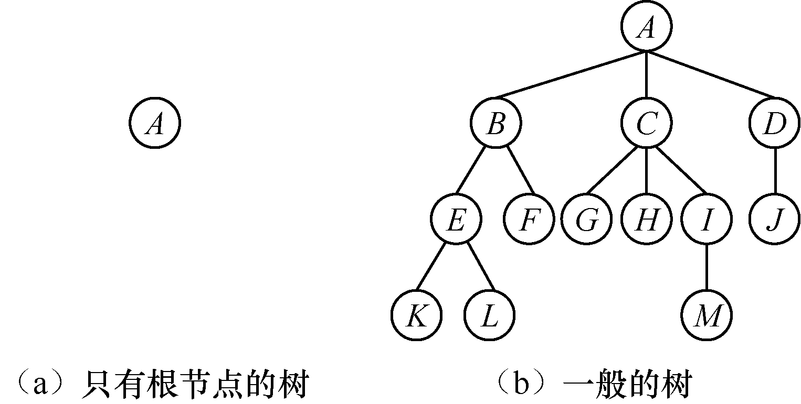
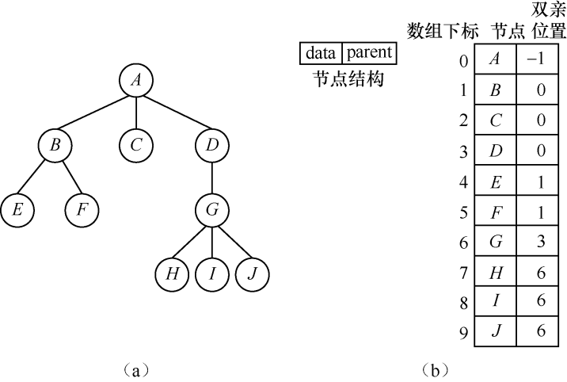
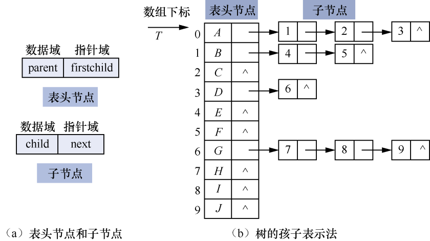
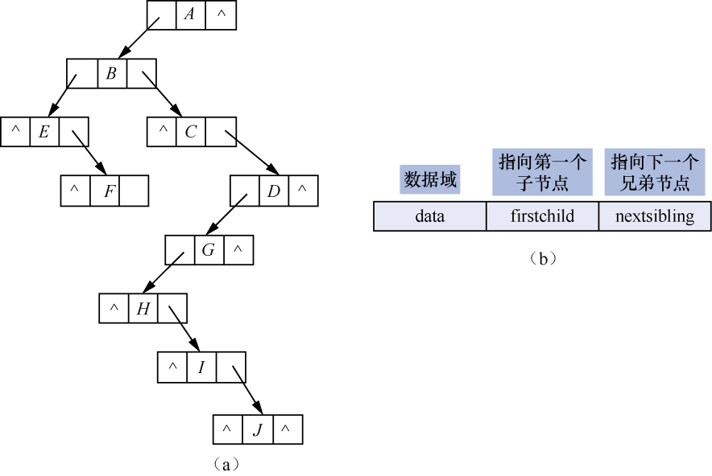
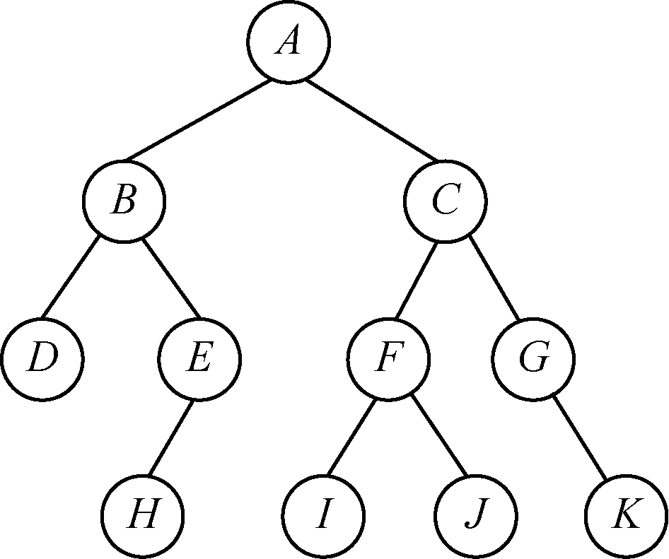
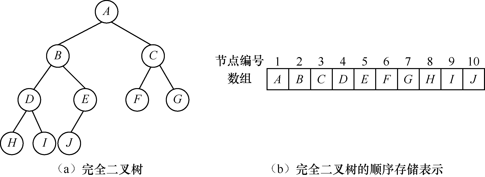
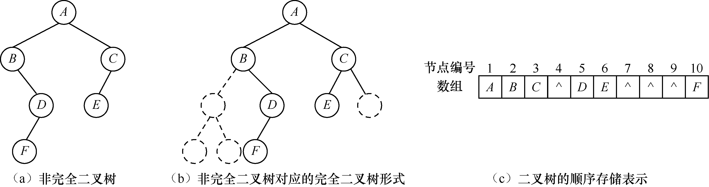
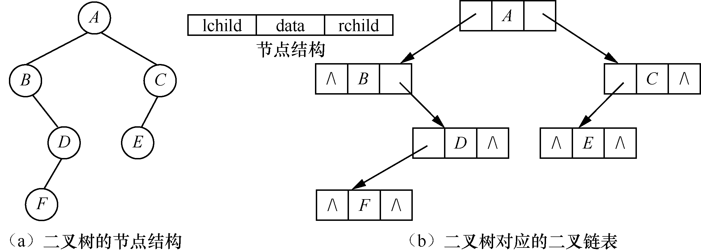

### 7.1　树的表示及创建二叉树

**【定义】**

**树** （tree）是由n（n
0）个节点构成的有限集合T。如果n=0，则称为空树；否则，任何一棵非空树中具有以下特点。

（1）有且只有一个称为根（root）的节点。

（2）当n>1时，其余n−1个节点可以划分为m个有限集合T<sub class="my_markdown">1</sub>,T<sub>2</sub>,…,T<sub class="my_markdown">m</sub>，且这m个有限集合互不相交，其中T<sub class="my_markdown">i</sub>（1
i
m）又是一棵树，称为根的子树（subtree）。

图7.1所示给出了树的逻辑结构。

在图7.1中，（a）是一棵只有根节点的树，（b）是一棵拥有13个节点的树。其中，A是根节点，其余节点分成3个互不相交的子集——T<sub class="my_markdown">1</sub>={B,E,F,K,L}，T<sub>2</sub>={C,G,H,I,M}和T<sub>3</sub>={D,J}。其中，T<sub class="my_markdown">1</sub>、T<sub>2</sub>和T<sub>3</sub>分别是一棵树，它们都是根节点A的子树。T<sub class="my_markdown">1</sub>的根节点是B，其余的4个节点又分为两个互不相交的子集——T<sub>11</sub>={E,K,L}和T<sub>12</sub>={F}。其中，T<sub>11</sub>和T<sub>12</sub>都是T<sub class="my_markdown">1</sub>的子树，E是T<sub>11</sub>的根节点，{K,L}是E的子树。

树的末端节点称为叶子节点。图7.1（b）中的K、L、F、G、H、M和J都是叶子节点。


<center class="my_markdown"><b class="my_markdown">图7.1　树的逻辑结构</b></center>

**【存储结构】**

一般情况下，树的存储结构有3种表示法——双亲表示法、孩子表示法和子节点-兄弟节点表示法。

#### 1．双亲表示法

双亲表示法是利用一组连续的存储单元存储树的每个节点，并利用一个指示器指示节点的双亲节点在树中的相对位置。双亲表示法的节点结构和数组表示如图7.2（a）与（b）所示。


<center class="my_markdown"><b class="my_markdown">图7.2　双亲表示法的节点结构和数组表示</b></center>

其中，data域存放数据元素信息，parent域存放该节点的双亲节点在数组中的下标。树的根节点的双亲位置用−1表示。

使用双亲表示法的树的存储结构定义如下。

```c
#define MaxSize 200
typedef struct PNode        /*双亲表示法的节点定义*/
{
    DataType data;
    int parent;             /*指示节点的双亲节点*/
}PNode;
typedef struct              /*双亲表示法的类型定义*/
{
    PNode node[MaxSize];
    int num;                /*节点的个数*/
}PTree;
```

在采用双亲表示法存储树结构时，根据给定节点查找其双亲节点非常容易。我们可通过反复调用求双亲节点的函数，找到树的根节点。

#### 2．孩子表示法

孩子表示法是将双亲节点的子节点构成一个链表，然后让双亲节点的指针指向这个链表，我们把这样的链表称为孩子链表。若树中有n个节点，就有n个孩子链表。n个节点的数据和头指针构成一个顺序表。要使用孩子表示法，需要设计两个节点结构：一个用于存储双亲节点信息，称为表头节点，其中parent为数据域，firstchild为指针域，指向第一个子节点；一个用于存储子节点信息，其中child为数据域，存储该节点在数组中的下标，next为指针域，指向下一个子节点。表头节点和子节点如图7.3（a）所示。树的孩子表示法如图7.3（b）所示，其中，“^”表示空。


<center class="my_markdown"><b class="my_markdown">图7.3</b></center>

树的孩子表示法的存储结构定义如下。

```c
#define MAXSIZE 200
typedef struct CNode               /*子节点*/
{
    int child;
    struct CNode *next;            /*指向下一个节点*/
}ChildNode;
typedef struct                     /*表头结构*/
{
    DataType data;
    ChildNode *firstchild;         /*孩子链表的指针*/
}DataNode;
typedef struct                     /*孩子表示法类型定义*/
{
    DataNode node[MAXSIZE];
    int num,root;                  /*节点的个数，根节点在顺序表中的位置*/
}CTree;
```

树的孩子表示法使得已知一个节点查找其子节点变得非常容易。通过表头节点指针指向的孩子链表，可找到该节点的每个子节点。但是通过孩子表示法查找双亲节点并不方便，可将双亲表示法与孩子表示法结合起来，即在表头节点的顺序表中增加一个表示双亲节点位置的域，这样无论查找双亲节点还是子节点都非常方便，图7.4所示为将两者结合起来的带双亲的孩子链表。


<center class="my_markdown"><b class="my_markdown">图7.4　带双亲的孩子链表</b></center>

#### 3．子节点 **-** 兄弟节点表示法

子节点-兄弟节点表示法，也称为树的二叉链表表示法。子节点-兄弟节点表示法采用链表作为存储结构，节点包含一个数据域和两个指针域。其中，数据域存放节点的数据信息，一个指针域用来指示节点的第一个子节点，另一个指针域用来指示节点的下一个兄弟节点。

图7.2所示的树的对应的子节点-兄弟节点表示法和节点结构如图7.5（a）与（b）所示。


<center class="my_markdown"><b class="my_markdown">图7.5　树的子节点-兄弟节点表示法和节点结构</b></center>

树的子节点-兄弟节点表示法的存储结构定义如下。

```c
typedef struct CSNode                      /*子节点-兄弟节点表示法的类型*/
{
    DataType data;
    struct CSNode *firstchild,*nextsibling; /*指向第一个子节点和下一个兄弟节点*/
}CSNode,*CSTree;
```

其中，指针firstchild指向节点的第一个子节点，nextsibling指向节点的下一个兄弟节点。

子节点-兄弟节点表示法是树常用的存储结构，利用树的子节点-兄弟节点表示法可以实现树的各种操作。例如，要查找上图树中G的第3个子节点，只需要从G的firstchild域出发找到第一个子节点，然后顺着节点的nextsibling域走两步。

**二叉树** （binary tree）是由n（n≥0）个节点构成的另一种树形结构。其中，每个节点最多只有两棵子树（即二叉树中不存在度大于2的节点），并且二叉树的子树有左右之分（称为左子节点和右子节点），次序不能颠倒。若n=0，则称该二叉树为空二叉树。其中，度指的是节点的度，即一个节点拥有的子树的个数。例如，图7.6中节点C有两棵子树，度为2。此外，树的度指的是树中所有节点的度的最大值。

在二叉树中，任何一个节点的度只可能是0、1和2。

在图7.6所示的二叉树中，D是B的左子节点，E是B的右子节点，H是E的左子节点，D没有左子节点也没有右子节点。


<center class="my_markdown"><b class="my_markdown">图7.6　一棵二叉树</b></center>

二叉树的存储结构有两种——顺序存储结构和链式存储结构。其中，链式存储结构最常用。

在图7.7（a）所示的完全二叉树（见7.3.3节）中，每个节点的编号很容易计算。因此，一棵完全二叉树的节点可以按照从上到下、从左到右的顺序依次存储在一维数组中。完全二叉树的顺序存储表示如图7.7（b）所示。


<center class="my_markdown"><b class="my_markdown">图7.7　完全二叉树</b></center>

对于非完全二叉树（见图7.8（a）和（b）），若将节点也按照以上方法存放在一维数组中，就有许多存储空间不能被充分使用（为了表示节点之间的逻辑关系，一维数组需要将非完全二叉树中不存在的节点位置空出来）。如图7.8（c）所示，其中“^”表示对应位置的节点不存在。


<center class="my_markdown"><b class="my_markdown">图7.8　非完全二叉树</b></center>

这种存储方式极大地浪费了存储空间。在只有右子节点，而没有左子节点的情况下，一维数组实际只存储了k个有效节点，却需要占用2<sup class="my_markdown">k</sup>−1个存储单元。

链式存储结构中，二叉树的节点由一个数据元素及左、右两个指针构成。为了表示二叉树，每个节点应至少包含3个域——data域、lchild域和rchild域。其中，data域为数据域，用于存放节点信息；lchild域指向左子节点；rchild域指向右子节点。利用这种节点结构得到的二叉树称为二叉链表。

二叉树的节点结构和二叉链表如图7.9（a）和（b）所示。


<center class="my_markdown"><b class="my_markdown">图7.9　二叉树的节点结构和二叉链表</b></center>

这里使用的存储结构如下。

```c
typedef struct Node               /*二叉链表存储结构类型定义*/
{
    DataType data;                /*数据域*/
    struct Node *lchild;          /*指向左子节点*/
    struct Node *rchild;          /*指向右子节点*/
}*BiTree,BitNode;
```

以下运算的具体实现保存在文件LinkBiTree.h中。

（1）二叉树的初始化。

```c
void InitBitTree(BiTree *T)
/*二叉树的初始化*/
{
    *T=NULL;
}
```

（2）销毁二叉树。

```c
void DestroyBitTree(BiTree *T)
/*销毁二叉树*/
{
    if(*T)                            /*如果二叉树是非空二叉树*/
    {
       if((*T)->lchild)
          DestroyBitTree(&((*T)->lchild));
       if((*T)->rchild)
          DestroyBitTree(&((*T)->rchild));
       free(*T);
       *T=NULL;
    }
}
```

（3）二叉树的插入操作。

**【分析】**

如果指针p指向的是非空二叉树，则判断LR的值。如果LR为0，则将子树c插入T中，使c成为节点*p的左子树，节点*p原来的左子树成为c的右子树；如果LR为1，则将子树c插入T中，使c成为节点*p的右子树，节点*p原来的右子树成为c的右子树。这里的c与T不相交且右子树为空。

```c
int InsertChild(BiTree p,int LR,BiTree c)
/*二叉树的插入操作*/
{
    if(p)                           /*如果p指向的非空二叉树*/
    {
        if(LR==0)
        {
            c->rchild=p->lchild;    /**p原来的左子树成为c的右子树*/
            p->lchild=c;            /*子树c成为*p的左子树*/
        }
        else
        {
            c->rchild=p->rchild;    /**p原来的右子树成为c的右子树*/
            p->rchild=c;            /*子树c成为*p的右子树*/
        }
        return 1;
    }
    return 0;
}
```

（4）返回二叉树的左子节点的元素值。

```c
DataType LeftChild(BiTree T,DataType e)
/*返回二叉树的左子节点的元素值*/
{
    BiTree p;
    if(T)                             /*如果二叉树非空*/
    {
       p=Point(T,e);                  /*p是元素值为e的节点的指针*/
       if(p&&p->lchild)               /*如果p不为空且*p的左子节点存在*/
          return p->lchild->data;     /*返回*p的左子节点的元素值*/
}
    return;
}
```

（5）返回二叉树的右子节点的元素值。

```c
DataType RightChild(BiTree T,DataType e)
/*返回二叉树的右子节点的元素值*/
{
    BiTree p;
    if(T)                             /*如果二叉树非空*/
    {
       p=Point(T,e);                  /*p是元素值为e的节点的指针*/
       if(p&&p->rchild)               /*如果p不为空且*p的右子节点存在*/
           return p->rchild->data;    /*返回*p的右子节点的元素值*/
    }
    return;
}
```

（6）返回二叉树中给定节点的指针。在二叉树中查找元素值为e的节点。如果找到该节点，则将该节点的指针返回；否则，返回NULL。

**【分析】**

定义一个队列Q，用来存放二叉树中节点的指针。从根节点出发，判断节点的值是否等于e。如果相等，则返回该节点的指针；否则，将指向该节点的左子节点的指针和指向右子节点的指针入队。然后将队头的指针出队，判断该指针指向的节点的元素值是否等于e。若相等，则返回该节点的指针；否则，继续将指向左子节点的指针和指向右子节点的指针入队。重复执行此操作，直到队列已空。

```c
BiTree Point(BiTree T,DataType e)
/*查找元素值为e的节点的指针*/
{
    BiTree Q[MaxSize];                /*定义一个队列，用于存放二叉树中节点的指针*/
    int front=0,rear=0;               /*初始化队列*/
    BitNode *p;
    if(T)                             /*如果二叉树非空*/
    {
        Q[rear]=T;
        rear++;
        while(front!=rear)            /*如果队列非空*/
        {
            p=Q[front];               /*取出队头指针*/
            front++;                  /*将队头指针出队*/
            if(p->data==e)
                return p;
            if(p->lchild)             /*如果左子节点存在，将左子节点的指针入队*/
            {
                Q[rear]=p->lchild;    /*左子节点的指针入队*/
                rear++;
            }
            if(p->rchild)             /*如果右子节点存在，将右子节点的指针入队*/
            {
                Q[rear]=p->rchild;    /*右子节点的指针入队*/
                rear++;
            }
        }
    }
    return NULL;
}
```

（7）删除子树操作。先判断p指向的子树是否已空，如果非空，则判断LR的值。如果LR为0，则删除p指向节点的左子树；如果LR为1，则删除p指向节点的右子树。如果删除成功，返回1；否则，返回0。

```c
int DeleteChild(BiTree p,int LR)
/*二叉树的删除操作*/
{
    if(p)                                   /*如果p不空*/
    {
       if(LR==0)
           DestroyBitTree(&(p->lchild));    /*删除左子树*/
        else
           DestroyBitTree(&(p->rchild));    /*删除右子树*/
        return 1;
    }
    return 0;
}
```

