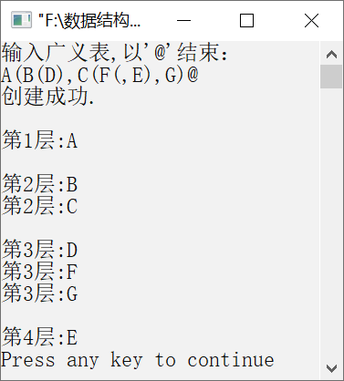

### 7.1.1　采用广义表创建二叉树


**问题描述**


已知某二叉树采用广义表作为输入，请实现一个非递归算法，创建该二叉树的二叉链表存储结构。关于采用广义表创建二叉树的约定如下。

（1）广义表中的一个字母表示一个节点的数据信息。

（2）每个根节点作为由子树构成的广义表的名字放在广义表的前面。

（3）每个节点的左子树与右子树之间用逗号分开。若只有右子树而无左子树，则逗号不能省略。

（4）整个广义表的末尾由一个特殊符号“@”作为结束标志。


**【分析】**

该题是清华大学和北京航空航天大学的考研试题。首先来了解一下二叉树的广义表代表的含义。例如，“A(B(D),C(F(,E),G))@”表示一棵二叉树，该二叉树的根节点为A，其左子节点为B，右子节点为C，而D是B的左子节点，F和G分别是C的左、右子节点，E是F的右子节点。这棵二叉树对应的图形化表示如图7.10所示。


<center class="my_markdown"><b class="my_markdown">图7.10　二叉树对应的图形化表示</b></center>

本题类似于算术表达式求值和先序遍历的非递归过程。主要问题是建立某节点的左子树后，如何建立该节点的右子树。为此，设置一个栈，用来存放根节点的指针，便于创建二叉树。这里采用栈，是因为顺序读取广义表所表示的二叉树节点具有后进先出的特性。

在算法中，依次读取广义表中的元素，根据不同情况按以下方式处理。

（1）若遇到左括号，可能接下来读取的元素是左子节点，需要将双亲节点入栈，同时将标志k置为1。

（2）若遇到逗号，下一个读取的元素一定是右子节点，将标志k置为2。

（3）若遇到右括号，表明当前层读取结束，需要退回到上一层，上一层的元素将成为新的双亲节点。

（4）若遇到字符，创建一个新节点，并将当前字符存入数据域，然后将该节点插入对应的子树中。根据k的值进行以下处理：若k为1，则使该节点成为栈顶元素节点的左子节点；若k为2，则使该节点成为栈顶元素节点的右子节点。


第7章\实例7-01.cpp

```c
/********************************************
*实例说明：采用广义表创建二叉树
*********************************************/
#include<iostream.h>
#include<malloc.h>
#include<stdio.h>
typedef char DataType;
#define  MAXSIZE 200
typedef struct BiTnode
{
    DataType data;
    struct  BiTnode *lchild,*rchild;
}*BiTree,BitNode;
int CreateBiTree(BiTree *T, DataType *str);
void DispBTNode(BiTree T);
int CreateBiTree(BiTree *T, DataType *str)
{
    BiTree S[MAXSIZE],  p=NULL;         
    int top=0,k=0,j=0;                  
    char ch;          
    *T=NULL;                            
    ch=str[j];
    while(ch!='@')                
    {     
        switch(ch)
        {
            case '(':                   
                S[top++]=p;
                k=1;
                break;
            case ')':                   
                top--;
                break;
            case ',':                   
                k=2;
                break;
            default:
                p=(BiTree)malloc(sizeof(BitNode));
                p->data=ch;
                p->lchild=p->rchild=NULL;
                if (*T==NULL)          //根节点
                    *T=p;              //创建根节点
                else                   //已建立二叉树根节点
                {
                    switch(k)          //根据k值建立与栈顶节点的关系
                    {
                    case 1:
                        S[top-1]->lchild=p;
                        break;
                    case 2:
                        S[top-1]->rchild=p;
                        break;
                    }
                }
            break;
          }
          ch=str[++j];                  //读下一个字符
    }
    return 1;
}
void main()
{
    int n,len=0;
    char ch,str[MAXSIZE];
    BiTree T;
    cout<<"输入广义表,以'@'结束："<<endl;
    while((ch=getchar())!='\n')
    {
        str[len++]=ch;
    }
    n=CreateBiTree(&T,str);
    if(n==1)
        cout<<"创建成功."<<endl;
    else
        cout<<"创建失败."<<endl;
    DispBTNode(T);
}
void DispBTNode(BiTree T)
{
    BitNode *qu[MAXSIZE];
    BitNode *p;
    int front,rear,n;
    n = 0;    //初始化层号
    front=rear=0;
    qu[rear++]=NULL;
    p = T;
    if(p!= NULL)
    {
        qu[rear ++] = p;
    }
    do
    {
        p = qu[front ++];
        if (p == NULL)
        {
            qu[rear++] = NULL;  //队列中进入空指针作为分层标志
            n++;                //层号加1
            printf("\n");
        }
        else
        {
            cout<<"第"<<n<<"层:"<<p->data<<endl;
            if (p->lchild != NULL)
            {
                qu[rear++] = p->lchild;
            }
            if (p->rchild != NULL)
            {
                qu[rear++] = p->rchild;
            }
        }
    } while (front!=rear-1);
}
```

运行结果如图7.11所示。


<center class="my_markdown"><b class="my_markdown">图7.11　运行结果</b></center>

