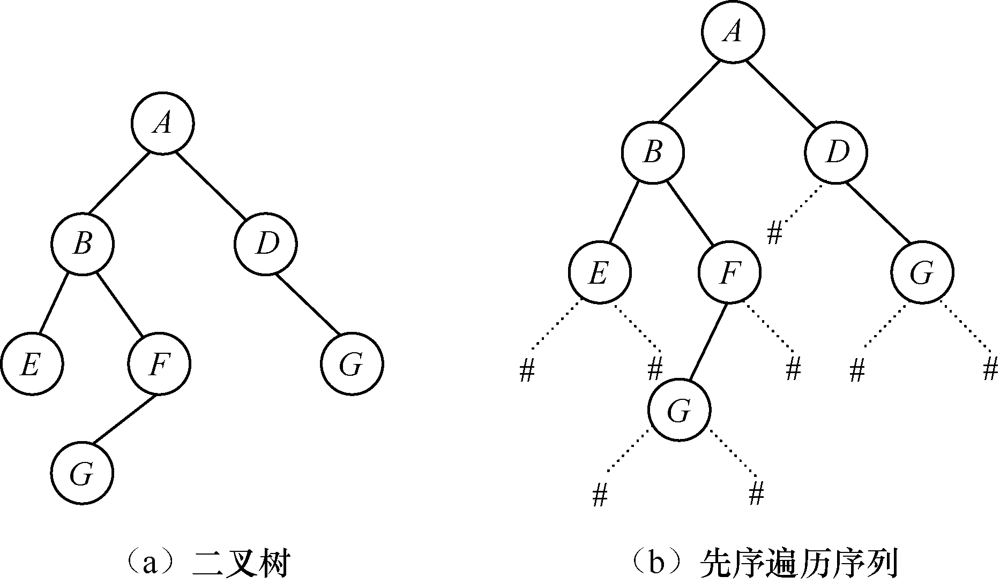
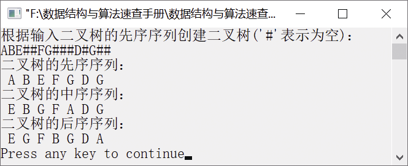

### 7.1.2　创建二叉树


**问题描述**


编写创建二叉树的算法，要求二叉树按照二叉链表方式存储。


**【分析】**

该题是西北大学考研试题。可以按照先序遍历的顺序创建二叉树，即先输入根节点，然后输入左子树，最后输入右子树。输入时，如果有左子（或右子）节点，则输入节点元素；如果没有，则输入“#”。例如，对于图7.12（a）所示的二叉树，它的输入节点序列就是图7.12（b）所示二叉树的先序遍历序列，即ABE##FG###D#G##。


<center class="my_markdown"><b class="my_markdown">图7.12　二叉树及先序遍历序列输入</b></center>


第7章\实例7-02.cpp

```c
/********************************************
*实例说明：创建二叉树
*********************************************/
#include<stdio.h>
#include<malloc.h>
#include<stdlib.h>
#include<iostream.h>
typedef char DataType;
typedef struct Node                    /*二叉链表存储结构类型定义*/
{
    DataType data;                     /*数据域*/
    struct Node *lchild;               /*指向左子节点*/
    struct Node *rchild;               /*指向右子节点*/
}*BiTree,BitNode;
void CreateBitTree(BiTree *T);
void PreOrderTraverse(BiTree T);       /*二叉树的先序遍历递归函数声明*/
void InOrderTraverse(BiTree T);        /*二叉树的中序遍历递归函数声明*/
void PostOrderTraverse(BiTree T);      /*二叉树的后序遍历递归函数声明*/
void InitBitTree(BiTree *T);
void DestroyBitTree(BiTree *T);
void main()
{
    BiTree T;
    InitBitTree(&T);
    cout<<"根据输入二叉树的先序序列创建二叉树('#'表示为空)："<<endl;
    CreateBitTree(&T);
    cout<<"二叉树的先序序列："<<endl;
    PreOrderTraverse(T);
    printf("\n");
    cout<<"二叉树的中序序列："<<endl;
    InOrderTraverse(T);
    printf("\n");
    cout<<"二叉树的后序序列："<<endl;
    PostOrderTraverse(T);
    cout<<endl;
    DestroyBitTree(&T);
}
void CreateBitTree(BiTree *T)
/*创建二叉树的递归实现*/
{
    DataType ch;
    scanf("%c",&ch);
    if(ch=='#')
        *T=NULL;
    else
    {
        *T=(BiTree)malloc(sizeof(BitNode));   /*生成根节点*/
        if(!(*T))
            exit(-1);
        (*T)->data=ch;
        CreateBitTree(&((*T)->lchild));       /*构造左子树*/
        CreateBitTree(&((*T)->rchild));       /*构造右子树*/
    }
}
void DestroyBitTree(BiTree *T)
/*销毁二叉树*/
{
    if(*T)                                    /*如果二叉树是非空二叉树*/
    {
        if((*T)->lchild)
            DestroyBitTree(&((*T)->lchild));
        if((*T)->rchild)
            DestroyBitTree(&((*T)->rchild));
        free(*T);
        *T=NULL;
    }
}
void InitBitTree(BiTree *T)
/*二叉树的初始化操作*/
{
    *T=NULL;
}
void PreOrderTraverse(BiTree T)
/*先序遍历二叉树的递归实现*/
{
    if(T)                                    /*如果二叉树非空*/
    {
        printf("%2c",T->data);               /*访问根节点*/
        PreOrderTraverse(T->lchild);         /*先序遍历左子树*/
        PreOrderTraverse(T->rchild);         /*先序遍历右子树*/
    }
}
void InOrderTraverse(BiTree T)
/*中序遍历二叉树的递归实现*/
{
    if(T)                                    /*如果二叉树非空*/
    {
        InOrderTraverse(T->lchild);          /*中序遍历左子树*/
        printf("%2c",T->data);               /*访问根节点*/
        InOrderTraverse(T->rchild);          /*中序遍历右子树*/
    }
}
void PostOrderTraverse(BiTree T)
/*后序遍历二叉树的递归实现*/
{
    if(T)                                    /*如果二叉树非空*/
    {
        PostOrderTraverse(T->lchild);        /*后序遍历左子树*/
        PostOrderTraverse(T->rchild);        /*后序遍历右子树*/
        printf("%2c",T->data);               /*访问根节点*/
    }
}
```

运行结果如图7.13所示。


<center class="my_markdown"><b class="my_markdown">图7.13　运行结果</b></center>

