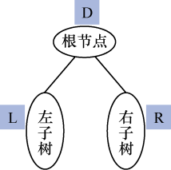
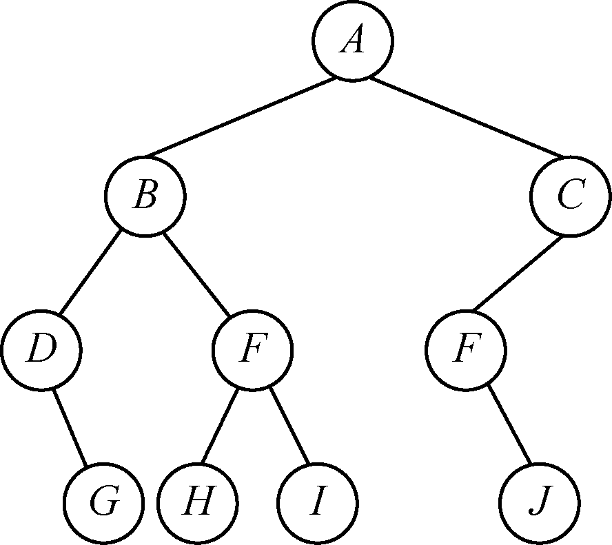
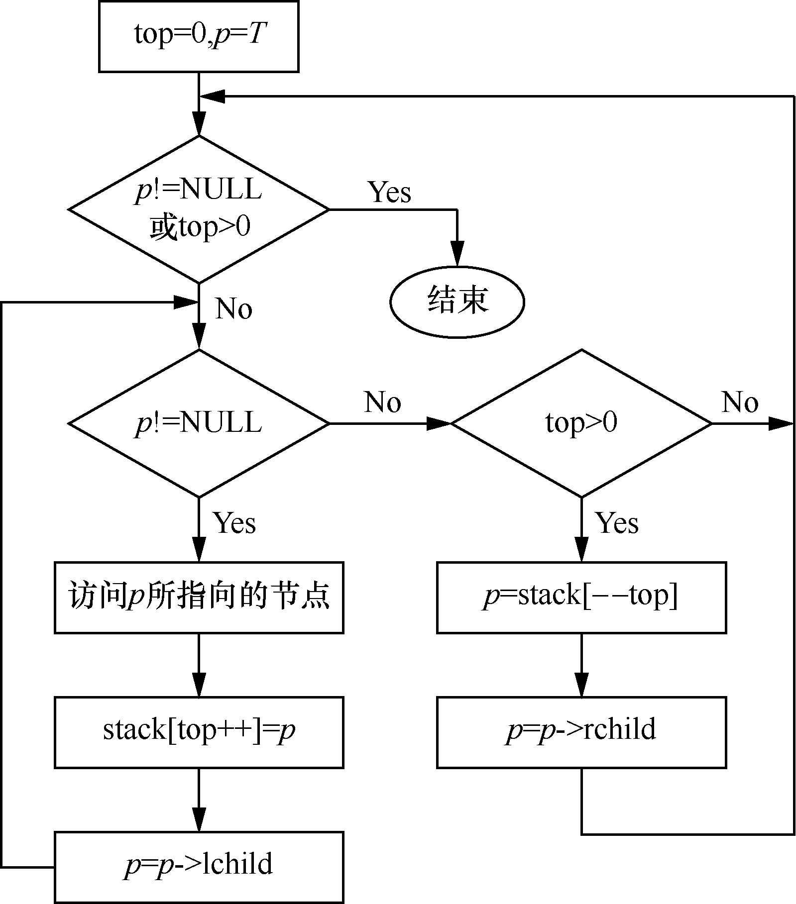
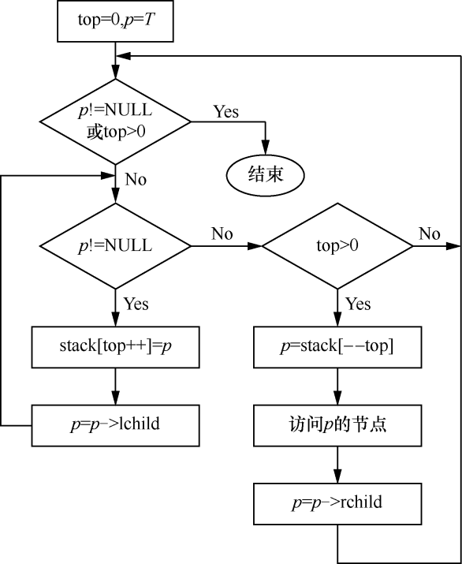
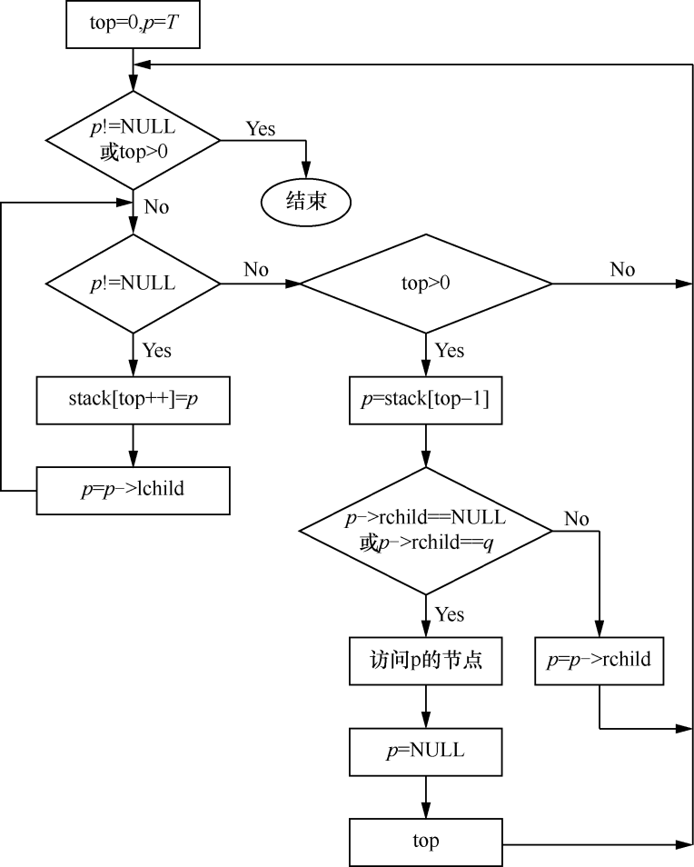

### 7.2　二叉树的遍历

**【定义】**

**遍历二叉树** （traversing binary tree），即按照某种规律对二叉树的每个节点进行访问，使得每个节点仅被访问一次。这里的访问，是指统计节点的数据信息、输出节点信息等。

二叉树的遍历不同于线性表的遍历。对于二叉树来说，每个节点有两棵子树，这就需要寻找一个方法，使得二叉树的节点能按照某种规律排列在一个线性队列上，从而便于遍历。因此，二叉树的遍历过程其实也是将二叉树的非线性序列转换成一个线性序列的过程。

根据二叉树的定义，二叉树是由根节点、左子树和右子树构成的。二叉树的基本结构如图7.14所示。如果能依次遍历这3个部分，那就是遍历了整棵二叉树。如果用D、L、R分别代表遍历根节点、遍历左子树和遍历右子树，就有6种遍历方式——DLR、DRL、LDR、LRD、RDL和RLD。


<center class="my_markdown"><b class="my_markdown">图7.14　二叉树的基本结构</b></center>

如果限定先左后右的次序，那么只剩下3种遍历方式——DLR、LDR和LRD。其中，DLR称为先序（根）遍历，LDR称为中序（根）遍历，LRD称为后序（根）遍历。

**【先序遍历】**

二叉树的先序遍历的递归定义如下。

如果二叉树为空，则执行空操作。如果二叉树非空，则执行以下操作。

（1）访问根节点。

（2）先序遍历左子树。

（3）先序遍历右子树。

根据二叉树的先序遍历的递归定义，图7.15所示的二叉树的先序序列为A、B、D、G、E、H、I、C、F、J。


<center class="my_markdown"><b class="my_markdown">图7.15　二叉树</b></center>

在二叉树的先序遍历过程中，对二叉树的每一棵子树重复执行以上的递归遍历操作，就可以得到先序序列。例如，在遍历根节点A的左子树{B,D,E,G,H,I}时，根据先序遍历的递归定义，先访问根节点B，然后遍历B的左子树{D,G}，最后遍历B的右子树{E,H,I}。具体过程为：访问过B之后，开始遍历B的左子树{D,G}，在左子树{D,G}中，先访问根节点D，因为D没有左子树，所以遍历其右子树，右子树只有一个节点G，所以访问G；B的左子树遍历完毕，按照以上方法遍历B的右子树。最后得到根节点A的左子树的先序序列——B、D、G、E、H、I。

依据二叉树的先序遍历递归定义，可得到二叉树的先序遍历递归算法。

```c
void PreOrderTraverse(BiTree T)
/*先序遍历二叉树的递归实现*/
{
    if(T)                                   /*如果二叉树非空*/
    {
        printf("%2c",T->data);              /*访问根节点*/
        PreOrderTraverse(T->lchild);        /*先序遍历左子树*/
        PreOrderTraverse(T->rchild);        /*先序遍历右子树*/
    }
}
```

下面介绍二叉树的先序遍历非递归算法实现，并利用栈来实现二叉树先序遍历的非递归算法。

从二叉树的根节点开始，访问根节点，然后将根节点的指针入栈，重复执行以下两个操作。

（1）如果该节点的左子节点存在，则访问左子节点，并将左子节点的指针入栈，重复执行此操作，直到节点的左子节点不存在。

（2）将栈顶的元素（指针）出栈，如果该指针指向的右子节点存在，则将当前指针指向右子节点。

重复执行以上两个操作，直到栈空为止。以上算法的执行流程如图7.16所示。


<center class="my_markdown"><b class="my_markdown">图7.16　二叉树的先序遍历非递归算法流程</b></center>

二叉树的先序遍历非递归算法实现如下。

```c
void PreOrderTraverse(BiTree T)
/*先序遍历二叉树的非递归算法实现*/
{
    BiTree stack[MaxSize];                /*定义一个栈，用于存放节点的指针*/
    int top;                              /*定义栈顶指针*/
    BitNode *p;                           /*定义一个节点的指针*/
    top=0;                                /*初始化栈*/
    p=T;
    while(p!=NULL||top>0)
    {
        while(p!=NULL)                    /*如果p非空，则访问根节点，遍历左子树*/
        {
            printf("%2c",p->data);        /*访问根节点*/
            stack[top++]=p;               /*将p入栈*/
            p=p->lchild;                  /*遍历左子树*/
        }
        if(top>0)                         /*如果栈非空*/
        {
            p=stack[--top];               /*栈顶元素出栈*/
            p=p->rchild;                  /*遍历右子树*/
        }
    }
}
```

以上算法直接利用数组来模拟栈。当然，也可以直接定义一个栈。如果用链栈来实现该算法，则需要将数据类型改为指向二叉树节点的指针类型。

**【中序遍历】**

二叉树的中序遍历的递归定义如下。

如果二叉树为空，则执行空操作；如果二叉树非空，则执行以下操作。

（1）中序遍历左子树。

（2）访问根节点。

（3）中序遍历右子树。

根据二叉树的中序遍历的递归定义，图7.15的二叉树的中序序列为D、G、B、H、E、I、A、F、J、C。

在二叉树的中序遍历过程中，对每一棵二叉树的子树重复执行以上的递归遍历操作，就可以得到二叉树的中序序列。

例如，如果要中序遍历根节点A的左子树{B,D,E,G,H,I}，则根据中序遍历的递归定义，需要先中序遍历B的左子树{D,G}，然后访问根节点B，最后中序遍历B的右子树{E,H,I}。在左子树{D,G}中，D是根节点，没有左子树，因此先访问根节点D，接着遍历D的右子树。因为右子树只有一个节点G，所以直接访问G。

在左子树遍历完毕之后，再访问根节点B，最后要遍历B的右子树{E,H,I}。E是右子树{E,H,I}的根节点，需要先遍历左子树{H},因为左子树只有一个H，所以直接访问H。然后，访问根节点E。最后，遍历右子树{I}。右子树也只有一个节点，所以直接访问I，B的右子树访问完毕。因此，A的左子树的中序序列为D、G、B、H、E、I。

从中序遍历的序列可以看出，A左边的序列是A的左子树序列，右边是A的右子树序列。同样，B的左边是其左子树序列，右边是其右子树序列。根节点把二叉树的中序序列分为左右两棵子树序列，左边为左子树序列，右边为右子树序列。

依据二叉树的中序遍历递归定义，可得到二叉树的中序遍历递归算法。

```c
void InOrderTraverse(BiTree T)
/*中序遍历二叉树的递归实现*/
{
    if(T)                                 /*如果二叉树非空*/
    {
        InOrderTraverse(T->lchild);       /*中序遍历左子树*/
        printf("%2c",T->data);            /*访问根节点*/
        InOrderTraverse(T->rchild);       /*中序遍历右子树*/
    }
}
```

下面来介绍二叉树中序遍历的非递归算法实现。

从二叉树的根节点开始，将根节点的指针入栈，执行以下两个操作。

（1）如果该节点的左子节点存在，则将左子节点的指针入栈，重复执行此操作，直到节点的左子节点不存在。

（2）将栈顶的元素（指针）出栈，并访问该指针指向的节点，如果该指针指向的右子节点存在，则将当前指针指向右子节点。

重复执行以上两个步骤，直到栈已空。以上算法的流程如图7.17所示。


<center class="my_markdown"><b class="my_markdown">图7.17　二叉树的中序遍历非递归算法的流程</b></center>

二叉树的中序遍历非递归算法实现如下。

```c
void InOrderTraverse(BiTree T)
/*中序遍历二叉树的非递归算法实现*/
{
    BiTree stack[MaxSize];                /*定义一个栈，用于存放节点的指针*/
    int top;                              /*定义栈顶指针*/
    BiNode *p;                            /*定义一个节点的指针*/
    top=0;                                /*初始化栈*/
    p=T;
    while(p!=NULL||top>0)
    {
        while(p!=NULL)                    /*如果p非空，则访问根节点，遍历左子树*/
        {
            stack[top++]=p;               /*将p入栈*/
            p=p->lchild;                  /*遍历左子树*/
        }
        if(top>0)                         /*如果栈非空*/
        {
            p=stack[--top];               /*栈顶元素出栈*/
            printf("%2c",p->data);        /*访问根节点*/
            p=p->rchild;                  /*遍历右子树*/
        }
    }
}
```

**【后序遍历】**

二叉树的后序遍历的递归定义如下。

如果二叉树为空，则执行空操作。如果二叉树非空，则执行以下操作。

（1）后序遍历左子树。

（2）后序遍历右子树。

（3）访问根节点。

根据二叉树的后序遍历递归定义，图7.15所示的二叉树的后序序列为G、D、H、I、E、B、J、F、C、A。

在二叉树的后序遍历过程中，对每一棵二叉树的子树重复执行以上的递归遍历操作，就可以得到二叉树的后序序列。

例如，如果要后序遍历根节点A的左子树{B,D,E,G,H,I}，根据后序遍历的递归定义，需要先后序遍历B的左子树{D,G}，然后后序遍历B的右子树为{E,H,I}，最后访问根节点B。在左子树{D,G}中，D是根节点，没有左子树，因此遍历D的右子树；因为右子树只有一个节点G，所以直接访问G，接着访问根节点D。

在左子树遍历完毕之后，需要遍历B的右子树{E,H,I}。E是右子树{E,H,I}的根节点，需要先遍历左子树{H},因为左子树只有一个节点H，所以直接访问H。然后，遍历右子树{I}，右子树也只有一个节点I，所以直接访问I。接着，访问子树{E,H,I}的根节点E。此时，B的左、右子树均访问完毕。最后，访问节点B。因此，A的左子树的后序序列为G、D、H、I、E、B。

依据二叉树的后序遍历递归定义，可得到二叉树的后序遍历递归算法。

```c
void PostOrderTraverse(BiTree T)
/*后序遍历二叉树的递归实现*/
{
    if(T)                                    /*如果二叉树非空*/
    {
        PostOrderTraverse(T->lchild);        /*后序遍历左子树*/
        PostOrderTraverse(T->rchild);        /*后序遍历右子树*/
        printf("%2c",T->data);               /*访问根节点*/
    }
}
```

下面来介绍二叉树后序遍历的非递归算法实现。

从二叉树的根节点开始，将根节点的指针入栈，执行以下两个操作。

（1）如果该节点的左子节点存在，则将左子节点的指针入栈，重复执行此操作，直到节点的左子节点不存在。

（2）取栈顶元素（指针）并赋给p，如果p−>rchild==NULL或p−>rchild=q，即p没有右子节点或右子节点已经访问过，则访问根节点，即p指向的节点，并用q记录刚刚访问过的节点的指针，将栈顶元素退栈；如果p有右子节点且右子节点没有被访问过，则执行p=p−>rchild。

重复执行步骤（1）和（2），直到栈已空。以上算法思想的流程如图7.18所示。


<center class="my_markdown"><b class="my_markdown">图7.18　二叉树的后序遍历非递归流程</b></center>

二叉树的后序遍历非递归算法实现如下。

```c
void PostOrderTraverse(BiTree T)
/*后序遍历二叉树的非递归实现*/
{
    BiTree stack[MaxSize];                 
    int top;                               
    BiNode *p,*q;                          
    top=0;                                 
    p=T,q=NULL;                            
    while(p!=NULL||top>0)
    {
        while(p!=NULL)                        /*如果p非空，则访问根节点，遍历左子树*/
        {
            stack[top++]=p;                 
            p=p->lchild;                    
        }
        if(top>0)                             /*如果栈非空*/
        {
            p=stack[top-1];                   /*取栈顶元素*/
            if(p->rchild==NULL||p->rchild==q) 
            {
                printf("%2c",p->data);        
                q=p;                          
                p=NULL;                       
                top--;                        
            }
            else
                p=p->rchild;
        }
    }
}
```

