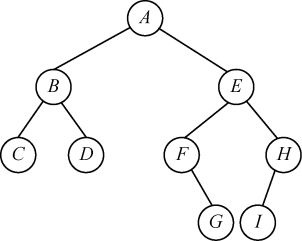
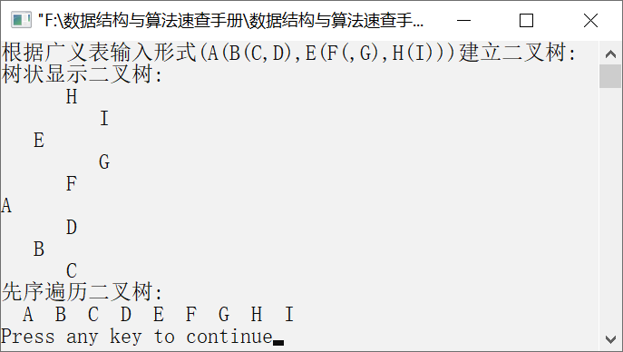

### 7.2.1　非递归先序遍历二叉树


**问题描述**


编写算法，要求非递归实现二叉树的先序遍历。


**【分析】**

这是同济大学考研试题。从二叉树的根节点开始，访问根节点，然后将根节点的指针入栈，重复执行以下两个操作。

（1）如果该节点的左子节点存在，则访问左子节点，并将左子节点的指针入栈，重复执行此操作，直到节点的左子节点不存在。

（2）将栈顶的元素（指针）出栈，如果该指针指向的右子节点存在，则将当前指针指向右子节点。重复执行以上两个操作，直到栈空为止。

例如，图7.19所示的二叉树的先序遍历序列为A、B、C、D、E、F、G、H、I。


<center class="my_markdown"><b class="my_markdown">图7.19　一棵二叉树</b></center>


第7章\实例7-03.cpp

```c
/********************************************
*实例说明：二叉树的非递归先序遍历
*********************************************/
#include<stdio.h>
#include<malloc.h>
#include<stdlib.h>
#include<iostream.h>
#include<iomanip.h>
typedef char DataType;
#define MAXSIZE 100            
typedef struct Node                   /*二叉链表存储结构类型定义*/
{
    DataType data;                    /*数据域*/
    struct Node *lchild;              /*指向左子节点*/
    struct Node *rchild;              /*指向右子节点*/
}*BiTree,BitNode;
void CreateBitTree(BiTree *T,char str[]);    
void TreePrint(BiTree T,int nLayer);
void PreOrderTraverse(BiTree T);
void DestroyBitTree(BiTree *T);
void main()
{
    BiTree root;
    cout<<"根据广义表输入形式(A(B(C,D),E(F(,G),H(I)))建立二叉树:"<<endl;
    CreateBitTree(&root,"(A(B(C,D),E(F(,G),H(I)))");
    cout<<"树状显示二叉树:"<<endl;
    TreePrint(root,0);
    cout<<"先序遍历二叉树:"<<endl;
    PreOrderTraverse(root);
    cout<<endl;
    DestroyBitTree(&root);
}
void PreOrderTraverse(BiTree T)
/*先序遍历二叉树的非递归实现*/
{
    BiTree stack[MAXSIZE];               /*定义一个栈，存放节点的指针*/
    int top;                             /*定义栈顶指针*/
    BitNode *p;                          /*定义一个节点的指针*/
    top=0;                               /*初始化栈*/
    p=T;
    while(p!=NULL||top>0)
    {
        while(p!=NULL)                   
        {
            cout<<setw(3)<<p->data;      
            stack[top++]=p;              
            p=p->lchild;                 
        }
        if(top>0)                        
        {
            p=stack[--top];              
            p=p->rchild;                 
        }
    }
}
void TreePrint(BiTree T,int level)
/*按树状输出的二叉树*/
{
    int i;
    if(T==NULL)                          
        return;
    TreePrint(T->rchild,level+1);        
    for(i=0;i<level;i++)                 
        printf("   ");
    printf("%c\n",T->data);             
    TreePrint(T->lchild,level+1);       
}
void  CreateBitTree(BiTree *T,char str[])
/*利用括号嵌套的字符串创建二叉链表*/
{
    char ch;
    BiTree stack[MAXSIZE];                /*定义栈，存放二叉树中的节点的指针*/
    int top=-1;                           /*初始化栈顶指针*/
    int flag,k;
    BitNode *p;
    *T=NULL,k=0;
    ch=str[k];
    while(ch!='\0')                       /*如果字符串没有结束*/
    {
        switch(ch)
        {
            case '(':
                stack[++top]=p;
                flag=1;
                break;
            case ')':
                top--;
                break;
            case ',':
                flag=2;
                break;
            default:
                p=(BiTree)malloc(sizeof(BitNode));
                p->data=ch;
                p->lchild=NULL;
                p->rchild=NULL;
                if(*T==NULL)                   /*若是第一个节点，表示其为根节点*/
                    *T=p;
                else
                {
                    switch(flag)
                   {
                    case 1:
                        stack[top]->lchild=p;
                        break;
                    case 2:
                        stack[top]->rchild=p;
                        break;
                    }
                }
            }
        ch=str[++k];
    }
}
void DestroyBitTree(BiTree *T)
/*销毁二叉树操作*/
{
    if(*T)                           /*如果是非空二叉树*/
    {
        if((*T)->lchild)
            DestroyBitTree(&((*T)->lchild));
        if((*T)->rchild)
            DestroyBitTree(&((*T)->rchild));
        free(*T);
        *T=NULL;
    }
}
```

运行结果如图7.20所示。


<center class="my_markdown"><b class="my_markdown">图7.20　运行结果</b></center>

