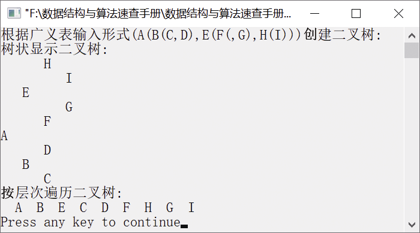

### 7.2.2　按层次遍历二叉树


**问题描述**


已知二叉树采用二叉链表存储，编写算法，实现按层次遍历二叉树。


**【分析】**

这是西北大学考研试题。定义一个队列，从二叉树的根节点开始，依次将每一层指向节点的指针入队。然后将队头元素出队，并输出该指针指向的节点值，如果该节点的左、右子节点不空，则将左、右子节点的指针入队。重复执行以上操作，直到队空为止。最后得到的序列就是二叉树层次的输出序列。


第7章\实例7-04.cpp

```c
/********************************************
*实例说明：按层次遍历二叉树
*********************************************/
#include<stdio.h>
#include<malloc.h>
#include<stdlib.h>
#include<iostream.h>
#include<iomanip.h>
typedef char DataType;
#define MAXSIZE 100                
typedef struct Node                          /*二叉链表存储结构类型定义*/
{
    DataType data;                           /*数据域*/
    struct Node *lchild;                     /*指向左子节点*/
    struct Node *rchild;                     /*指向右子节点*/
}*BiTree,BitNode;
#include"LinkBiTree.h"
void CreateBitTree(BiTree *T,char str[]);    /*利用括号嵌套的字符串创建二叉树的函数声明*/
void LevelTraverse(BiTree T);
void main()
{
    BiTree root;
    cout<<"根据广义表输入形式(A(B(C,D),E(F(,G),H(I)))创建二叉树:"<<endl;
    CreateBitTree(&root,"(A(B(C,D),E(F(,G),H(I)))");
    cout<<"树状显示二叉树:"<<endl;
    TreePrint(root,0);
    cout<<"按层次遍历二叉树:"<<endl;
    LevelTraverse(root);
    cout<<endl;
    DestroyBitTree(&root);
}
void LevelTraverse(BiTree T)
/*按层次输出二叉树中的节点*/
{
    BiTree queue[MAXSIZE];         /*定义一个队列，用于存放节点的指针*/
    BitNode *p;
    int front,rear;              
    front=rear=-1;               
    rear++;                     
    queue[rear]=T;              
    while(front!=rear)          
    {
        front=(front+1)%MAXSIZE;
        p=queue[front];         
        cout<<setw(3)<<p->data; 
        if(p->lchild!=NULL)     
        {
            rear=(rear+1)%MAXSIZE;
            queue[rear]=p->lchild;
        }
        if(p->rchild!=NULL)          /*如果右子节点非空，则将右子节点指针入队*/
        {
            rear=(rear+1)%MAXSIZE;
            queue[rear]=p->rchild;
        }
    }
}
```

运行结果如图7.21所示。


<center class="my_markdown"><b class="my_markdown">图7.21　运行结果</b></center>

**【说明】**

为了增强代码的复用性，这里把创建二叉树、销毁二叉树、树状输出二叉树等功能放在文件LinkBiTree.h中。在前文的实例中，这些代码曾出现过，这里略去这些重复代码。

