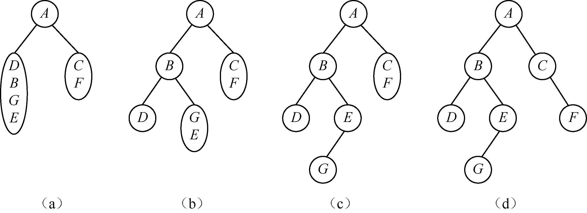

### 7.2.3　由中序和后序序列构造二叉树


**问题描述**


已知一棵二叉树的中序序列为D、B、G、E、A、C、F，后序序列为D、G、E、B、F、C、A，给出其对应的二叉树。


**【分析】**

这是西北大学考研试题。由先序序列和中序序列可以唯一地确定一棵二叉树。同样，由中序序列和后序序列也可以唯一地确定一棵二叉树。先来分析中序序列和后序序列有什么特点。根据二叉树遍历的递归定义，二叉树的后序遍历是先后序遍历左子树，然后后序遍历右子树，最后访问根节点。因此，在后序遍历的过程中，根节点位于后序序列的最后。在二叉树的中序遍历过程中，先中序遍历左子树，然后是根节点，最后中序遍历右子树。因此，在二叉树的中序序列中，根节点将中序序列分割为左子树序列和右子树序列两个部分。由中序序列的左子树节点个数，通过扫描后序序列，可以将后序序列分为左子树序列和右子树序列。以此类推，就可以构造出二叉树。

例如，给定中序序列D、B、G、E、A、C、F和后序序列D、G、E、B、F、C、A，则可以唯一确定一棵二叉树，如图7.22（a）～（d）所示。

由后序序列可知，A是二叉树的根节点。再根据中序序列得知，A的左子树的中序序列为D、B、G、E，右子树的中序序列为C、F。然后，在后序序列中，可以确定A的左子树的后序序列为D、G、E、B，右子树的后序序列为F、C。进一步，由A的左子树的后序序列得知，B是子树{D、G、E}的根节点，由中序序列D、B、G、E可知，B的左子树是D，右子树的中序序列是G、E，而后序序列为G、E。子树{G、E}的根节点为E，从而左子树为G。因此，确定了A的左子树，同理，可以确定A的右子树。


<center class="my_markdown"><b class="my_markdown">图7.22　由中序序列和后序序列确定二叉树的过程</b></center>


第7章\实例7-05.cpp

```c
/********************************************
*实例说明：由中序序列和后序序列确定二叉树
*********************************************/
#include"stdio.h"
#include"stdlib.h"
#include"string.h"
#define MAXSIZE 100
typedef struct Node
{
    char data;
    struct Node * lchild,*rchild;
}BitNode,*BiTree;
void CreateBiTree(BiTree *T,char *in,char *post,int len);
void PrintLevel(BiTree T);
void PreTraverse(BiTree T);
void PrintLevel(BiTree T)
/*层次输出二叉树的节点*/
{
    BiTree Queue[MAXSIZE];
    int front,rear;
    if(T==NULL)
        return;
    front=-1;                             /*初始化队列*/
        rear=0;
    Queue[rear]=T;
    while(front!=rear)                    
    {
        front++;                          
        printf("%4c",Queue[front]->data); 
        if(Queue[front]->lchild!=NULL)    
        {
            rear++;
            Queue[rear]=Queue[front]->lchild;
        }
        if(Queue[front]->rchild!=NULL)
        {
            rear++;
            Queue[rear]=Queue[front]->rchild;
        }
    }
}
void PreTraverse(BiTree T)
/*先序输出二叉树的节点*/
{
    if(T!=NULL)
    {
        printf("%4c ",T->data);            /*输出根节点*/
        PreTraverse(T->lchild);            /*先序遍历左子树*/
        PreTraverse(T->rchild);            /*先序遍历右子树*/
    }
}
void CreateBiTree(BiTree *T,char *in,char *post,int len)
/*由中序序列和后序序列构造二叉树*/
{
    int k;
    char *temp;
    if(len<=0)
    {
        *T=NULL;
        return;
    }
    for(temp=in;temp<in+len;temp++)           /*在中序序列中找到根节点所在的位置*/
        if(*(post+len-1)==*temp)
        {
            k=temp-in;                        /*左子树的长度*/
            (*T)=(BitNode*)malloc(sizeof(BitNode));
            (*T)->data =*temp;
            break;
        }
    CreateBiTree(&((*T)->lchild),in,post,k);   /*创建左子树*/
    CreateBiTree(&((*T)->rchild),in+k+1,post+k,len-k-1); /*创建右子树*/    
}
void TreePrint(BiTree T,int level)
/*按树状输出的二叉树*/
{
    int i;
    if(T==NULL)                     
        return;
    TreePrint(T->rchild,level+1);   
    for(i=0;i<level;i++)            
        printf("   ");
    printf("%c\n",T->data);         
    TreePrint(T->lchild,level+1);   
}
void main()
{
    BiTree T;
    int len;
    char in[MAXSIZE],post[MAXSIZE];
    printf("由中序序列和后序序列构造二叉树：\n");
    printf("请你输入中序的字符串序列：");
    gets(in);
    printf("请你输入后序的字符串序列：");
    gets(post);
    len=strlen(post);
    CreateBiTree(&T,in,post,len);
    TreePrint(T,1);
    printf("\n二叉树先序遍历结果是\n");
    PreTraverse(T);
    printf("\n二叉树层次遍历结果是\n");
    PrintLevel(T);
    printf("\n");
}
```

运行结果如图7.23所示。


<center class="my_markdown"><b class="my_markdown">图7.23　运行结果</b></center>

