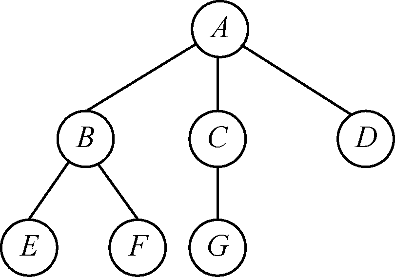
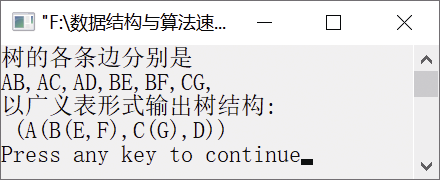

### 7.2.4　输出树的各条边


**问题描述**


树采用子节点-兄弟节点表示法存放，节点结构如下。


fch→data→nsib

其中，fch表示指向第一个子节点，nsib表示指向下一个兄弟节点。编写算法，要求由根节点开始逐层输出树中的各条边，边输出格式为(K<sub class="my_markdown">i</sub>,K<sub class="my_markdown">j</sub>)。例如，对于图7.24所示的树，输出的边为AB、AC、AD、BE、BF、CG。


<center class="my_markdown"><b class="my_markdown">图7.24　一棵树</b></center>

**【分析】**

这是西北大学考研试题。这个题目主要考查对树的子节点-兄弟节点表示法的理解和树的遍历算法设计思想。首先根据树的结构画出树的子节点-兄弟节点表示，然后考虑如何按照以上顺序输出各条边。具体算法思想如下。

（1）如果树为空树，则直接返回。

（2）如果节点处有子树，则输出这个节点的子树的各条边。

（3）递归调用函数输出兄弟节点的子树的边。

（4）递归调用函数输出下一层所有子树的边。

其中，步骤（3）与（4）分别输出兄弟节点和下一层子树的边，两者顺序不能颠倒。


第7章\实例7-06.cpp

```c
/********************************************
*实例说明：输出树的各条边
*********************************************/
#include<stdio.h>
#include<stdlib.h>
#include<iostream.h>
#include<assert.h>
typedef struct node
{
    struct node * fch;
    char data;
    struct node * nsib;
    int level;
} NODE;
typedef NODE    * TREE;
#define SET(pos, c, l)
{
    pos = (NODE*)malloc(sizeof(NODE));
    pos->data = c;
    pos->level = l;
    pos->fch = NULL;
    pos->nsib = NULL;
    return pos;
}
void Display(TREE tree);
void ListPrintTree(TREE T);
TREE InitTree()
{
    TREE tree;
    SET(tree, '\0', 0);
}
void ReleaseTree(TREE tree)
{
    assert(tree);
    if (tree->fch != NULL)
        ReleaseTree(tree->fch);
    if (tree->nsib != NULL)
        ReleaseTree(tree->nsib);
    free(tree);
}
TREE Insert(TREE tree, char data, int level)
{
    assert(tree);
    if (tree->level == level - 1)
        SET(tree->fch, data, level);
    if (tree->level == level)
        SET(tree->nsib, data, level);
    return NULL;
}
void main()
{
    TREE T = InitTree(), temp1, temp2, temp3, temp4;
    temp1 = Insert(T, 'A', 1);
    temp2 = Insert(temp1, 'B', 2);
    temp3 = Insert(temp2, 'C', 2);
    Insert(temp3, 'D', 2);
    temp4 = Insert(temp2, 'E', 3);
    Insert(temp4, 'F', 3);
    Insert(temp3, 'G', 3);
    cout<<"树的各条边分别是"<<endl;
    Display(T->fch);
    cout<<endl;
    cout<<"以广义表形式输出树结构:\n";
    ListPrintTree(T);
    cout<<endl;
    ReleaseTree(T);
}
void Display(TREE tree)
//输出树中的各条边
{
    NODE   * p;
    if (tree == NULL)
        return;
    if (tree->fch != NULL)        //如果有子节点
    {
        //则输出全部边
        for (p = tree->fch; p != NULL; p = p->nsib)
            printf("%c%c,", tree->data, p->data);
    }
    //输出兄弟节点的全部边
    if (tree->nsib != NULL)
    Display(tree->nsib);
    //进入下一层
    if (tree->fch != NULL)
        Display(tree->fch);
}
void ListPrintTree(TREE T)
//以广义表形式输出树结构
{
    TREE p;
    if(T==NULL)
        return;
    cout<<T->data;
    p=T->fch;
    if(p!=NULL)
    {
        cout<<"(";
        ListPrintTree(p);
        p=p->nsib;
        while(p!=NULL)
        {
            cout<<",";
            ListPrintTree(p);
            p=p->nsib;
        }
        cout<<")";
    }
}
```

运行结果如图7.25所示。


<center class="my_markdown"><b class="my_markdown">图7.25　运行结果</b></center>

