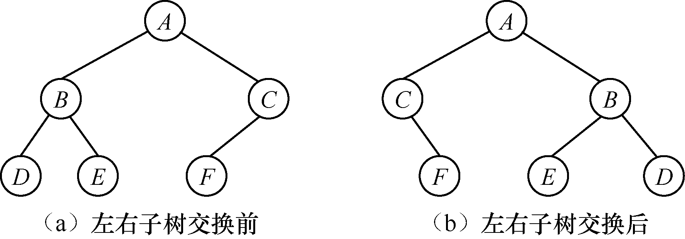
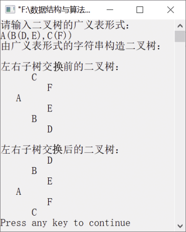

### 7.3.2　交换二叉树的左右子树


**问题描述**


编写算法，要求实现以下功能。

（1）实现一个创建二叉树的算法，要求二叉树按二叉链表形式存储。

（2）已知二叉树用二叉链表形式存储，要求实现算法，将该二叉树的左右子树交换。


**【分析】**

这是西北大学考研试题。例如，一棵二叉树在左右子树交换前后的情况如图7.27（a）与（b）所示。


<center class="my_markdown"><b class="my_markdown">图7.27　二叉树的左右子树交换前后的情况</b></center>

本题考查二叉树的创建算法思想和左右子树交换算法思想。左右子树交换可用递归实现，类似于二叉树的先序遍历算法，通过对先序遍历算法的改进就可以将左右子树交换。从根节点开始，先交换根节点处左右两棵子树的指针，然后分别递归调用左右两棵子树，交换子树的各个节点的左右两个指针，这样就完成了两棵子树的交换。


第7章\实例7-08.cpp

```c
/********************************************
*实例说明：交换二叉树的左右子树
*********************************************/
#include"stdio.h"
#include"stdlib.h"
#include"string.h"
#include<iostream.h>
#define MAXSIZE 100
typedef struct Node
{
    char data;
    struct Node     * lchild,*rchild;
}BitNode,*BiTree;
void CreateBitTree(BiTree *T,char str[]);
void PrintLevel(BiTree T);
void SwapSubTree(BiTree *T);
void SwapSubTree(BiTree *T)
//交换左右子树
{
    BitNode *temp;
    if((*T))
    {
        //交换左右子树的指针
        temp=(*T)->lchild;
        (*T)->lchild=(*T)->rchild;
        (*T)->rchild=temp;    
        SwapSubTree(&((*T)->lchild));
        SwapSubTree(&((*T)->rchild));
    }
}
void  CreateBitTree(BiTree *T,char str[])
/*利用括号嵌套的字符串创建二叉链表*/
{
    char ch;
    BiTree stack[MAXSIZE];             /*定义栈，用于存放指向二叉树中节点的指针*/
    int top=-1;                        /*初始化栈顶指针*/
    int flag,k;
    BitNode *p;
    *T=NULL,k=0;
    ch=str[k];
    while(ch!='\0')                    /*如果字符串没有结束*/
    {
        switch(ch)
        {
            case '(':
                stack[++top]=p;
                flag=1;
                break;
            case ')':
                top--;
                break;
            case ',':
                flag=2;
                break;
            default:
                p=(BiTree)malloc(sizeof(BitNode));
                p->data=ch;
                p->lchild=NULL;
                p->rchild=NULL;
                if(*T==NULL)               /*如果是第一个节点，表示其为根节点*/
                    *T=p;
            else
            {
                switch(flag)
                {
                    case 1:
                        stack[top]->lchild=p;
                        break;
                    case 2:
                        stack[top]->rchild=p;
                        break;
                }
            }
        }
        ch=str[++k];
    }
}
void TreePrint(BiTree T,int level)
/*按树状输出的二叉树*/
{
    int i;
    if(T==NULL)                      
        return;
    TreePrint(T->rchild,level+1);     /*输出右子树，并将层次加1*/
    for(i=0;i<level;i++)              /*按照递归的层次输出空格*/
        printf("   ");
    printf("%c\n",T->data);           /*输出根节点*/
    TreePrint(T->lchild,level+1);     /*输出左子树，并将层次加1*/
}
void main()
{
    BiTree T;
    char str[MAXSIZE];
    cout<<"请输入二叉树的广义表形式："<<endl;
    cin>>str;
    cout<<"由广义表形式的字符串构造二叉树："<<endl;
    CreateBitTree(&T,str);
    cout<<endl<<"左右子树交换前的二叉树："<<endl;
    TreePrint(T,1);
    SwapSubTree(&T);
    cout<<endl<<"左右子树交换后的二叉树："<<endl;
    TreePrint(T,1);
}
```

运行结果如图7.28所示。


<center class="my_markdown"><b class="my_markdown">图7.28　运行结果</b></center>

