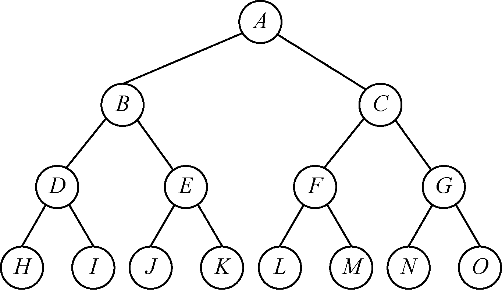
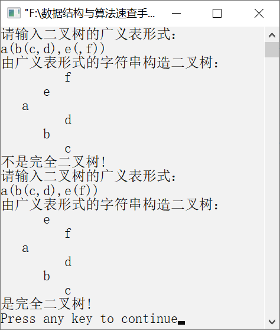

### 7.3.3　判断二叉树是否为完全二叉树


**问题描述**


要求如下。

（1）实现出一个创建二叉树的算法。

（2）实现一个判断给定的二叉树是否为完全二叉树的算法。完全二叉树满足以下条件。

深度为K，具有N个节点的二叉树的每个节点都与深度为K的满二叉树中编号为1～N的节点一一对应。


**【分析】**

这是西北大学考研试题。主要考查考生对创建二叉树的算法思想和完全二叉树的性质的掌握程度。创建二叉树可通过递归实现，可以按照先序方式创建二叉树，也可以根据广义表输入方式创建二叉树。

每层节点都是满的二叉树称为满二叉树，即在满二叉树中，每一层的节点都具有最大的节点个数。图7.29就是一棵满二叉树。在满二叉树中，每个节点的度或者为2，或者为0（对于叶子节点），不存在度为1的节点。


<center class="my_markdown"><b class="my_markdown">图7.29　满二叉树</b></center>

依据“若某节点无左子节点则一定无右子节点”原则，判断给定的二叉树是否为完全二叉树。具体实现时，定义一个标志tag，初始时为0，表示二叉树不是完全二叉树。若第一次出现的节点没有左子节点或右子节点，则置tag为1；若之前tag已经为1，但是当前节点还有左子节点或右子节点，则说明它不具备完全二叉树的特征。可借助队列按层次遍历二叉树，初始时将根节点指针入队，然后按照上述性质判断二叉树是否为完全二叉树。本层遍历完毕，然后遍历下一层，直至队列已空。


第7章\实例7-09.cpp

```c
/********************************************
*实例说明：判断二叉树是否为完全二叉树
*********************************************/
#include"stdio.h"
#include"stdlib.h"
#include"string.h"
#include<iostream.h>
#define MAXSIZE 100
typedef struct Node
{
    char data;
    struct Node    * lchild,*rchild;
}BitNode,*BiTree;
#include"BiTreeQueue.h"
void CreateBitTree(BiTree *T,char str[]);
void TreePrint(BiTree T,int level);
int JudgeComplete(BiTree T)
//判断是否为完全二叉树
{
    int tag=0;                        
    BiTree p=T;    
    Queue Q;                          
    if(p==NULL)                      
        return 1;
    InitQueue(&Q);                    
    EnQueue(&Q,p);                    
    while(!QueueEmpty(Q))             
    {
        DeQueue(&Q,&p);               
        if(p->lchild && !tag)         
            EnQueue(&Q,p->lchild);    
        else if(p->lchild)            
            return 0;                 
        else                          
            tag=1;                   
        if(p->rchild && !tag)        
            EnQueue(&Q,p->rchild);   
        else if(p->rchild)           
            return 0;                
        else                          
            tag=1;                   
    }
    ClearQueue(&Q);                   
    return 1;                         
}
void  CreateBitTree(BiTree *T,char str[])
/*利用括号嵌套的字符串创建二叉链表*/
{
    char ch;
    BiTree stack[MAXSIZE];      /*栈用于存放二叉树节点的指针*/
    int top=-1;                 /*初始化栈顶指针*/
    int flag,k;
    BitNode *p;
    *T=NULL,k=0;
    ch=str[k];
    while(ch!='\0')             /*如果字符串没有结束*/
    {
        switch(ch)
        {
            case '(':
                stack[++top]=p;
                flag=1;
                break;
            case ')':
                top--;
                break;
            case ',':
                flag=2;
                break;
            default:
                p=(BiTree)malloc(sizeof(BitNode));
                p->data=ch;
                p->lchild=NULL;
                p->rchild=NULL;
                if(*T==NULL)          /*如果节点是第一个节点，表示其为根节点*/
                    *T=p;
                else
                {
                    switch(flag)
                    {
                        case 1:
                            stack[top]->lchild=p;
                            break;
                        case 2:
                            stack[top]->rchild=p;
                            break;
                    }
                }
        }
        ch=str[++k];
    }
}
void TreePrint(BiTree T,int level)
/*按树状输出的二叉树*/
{
    int i;
    if(T==NULL)                      
        return;
    TreePrint(T->rchild,level+1);    
    for(i=0;i<level;i++)             
        printf("   ");
    printf("%c\n",T->data);          
    TreePrint(T->lchild,level+1);    
}
void main()
{
    BiTree T;
    int flag;
    char str[MAXSIZE];
    cout<<"请输入二叉树的广义表形式："<<endl;
    cin>>str;
    cout<<"由广义表形式的字符串构造二叉树："<<endl;
    CreateBitTree(&T,str);
    TreePrint(T,1);
    flag=JudgeComplete(T);
    if(flag)
        cout<<"是完全二叉树!"<<endl;
    else
        cout<<"不是完全二叉树!"<<endl;
    cout<<"请输入二叉树的广义表形式："<<endl;
    cin>>str;
    cout<<"由广义表形式的字符串构造二叉树："<<endl;
    CreateBitTree(&T,str);
    TreePrint(T,1);
    flag=JudgeComplete(T);
    if(flag)
        cout<<"是完全二叉树!"<<endl;
    else
        cout<<"不是完全二叉树!"<<endl;
}
```

相应的算法实现如下。

```c
/*节点类型定义*/
typedef struct QNode
{
    BitNode *data;                           /*节点类型为二叉树节点类型指针*/
    struct QNode* next;
}LQNode,*QueuePtr;
/*队列类型定义*/
typedef struct
{
    QueuePtr front;
    QueuePtr rear;
}Queue;
void InitQueue(Queue *LQ)
/*初始化链式队列*/
{
    LQ->front=LQ->rear=(LQNode*)malloc(sizeof(LQNode));
    if(LQ->front==NULL) exit(-1);
    LQ->front->next=NULL;                  /*把头节点的指针域置为空*/
}
int QueueEmpty(Queue LQ)
/*判断链式队列是否为空*/
{
    if(LQ.front->next==NULL)                /*当链式队列为空时*/
        return 1;                           /*返回1*/
    else                                    /*否则*/
        return 0;                           /*返回0*/
}
int EnQueue(Queue *LQ,BitNode  * x)
/*将指针x插入链式队列LQ中，插入成功返回1*/
{
    LQNode *s;
    s=(LQNode*)malloc(sizeof(LQNode));      
    if(!s) exit(-1);                        
    s->data=x;                              
    s->next=NULL;                           
    LQ->rear->next=s;                       
    LQ->rear=s;                             
    return 1;
}
int DeQueue(Queue *LQ,BitNode **e)
/*删除链式队列中的队头元素，并将该指针赋给e*/
{
    LQNode *s;
    if(LQ->front==LQ->rear)          
        return 0;
    else
    {
        s=LQ->front->next;                
        *e=s->data;                       
        LQ->front->next=s->next;          
        if(LQ->rear==s) LQ->rear=LQ->front;
        free(s);                           
        return 1;
    }
}
void ClearQueue(Queue *LQ)
/*清空队列*/
{
    while(LQ->front!=NULL)
    {
        LQ->rear=LQ->front->next;          
        free(LQ->front);                   
        LQ->front=LQ->rear;                
    }
}
```

运行结果如图7.30所示。


<center class="my_markdown"><b class="my_markdown">图7.30　运行结果</b></center>

该算法用到了队列，可以定义一个数组作为队列，也可以利用链式队列实现，但是还需要对队列的入队和出队操作进行修改。因为这里需要入队和出队的元素是二叉树节点的指针，修改也很简单，所以只需要将原来的元素类型DataType换成BitNode即可，但是要注意指针作为函数参数传递的方式。读者需要深刻理解一级指针、二级指针的使用时机及为什么要使用二级指针、什么时候用。

