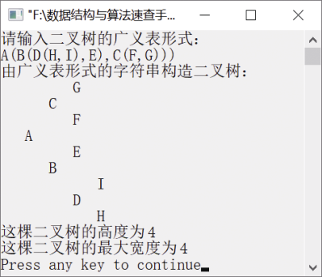

### 7.3.4　计算二叉树的高度和最大宽度


**问题描述**


二叉树采用二叉链表存储。

（1）编写计算二叉树高度的算法。

（2）编写计算二叉树最大宽度的算法。二叉树的最大宽度是指二叉树所有层中节点个数的最大值。


**【分析】**

这是西北大学考研试题。

二叉树的高度递归定义如下。


当二叉树已空时，其高度为0。当二叉树只有根节点（即节点的左、右子树均已空）时，二叉树的深度为1。其他情况下，二叉树的左、右子树高度的最大值再加1（根节点）就是二叉树的高度。

求二叉树的最大宽度可通过层次遍历二叉树实现。具体思路为依次将每一层中节点的指针入队，然后再分别将当前层的指针出队，统计其节点个数，并将下一层节点的指针入队，记录每一层节点个数，得出节点个数最大值。遍历完毕后，节点个数最大值就是二叉树的最大宽度。


第7章\实例7-10.cpp

```c
/********************************************
*实例说明：求二叉树的高度和最大宽度
*********************************************/
#include"stdio.h"
#include"stdlib.h"
#include"string.h"
#include<iostream.h>
#define MAXSIZE 100
typedef struct Node
{
    char data;
    struct Node    * lchild,*rchild;
}BitNode,*BiTree;
void CreateBitTree(BiTree *T,char str[]);
void PrintLevel(BiTree T);
void CreateBitTree(BiTree *T,char str[])
/*利用括号嵌套法创建二叉链表*/
{
    char ch;
    BiTree stack[MAXSIZE];      /*定义栈，用于存放指向二叉树中节点的指针*/
    int top=-1;                 /*初始化栈顶指针*/
    int flag,k;
    BitNode *p;
    *T=NULL,k=0;
    ch=str[k];
    while(ch!='\0')             /*如果字符串没有结束*/
    {
        switch(ch)
        {
            case '(':
                stack[++top]=p;
                flag=1;
                break;
            case ')':
                top--;
                break;
            case ',':
                flag=2;
                break;
            default:
                p=(BiTree)malloc(sizeof(BitNode));
                p->data=ch;
                p->lchild=NULL;
                p->rchild=NULL;
                if(*T==NULL)/*如果节点是第一个节点，表示它为根节点*/
                    *T=p;
                else
                {
                    switch(flag)
                    {
                        case 1:
                            stack[top]->lchild=p;
                            break;
                        case 2:
                            stack[top]->rchild=p;
                            break;
                    }
                }
        }
        ch=str[++k];
    }
}
void TreePrint(BiTree T,int level)
/*按树状输出的二叉树*/
{
    int i;
    if(T==NULL)                    
        return;
    TreePrint(T->rchild,level+1);  
    for(i=0;i<level;i++)           
        printf("   ");
    printf("%c\n",T->data);       
    TreePrint(T->lchild,level+1);  
}
int BiTreeDepth(BiTree T)
/*计算二叉树的高度*/
{
    if(T == NULL)
        return 0;
    return  BiTreeDepth(T->lchild)>BiTreeDepth(T->rchild)?
            1+BiTreeDepth(T->lchild):1+BiTreeDepth(T->rchild);
}
int BiTreeWidth(BiTree T)
//计算二叉树的最大宽度
{
    int front,rear,last,maxw,temp;
    BiTree Q[MAXSIZE];         //Q是队列，元素为二叉树节点的指针
    BitNode *p;
    if (T==NULL)               //空二叉树最大宽度为0
        return 0;
    else
    {
        front=1;rear=1;last=1;  
        temp=0;                
        maxw=0;                
        Q[rear]=T;             
        while(front<=last)
        {
            p=Q[front++];
            temp++;                      //同层节点数加1
            if (p->lchild!=NULL)
                Q[++rear]=p->lchild;     //左子节点入队
            if (p->rchild!=NULL)
                Q[++rear]=p->rchild;     //右子节点入队
            if (front>last)              //一层结束
            {
                last=rear;
                if(temp>maxw)
                    maxw=temp;           //last指向下层最右节点, 更新当前最大宽度
                temp=0;
            }
        }
        return maxw;
    }
}
void main()
{
    BiTree T;
    char str[MAXSIZE];
    cout<<"请输入二叉树的广义表形式："<<endl;
    cin>>str;
    cout<<"由广义表形式的字符串构造二叉树："<<endl;
    CreateBitTree(&T,str);
    TreePrint(T,1);
    cout<<"这棵二叉树的高度为"<<BiTreeDepth(T)<<endl;
    cout<<"这棵二叉树的最大宽度为"<<BiTreeWidth(T)<<endl;
}
```

运行结果如图7.31所示。


<center class="my_markdown"><b class="my_markdown">图7.31　运行结果</b></center>

