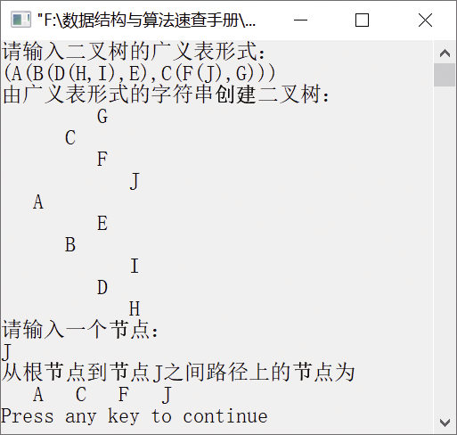

### 7.3.5　求树中根节点到任意节点之间的路径


**问题描述**


已知一棵二叉树用二叉链表存储，t指向根节点，p指向树中任意节点。要求编写算法，输出从t到p之间路径上的节点。


**【分析】**

这是南京航空航天大学的考研试题，主要考查二叉树的后序遍历。由于后序遍历二叉树的过程中，访问指针r所指节点时，栈中所有节点均为r所指节点的“祖先”，由这些祖先便构成了一条从根节点到r所指节点之间的路径，因此可采用后序遍历。


第7章\实例7-11.cpp

```c
/********************************************
*实例说明：求根节点到任意节点之间的路径
*********************************************/
#include"stdio.h"
#include"stdlib.h"
#include"string.h"
#include<iostream.h>
#include<iomanip.h>
typedef char DataType;
#define MAXSIZE 100
typedef struct Node
{
    DataType data;
    struct Node    * lchild,*rchild;
}BitNode,*BiTree;
void CreateBitTree(BiTree *T,char str[]);
void PrintLevel(BiTree T);
void CreateBitTree(BiTree *T,char str[])
/*利用括号嵌套法创建二叉链表*/
{
    char ch;
    BiTree stack[MAXSIZE];     /*栈用于存放指向二叉树中节点的指针*/
    int top=-1;                /*初始化栈顶指针*/
    int flag,k;
    BitNode *p;
    *T=NULL,k=0;
    ch=str[k];
    while(ch!='\0')            /*如果字符串没有结束*/
    {
        switch(ch)
        {
            case '(':
                stack[++top]=p;
                flag=1;
                break;
            case ')':
                top--;
                break;
            case ',':
                flag=2;
                break;
            default:
                p=(BiTree)malloc(sizeof(BitNode));
                p->data=ch;
                p->lchild=NULL;
                p->rchild=NULL;
            if(*T==NULL)        /*如果节点是第一个节点，表示它为根节点*/
                *T=p;
            else
            {
                switch(flag)
                {
                    case 1:
                        stack[top]->lchild=p;
                        break;
                    case 2:
                        stack[top]->rchild=p;
                        break;
                }
            }
        }
        ch=str[++k];
    }
}
void TreePrint(BiTree T,int level)
/*按树状输出的二叉树*/
{
    int i;
    if(T==NULL)/*如果指针为空，返回上一层*/
        return;
    TreePrint(T->rchild,level+1);    
    for(i=0;i<level;i++)             
        printf("   ");
    printf("%c\n",T->data);          
    TreePrint(T->lchild,level+1);    
}
void Path(BiTree root, BitNode *r)
//输出从root到r之间路径上的节点
{
    BitNode *p,*q;
    int i,top=0;
    BitNode *s[MAXSIZE];
    q=NULL;
    p=root;
    while(p!=NULL||top!=0)
    {
        while(p!=NULL)
        /*遍历左子树*/
        {
            top++;
            if(top>=MAXSIZE)
                exit(-1);
            s[top]=p;
            p=p->lchild;
        }
        if(top>0)
        {
            p=s[top];
            if(p->rchild == NULL || p->rchild==q) /*根节点*/
            {
                if(p==r)   
                {
                    for(i=1;i<=top;i++)
                        cout<<setw(4)<<s[i]->data;
                    top=0;p=NULL;     /*将栈置为空且p=NULL，目的是退出整个循环*/
                }
                else
                {
                    q=p;              /*用q保存刚刚遍历过的节点*/
                    top--;            /*将栈顶指针退栈，回到上一层*/
                    p=NULL;
                }
            }
            else
                p=p->rchild;          /*遍历右子树*/
        }
    }
}
BiTree FindPointer(BiTree T,DataType e)
/*查找元素值为e的节点的指针*/
{
    BiTree Q[MAXSIZE];               
    int front=0,rear=0;              
    BitNode *p;
    if(T)        
    {
        Q[rear]=T;
        rear++;
        while(front!=rear)            /*如果队列非空*/
        {
            p=Q[front];             
            front++;                
            if(p->data==e)
                return p;
            if(p->lchild)           
            {
                Q[rear]=p->lchild;  
                rear++;
            }
            if(p->rchild)           
            {
                Q[rear]=p->rchild;  
                rear++;
            }
        }
    }
    return NULL;
}
void main()
{
    BiTree T;
    BitNode *s;
    DataType e;
    char str[MAXSIZE];
    cout<<"请输入二叉树的广义表形式："<<endl;
    cin>>str;
    cout<<"由广义表形式的字符串创建二叉树"<<endl;
    CreateBitTree(&T,str);
    TreePrint(T,1);
    cout<<"请输入一个节点："<<endl;
    cin>>e;
    s=FindPointer(T,e);
    cout<<"从根节点到节点"<<e<<"之间路径上的节点为"<<endl;
    Path(T,s);
    cout<<endl;
}
```

运行结果如图7.32所示。


<center class="my_markdown"><b class="my_markdown">图7.32　运行结果</b></center>

为了输出根节点到输入节点之间路径上的节点，还需要根据节点元素值找到对应的指针，这样才能调用Path函数。这里在查找节点的指针时，也运用了层次遍历的算法。

