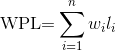
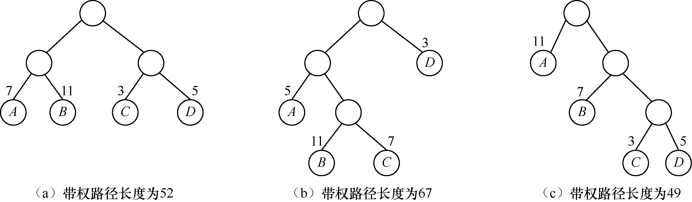
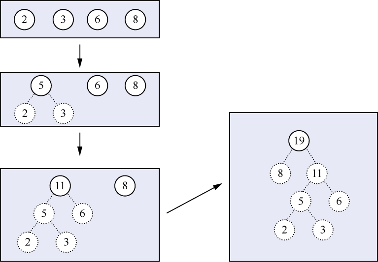
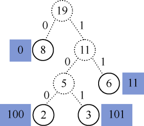

### 7.4　哈夫曼树

**【定义】**

**哈夫曼** （Huffman）树又称最优二叉树。它是一种带权路径长度最小的二叉树。

节点的带权路径长度为从该节点到根节点之间的路径长度与节点上权值的乘积。二叉树的带权路径长度为二叉树中所有叶子节点的带权路径长度之和，通常记作

其中，n是二叉树中叶子节点的个数，wi是第i个叶子节点的权值，li是第i个叶子节点的路径长度。

例如，图7.33（a）～（c）所示的权值分别为7、11、3、5的二叉树的带权路径长度分别如下。

（a）WPL=7×2+11×2+3×2+5×2=52。

（b）WPL=5×2+11×3+7×3+3×1=67。

（c）WPL=11×1+7×2+3×3+5×3=49。

因此，第3棵树的带权路径长度最小，它就是一棵哈夫曼树。在哈夫曼树中，权值越小的节点越远离根节点，权值越大的节点越靠近根节点。

<b class="my_markdown">图7.33　二叉树的带权路径长度</b>

**【哈夫曼树的构造算法】**

哈夫曼树的构造算法如下。

（1）由给定的n个权值w1,w2,…,wn，构成n棵只有根节点的二叉树集合F={T1,T2,…,Tn}，其中每棵二叉树Ti中只有一个权值为wi的根节点，其左右子树均为空。

（2）在二叉树集合F中，选取两棵根节点的权值最小和次小的树，作为左、右子树构造一棵新的二叉树，新二叉树的根节点的权值为这两棵子树中根节点的权值之和。

（3）在二叉树集合F中，删除这两棵二叉树，并将新得到的二叉树加入集合F中。

（4）重复步骤（2）和（3），直到集合F中只剩下一棵二叉树为止。这棵二叉树就是哈夫曼树。

例如，假设给定一组权值2、3、6、8，按照哈夫曼树的构造算法对权值集合构造哈夫曼树的过程如图7.34所示。其中，实线表示集合中的元素，虚线表示非集合中的元素。

<b class="my_markdown">图7.34　哈夫曼树构造过程</b>

**【哈夫曼编码的定义】**

如果规定哈夫曼树的左子节点分支为0，右子节点分支为1，那么从根节点到每个叶子节点经过的分支所组成的0和1序列就是节点的哈夫曼编码。

例如，图7.34所示的哈夫曼树对应的哈夫曼编码如图7.35所示。权值为2的叶子节点的哈夫曼编码为100，权值为3的叶子节点的哈夫曼编码为101，权值为6的叶子节点的哈夫曼编码为11，权值为8的叶子节点的哈夫曼编码为0。

<b class="my_markdown">图7.35　哈夫曼编码</b>

