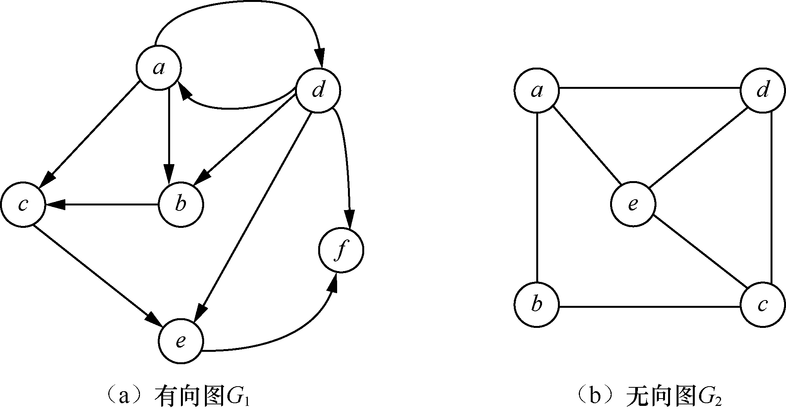
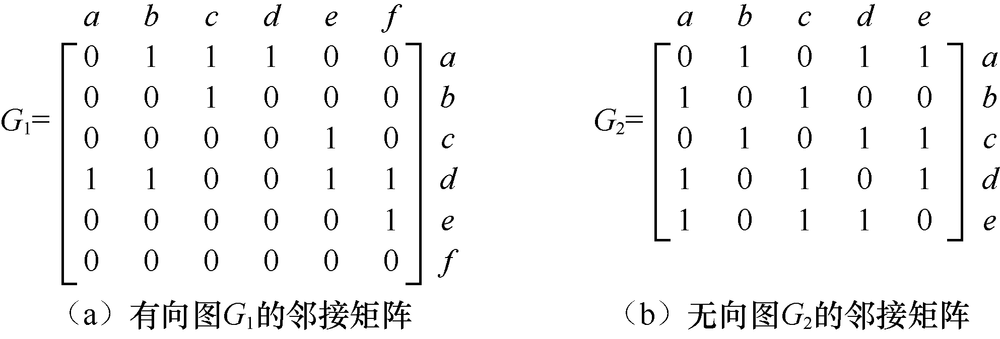
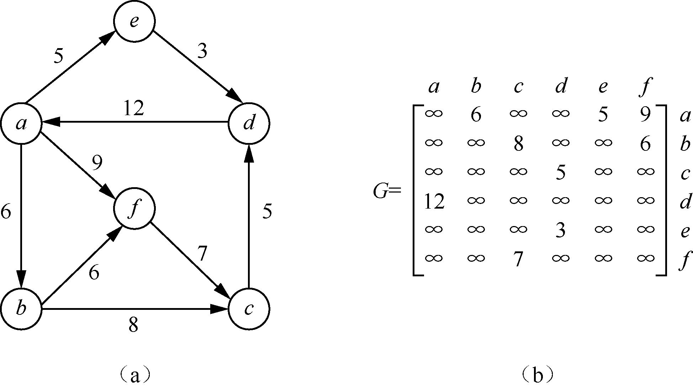
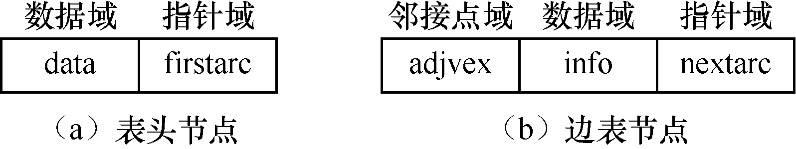
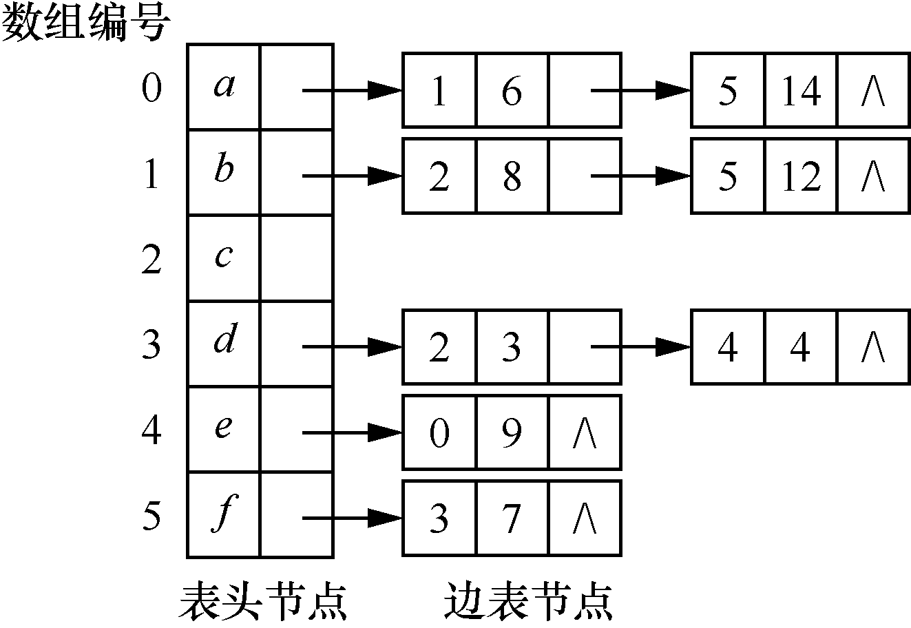

### 8.1　图的表示及应用

**【定义】**

图是由非空的数据元素集合与边的集合构成的二元组。

G=(V,E)

其中，G表示图，V表示顶点（vertex）集合，E表示顶点之间的关系即边（edge）集合。图中的数据元素通常称为顶点。

如果<x,y>∈E，则<x,y>表示顶点x到顶点y之间存在一条弧（arc），x称为弧尾（tail）或起始点（initial node），y称为弧头（head）或终端点（terminal node），这样的图称为有向图（digraph）。

如果<x,y>∈E且有<y,x>∈E，即E是对称的，则用无序对(x,y)代替有序对<x,y>和<y,x>，表示顶点x与顶点y之间存在一条边，这样的图称为无向图（undigraph）。有向图和无向图如图8.1（a）与（b）所示。

图G的形式化定义为G=(V, E)。其中，V={x|x∈顶点集合}，E={<x, y>|Path(x, y)/(x∈V, y∈V)}。Path(x, y)表示边<x, y>的相关信息。

如图8.1所示，有向图G<sub class="my_markdown">1</sub>可以表示为G<sub class="my_markdown">1</sub>=(V<sub class="my_markdown">1</sub>, E<sub class="my_markdown">1</sub>)。其中，顶点集合为V<sub class="my_markdown">1</sub>={a,b,c,d,e,f}，边集合为E<sub class="my_markdown">1</sub>={<a, b>,<a,c>,<a,d>,<b,c>,<c,e>,<d,a>,<d,b>, <d,e>,<d, f>,<e, f>}。无向图G<sub>2</sub>可以表示为G<sub>2</sub>=(V<sub>2</sub>, E<sub>2</sub>)，其中，顶点集合为V<sub>2</sub>={a,b,c,d,e}，边集合为E<sub>2</sub>={(a,b),(a,d),(a,e),(b,c),(c,d),(c,e),(d,e)}。


<center class="my_markdown"><b class="my_markdown">图8.1　有向图G<sub class="my_markdown">1</sub>与无向图G<sub>2</sub></b></center>

一般情况下，有向图中顶点之间的关系称为弧，无向图中顶点之间的关系称为边。

**【邻接点】**

对于无向图G=(V, E)，若边(v<sub class="my_markdown">i</sub>, v<sub class="my_markdown">j</sub>)∈E，则称顶点v<sub class="my_markdown">i</sub>和顶点v<sub class="my_markdown">j</sub>互为邻接（adjacent）点，即v<sub class="my_markdown">i</sub>和v<sub class="my_markdown">j</sub>相邻接。对于有向图G=(V, A)，若弧<v<sub class="my_markdown">i</sub>,v<sub class="my_markdown">j</sub>>∈A，则称顶点v<sub class="my_markdown">i</sub>邻接到顶点v<sub class="my_markdown">j</sub>，顶点v<sub class="my_markdown">j</sub>邻接自顶点v<sub class="my_markdown">i</sub>。弧<v<sub class="my_markdown">i</sub>,v<sub class="my_markdown">j</sub>>和顶点v<sub class="my_markdown">i</sub>、v<sub class="my_markdown">j</sub>相关联。

在无向图G<sub class="my_markdown">2</sub>中，顶点a和b互为邻接点，边(a, b)依附于顶点a和b；顶点b和c互为邻接点，边(b, c)依附于顶点b和c。在有向图G<sub>1</sub>中，弧<a,b>与顶点a和b相关联，也可以说，顶点a邻接到顶点b；弧<d,e>与顶点d和e相关联，也可以说顶点e邻接到顶点d。

**【顶点的度】**

对于无向图，顶点v的度（degree）是指与v相关联的边的数目，记作TD(v)。对于有向图，以顶点v为弧头的数目称为顶点v的入度（indegree），记作ID(v)；以顶点v为弧尾的数目称为顶点v的出度（outdegree），记作OD(v)。顶点v的度为TD(v)=ID(v)+OD(v)。

有向图G<sub class="my_markdown">1</sub>中顶点a、b、c、d、e和f的入度分别为1、2、2、1、2与2，顶点a、b、c、d、e和f的出度分别为3、1、1、4、1与0，所以顶点a、b、c、d、e和f的度分别为4、3、3、5、3与2。无向图G<sub>2</sub>中顶点a、b、c、d、e的度分别为3、2、3、3和3。

若图的顶点的个数为n，边数或弧数为e，顶点v<sub class="my_markdown">i</sub>的度记作TD(v<sub class="my_markdown">i</sub>)，则顶点的度与弧数或者边数满足关系
。

**【路径】**

无向图G中，从顶点v到顶点v′ 的路径（path）指从v出发，经过一系列的顶点序列到达顶点v′。如果G是有向图，则路径也是有向的，路径的长度是路径上弧或边的数目。第一个顶点和最后一个顶点相同的路径称为 **回路** 或 **环** （cycle）。序列中顶点不重复出现的路径称为简单路径。除了第一个顶点和最后一个顶点外，其他顶点不重复出现的回路，称为简单回路或简单环。

在图8.1（a）所示的有向图G<sub class="my_markdown">1</sub>中，顶点序列a→b→c→a就构成了一个简单回路。

**【图的邻接矩阵表示法】**

图的存储方式主要有4种——邻接矩阵表示法、邻接表表示法、十字链表表示法和邻接多重链表表示法。其中，邻接矩阵表示法和邻接表表示法最常用。

图的邻接矩阵表示法可利用两个数组实现：一个一维数组用来存储图中的顶点信息；另一个二维数组用来存储图中的顶点之间的关系，该二维数组称为邻接矩阵。如果图是一个无权图，则邻接矩阵表示为


对于带权图，有


其中，w<sub class="my_markdown">ij</sub>表示顶点i与顶点j构成的弧或边的权值。如果顶点之间不存在弧或边，则用∞表示。

图8.1（a）与（b）所示的两个图G<sub class="my_markdown">1</sub>和G<sub>2</sub>的邻接矩阵表示如图8.2（a）与（b）所示。在无向图中，如果边(a,b)存在，则邻接矩阵中<a,b>和<b,a>的对应位置都为1。


<center class="my_markdown"><b class="my_markdown">图8.2　图的邻接矩阵表示</b></center>

带权图的邻接矩阵表示如图8.3所示。


<center class="my_markdown"><b class="my_markdown">图8.3　带权图的邻接矩阵表示</b></center>

**【图的邻接矩阵存储结构】**

```c
#define INFINITY 65535                /*65535被视为一个无穷大的值*/
#define MAXSIZE 100                   /*最大顶点数*/
typedef enum{DG,DN,UG,UN}GraphKind;   /*图的类型，包括有向图、有向网、无向图和无向网*/
typedef struct
{
    VRType adj;                       /*对于无权图，1表示相邻，0表示不相邻；对于带权图，存储权值*/
    InfoPtr *info;                    /*与弧或边有关的信息*/
}ArcNode,AdjMatrix[MAXSIZE][MAXSIZE];
typedef struct                        /*图的类型定义*/
{
    VertexType vex[MAXSIZE];          /*用于存储顶点元素值*/
    AdjMatrix arc;                    /*邻接矩阵，存储边或弧的信息*/
    int vexnum,arcnum;                /*顶点数和边（弧）的数目*/
    GraphKind kind;                   /*图的类型*/
}MGraph;
```

其中，数组vex用于存储图中的顶点元素值，如a、b、c、d，arc表示图中顶点间的边或弧的信息。

**【图的邻接表表示法】**

**邻接表** （adjacency list）是图的一种链式存储方式。采用邻接表表示图一般需要两个表结构——边表和表头节点表。

+ **边表** ：在邻接表中，对图中的每个顶点都建立一个单链表，第i个单链表中的节点表示依附于顶点v<sub class="my_markdown">i</sub>的边（对于有向图来说是以顶点v<sub class="my_markdown">i</sub>为弧尾的弧）。这种链表称为边表。其中节点称为边表节点，边表节点由3个域组成，分别是邻接点（adjvex）域、数据（info）域和指针（nextarc）域。其中，邻接点域表示与相应的表头顶点邻接的位置，数据域存储与边或弧相关的信息，指针域用来指示下一条边或弧的节点。
+ **表头节点表** ：在每个链表前面设置一个头节点，表头节点除了有存储各个顶点信息的数据（data）域外，还有指向链表中第一个节点的指针（firstarc）域。我们把这种表称为表头节点表，相应地，节点称为表头节点。通常情况下，表头节点采用顺序存储结构实现，这样可以随机地访问任意顶点。

表头节点和边表节点的存储结构如图8.4所示。图8.3（a）所示的带权图对应的邻接表如图8.5所示。


<center class="my_markdown"><b class="my_markdown">图8.4　表头节点和边表节点的存储结构</b></center>


<center class="my_markdown"><b class="my_markdown">图8.5　带权图对应的邻接表</b></center>

**【图的邻接表存储结构】**

```c
#define MAXSIZE 100                  /*最大顶点个数*/
typedef enum{DG,DN,UG,UN}GraphKind;  /*图的类型，包括有向图、有向网、无向图和无向网*/
typedef struct ArcNode               /*边节点的类型定义*/
{
    int adjvex;                      /*弧指向的顶点的位置*/
    InfoPtr *info;                   /*与弧相关的信息*/
    struct ArcNode *nextarc;         /*指示下一个与该顶点相邻接的顶点*/
}ArcNode;
typedef struct VNode                 /*表头节点的类型定义*/
{
    VertexType data;                 /*用于存储顶点*/
    ArcNode *firstarc;               /*指示第一个与该顶点邻接的顶点*/
}VNode,AdjList[MAXSIZE];
typedef struct                       /*图的类型定义*/
{
    AdjList vertex;
    int vexnum,arcnum;               /*图的顶点数与弧的数目*/
    GraphKind kind;                  /*图的类型*/
}AdjGraph;
```

