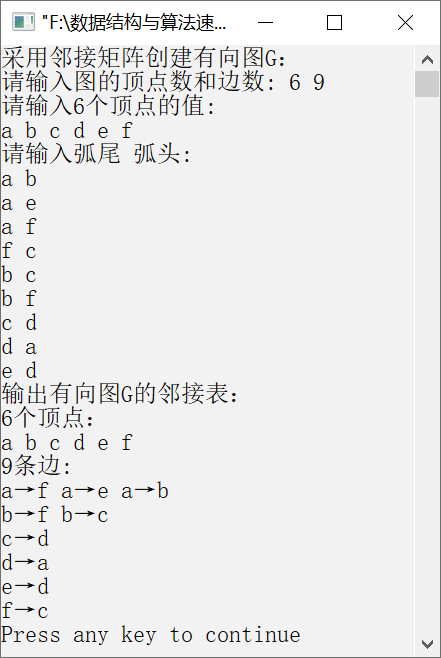

### 8.1.2　利用邻接表创建有向图


**问题描述**


假设以邻接表作为图的存储结构，编写算法，创建有向图并输出邻接表。


**【分析】**

本题主要考查对邻接表的理解。图的邻接表分为两个部分——表头节点和边表节点。因此利用邻接表创建有向图也分为两个部分。一是创建表头节点，二是创建边表节点构成的边表。

创建表头节点就是根据输入的顶点信息，将顶点直接存入对应的数据域中，并且将该顶点的指针域置为空。

```c
for(i=0;i<G->vexnum;i++)                //将顶点存储在表头节点中
{
    cin>>G->vertex[i].data;
    G->vertex[i].firstarc=NULL;         //将相关联的顶点的指针域置为空
}
```

创建边表就是根据输入的弧信息，创建新节点，并将该节点插入对应的链表中。

```c
for(k=0;k<G->arcnum;k++)                //建立边表
{
    cin>>v1>>v2;
    i=LocateVertex(*G,v1);              /*确定v1对应的编号*/
    j=LocateVertex(*G,v2);              /*确定v2对应的编号*/
    p=(ArcNode*)malloc(sizeof(ArcNode));
    p->adjvex=j;
    p->nextarc=G->vertex[i].firstarc;   //插入编号为i的链表中
    G->vertex[i].firstarc=p;
}
```


第8章\实例8-02.cpp

```c
/********************************************
*实例说明：利用邻接表创建有向图
*********************************************/
#include<stdlib.h>
#include<stdio.h>
#include<malloc.h>
#include<string.h>
#include<iostream.h>
/*图的邻接表类型定义*/
typedef char VertexType[4];
typedef char InfoPtr;
typedef int VRType;
#define MAXSIZE 100                 
typedef enum{DG,DN,UG,UN}GraphKind; 
typedef struct ArcNode              
{
    int adjvex;                     
    InfoPtr *info;                  
    struct ArcNode *nextarc;        
}ArcNode;
typedef struct VNode                
{
    VertexType data;                
    ArcNode *firstarc;              
}VNode,AdjList[MAXSIZE];
typedef struct                      
{
    AdjList vertex;
    int vexnum,arcnum;              
    GraphKind kind;                 
}AdjGraph;
int LocateVertex(AdjGraph G,VertexType v);
void CreateGraph(AdjGraph *G);
void DisplayGraph(AdjGraph *G);
void DestroyGraph(AdjGraph *G);
int LocateVertex(AdjGraph G,VertexType v)
//返回有向图中顶点对应的位置
{
    int i;
    for(i=0;i<G.vexnum;i++)
    if(strcmp(G.vertex[i].data,v)==0)
    return i;
    return -1;
}
void CreateGraph(AdjGraph *G)
//采用邻接表创建有向图G
{
    int i,j,k;
    VertexType v1,v2;                    //定义两个顶点v1和v2
    ArcNode *p;
    cout<<"请输入有向图的顶点数和边数: ";
    cin>>(*G).vexnum>>(*G).arcnum;
    cout<<"请输入"<<G->vexnum<<"个顶点的值:"<<endl;
    for(i=0;i<G->vexnum;i++)             //将顶点存储在表头节点中
{
    cin>>G->vertex[i].data;
    G->vertex[i].firstarc=NULL;          //将相关联的顶点的指针域置为空
}
cout<<"请输入弧尾  弧头:"<<endl;
for(k=0;k<G->arcnum;k++)                 //建立边表
{
    cin>>v1>>v2;
    i=LocateVertex(*G,v1);           /*确定v1对应的编号*/
    j=LocateVertex(*G,v2);           /*确定v2对应的编号*/
    /*以j为弧头、i为弧尾创建邻接表*/
    p=(ArcNode*)malloc(sizeof(ArcNode));
    p->adjvex=j;
    p->info=NULL;
    p->nextarc=G->vertex[i].firstarc;
    G->vertex[i].firstarc=p;
}
 (*G).kind=DG;
}
void DestroyGraph(AdjGraph *G)
//销毁有向图G
{
    int i;
    ArcNode *p,*q;
    for(i=0;i<(*G).vexnum;i++)       //释放有向图中的边表节点
        {
        p=G->vertex[i].firstarc;     //p指向边表的第一个节点
        if(p!=NULL)                  //如果边表不为空，则释放边表的节点
        {
    q=p->nextarc;
    free(p);
    p=q;
    }
    }
     (*G).vexnum=0;                 
     (*G).arcnum=0;                 
}
void DisplayGraph(AdjGraph G)
//输出有向图的邻接矩阵
{
    int i;
    ArcNode *p;
    cout<<G.vexnum<<"个顶点："<<endl;
    for(i=0;i<G.vexnum;i++)
    cout<<G.vertex[i].data<<" ";
    cout<<endl<<G.arcnum<<"条边:"<<endl;
    for(i=0;i<G.vexnum;i++)
        {
        p=G.vertex[i].firstarc;
    while(p)
    {
        cout<<G.vertex[i].data<<"→"<<G.vertex[p->adjvex].data<<" ";
        p=p->nextarc;
    }
    cout<<endl;
}
}
void main()
{
    AdjGraph G;
    cout<<"采用邻接矩阵创建有向图G："<<endl;
    CreateGraph(&G);
    cout<<"输出有向图G的邻接表："<<endl;
    DisplayGraph(G);
    DestroyGraph(&G);
}
```

运行结果如图8.7所示。


<center class="my_markdown"><b class="my_markdown">图8.7　运行结果</b></center>

