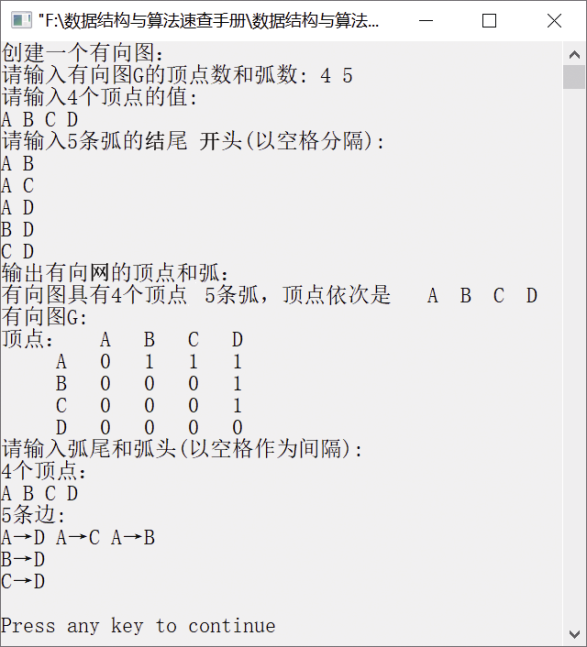

### 8.1.3　把图的邻接矩阵表示转换为邻接表表示


**问题描述**


编写算法，试把图的邻接矩阵表示转换为邻接表表示。


**【分析】**

这是哈尔滨工业大学考研试题。本题要求实现图邻接矩阵表示到邻接表表示的转换，因此需要熟悉图的邻接矩阵存储结构和图的邻接表存储结构的特点。由于有向图和无向图的邻接存储结构不同，并与带权图的存储存在一定差别，因此这里只给出有向图的邻接矩阵表示到邻接表表示的转换。


第8章\实例8-03.cpp

```c
/********************************************
*实例说明：把有向图的邻接矩阵表示转换为邻接表表示
*********************************************/
#include<stdio.h>
#include<string.h>
#include<malloc.h>
#include<stdlib.h>
#include<iostream.h>
#include<iomanip.h>
typedef char VertexType[4];
typedef char InfoPtr;
typedef int VRType;
#define MAXSIZE 50                   
typedef enum{DG,DN,UG,UN}GraphKind;  
//以下是邻接矩阵的类型定义
typedef struct
{
    VRType adj;                      
    InfoPtr *info;                   
}AdjMatrix[MAXSIZE][MAXSIZE];
typedef struct                       
{
    VertexType vex[MAXSIZE];         
    AdjMatrix arc;                  
    int vexnum,arcnum;              
    GraphKind kind;                 
}MGraph;
//以下是邻接表的类型定义
typedef struct ArcNode              
{
    int adjvex;                     
    InfoPtr *info;                  
    struct ArcNode *nextarc;        
}ArcNode;
typedef struct VNode                
{
    VertexType data;                
    ArcNode *firstarc;              
}VNode,AdjList[MAXSIZE];
typedef struct                      
{
    AdjList vertex;
    int vexnum,arcnum;              
    GraphKind kind;                 
}AdjGraph;
void CreateGraph(MGraph *G);
int LocateVertex(MGraph G,VertexType v);
void DestroyGraph(MGraph *G);
void DisplayGraph(MGraph G);
void DisplayAdjGraph(AdjGraph G);
void ConvertGraph(AdjGraph *A,MGraph M);
void main()
{
    MGraph M;
    AdjGraph A;
    cout<<"创建一个有向图："<<endl;
    CreateGraph(&M);
    cout<<"输出有向网的顶点和弧："<<endl;
    DisplayGraph(M);
    ConvertGraph(&A,M);
    DisplayAdjGraph(A);
    DestroyGraph(&M);
}
void CreateGraph(MGraph *G)
/*采用邻接矩阵创建有向图G*/
{
    int i,j,k;
    VertexType v1,v2;
    cout<<"请输入有向图G的顶点数和弧数: ";
    cin>>(*G).vexnum>>(*G).arcnum;
    cout<<"请输入"<<G->vexnum<<"个顶点的值:"<<endl;
    for(i=0;i<G->vexnum;i++)       /*创建一个数组，以保存有向图的各个顶点*/
    cin>>G->vex[i];
    for(i=0;i<G->vexnum;i++)       /*初始化邻接矩阵*/
    for(j=0;j<G->vexnum;j++)
    {
        G->arc[i][j].adj=0;
        G->arc[i][j].info=NULL;    /*弧的信息初始化为空*/
    }
    cout<<"请输入"<<G->arcnum<<"条弧的结尾  开头(以空格分隔): "<<endl;
    for(k=0;k<G->arcnum;k++)
    {
        cin>>v1>>v2;               /*输入两个顶点元素*/
    i=LocateVertex(*G,v1);
    j=LocateVertex(*G,v2);
    G->arc[i][j].adj=1;
    }
    G->kind=DG;                    /*图的类型为有向图*/
}
int LocateVertex(MGraph G,VertexType v)
{
    int i;
    for(i=0;i<G.vexnum;++i)
    if(strcmp(G.vex[i],v)==0)
    return i;
    return -1;
}
void DestroyGraph(MGraph *G)
/*销毁有向图G*/
{
    int i,j;
    for(i=0;i<G->vexnum;i++)      
        for(j=0;j<G->vexnum;j++)
        if(G->arc[i][j].adj!=0)   
        if(G->arc[i][j].info!=NULL)
{
        free(G->arc[i][j].info);
        G->arc[i][j].info=NULL;
}
G->vexnum=0;                    
G->arcnum=0;                    
}
void DisplayGraph(MGraph G)
/*输出邻接矩阵存储表示的有向图G*/
{
    int i,j;
    cout<<"有向图具有"<<G.vexnum<<"个顶点"  <<G.arcnum<<"条弧，顶点依次是 ";
    for(i=0;i<G.vexnum;++i)         /*输出有向图的顶点*/
        cout<<"  "<<G.vex[i];
        cout<<endl<<"有向图G:"<<endl;
        /*输出有向图G的邻接矩阵*/
        cout<<"顶点：";
    for(i=0;i<G.vexnum;i++)
        cout<<setw(4)<<G.vex[i];
        cout<<endl;
        for(i=0;i<G.vexnum;i++)
    {
            cout<<setw(6)<<G.vex[i];
            for(j=0;j<G.vexnum;j++)
            cout<<setw(4)<<G.arc[i][j].adj;
            cout<<endl;
    }
}
void ConvertGraph(AdjGraph *A,MGraph M)
//将采用邻接矩阵表示的有向图M转换成邻接表A
{
    int i,j;
    ArcNode *p;
    A->vexnum=M.vexnum;
    A->arcnum=M.arcnum;
    A->kind=M.kind;
    for(i=0;i<A->vexnum;i++)            /*将顶点存储在表头节点中*/
    {
        strcpy(A->vertex[i].data,M.vex[i]);
        A->vertex[i].firstarc=NULL;     /*将相关联的顶点置为空*/
}
    printf("请输入弧尾和弧头(以空格作为间隔):\n");
    for(i=0;i<M.arcnum;i++)            /*建立边表*/
        for(j=0;j<M.arcnum;j++)
        if(M.arc[i][j].adj==1)
        {    
             /*j为弧头、i为弧尾创建邻接表*/
             p=(ArcNode*)malloc(sizeof(ArcNode));
             p->adjvex=j;
             p->info=NULL;
             p->nextarc=A->vertex[i].firstarc;
             A->vertex[i].firstarc=p;
        }
        (*A).kind=DG;
}
void DisplayAdjGraph(AdjGraph G)
/*输出有向图的邻接矩阵G*/
{
    int i;
    ArcNode *p;
    cout<<G.vexnum<<"个顶点："<<endl;
    for(i=0;i<G.vexnum;i++)
        cout<<G.vertex[i].data<<" ";
        cout<<endl<<G.arcnum<<"条边:"<<endl;
    for(i=0;i<G.vexnum;i++)
    {
        p=G.vertex[i].firstarc;
    while(p)
    {
        cout<<G.vertex[i].data<<"→"
        <<G.vertex[p->adjvex].data<<" ";
        p=p->nextarc;
    }
    cout<<endl;
    }
}
```

运行结果如图8.8所示。


<center class="my_markdown"><b class="my_markdown">图8.8　运行结果</b></center>

