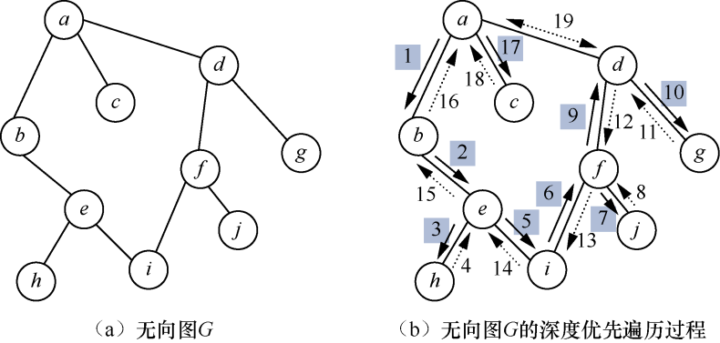
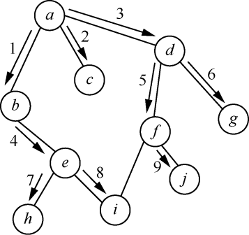

### 8.2　图的遍历

**【图的深度优先搜索遍历】**

图的深度优先搜索（depth_first search）遍历是树的先序遍历的推广。图的深度优先搜索遍历的思想如下。

从图中某个顶点v0出发，访问顶点v0的第一个邻接顶点，然后以该邻接顶点为新的顶点，访问该顶点的邻接顶点。重复执行以上操作，直到当前顶点没有邻接顶点为止。接下来，返回上一个已经访问过但还有未被访问的邻接顶点的顶点，按照以上步骤继续访问该顶点的其他未被访问的邻接顶点。以此类推，直到图中所有的顶点都被访问过。

对于图8.9（a）所示的无向图，深度优先搜索遍历过程如图8.9（b）所示。其中，实线箭头表示访问顶点的方向，虚线箭头表示回溯，带阴影的数字编号表示访问的顺序，不带阴影的数字编号表示回溯的顺序。

<b class="my_markdown">图8.9　无向图G及其深度优先搜索遍历过程</b>

图的深度优先搜索遍历过程如下。

（1）访问顶点a，顶点a的邻接顶点有b、c、d，因此开始访问顶点a的第一个邻接顶点b。

（2）顶点b未访问的邻接顶点只有顶点e，因此访问顶点e。

（3）顶点e的邻接顶点有h和i，且都未被访问，先访问顶点h。

（4）顶点h的邻接顶点只有e，且已被访问，回溯到上一个顶点e。

（5）访问e的下一个邻接顶点i。

（6）顶点i的邻接顶点f还没有被访问，则访问顶点f。

（7）顶点f的邻接顶点有j和d，且都没有被访问，先访问顶点j。

（8）顶点j的邻接顶点都已访问过，则回溯到上一个顶点f。

（9）访问顶点d。

（10）顶点d的邻接顶点有f、g和a，只有g还没有被访问，因此访问顶点g。

（11）顶点g的所有邻接顶点都已经被访问，则回溯到上一个顶点d，同理顶点d的所有邻接顶点也已经被访问，则继续回溯到顶点a。

（12）顶点a的邻接顶点c还没有被访问，因此访问顶点c。顶点c没有未被访问的邻接顶点，回溯到上一个顶点a，顶点a的所有邻接顶点都已经被访问，因此无向图G的深度优先搜索遍历序列为a、b、e、h、i、f、j、d、g、c。

**【图的广度优先搜索遍历】**

图的广度优先搜索（breadth first search）遍历类似于树的层次遍历过程。图的广度优先搜索遍历的思想如下。

从图的某个顶点v出发，在访问了v之后依次访问v的各个未曾访问过的邻接顶点，然后分别从这些邻接顶点出发依次访问它们的邻接顶点，并使“先被访问的顶点的邻接顶点”先于“后被访问的顶点的邻接顶点”被访问，直至图中所有已被访问的顶点的邻接顶点都被访问到。若此时图中还有顶点未被访问，则另选图中一个未曾被访问的顶点作为起始顶点，重复上述过程，直至图中的所有顶点都被访问为止。

例如，图8.9所示无向图G的广度优先搜索遍历过程如图8.10所示。其中，箭头和数字编号分别表示广度优先搜索遍历的方向和顺序。图G的广度优先搜索遍历的过程如下。

<b class="my_markdown">图8.10　图G的广度优先搜索遍历过程</b>

（1）从顶点a出发，因为顶点a还未被访问过，所以访问顶点a。

（2）顶点a的邻接顶点有b、c、d，先访问a的第1个邻接顶点b。

（3）顶点a的邻接顶点c还没有被访问，故访问邻接顶点c。

（4）同上，访问邻接顶点d。

（5）顶点b的邻接顶点e未被访问，故访问邻接顶点e。

（6）顶点d的邻接顶点f和g未被访问，故访问邻接顶点f。

（7）访问邻接顶点g。

（8）顶点e的邻接顶点有h和i，且未被访问，故访问邻接顶点h。

（9）访问邻接顶点i。

（10）顶点f的邻接顶点是i和j，其中邻接顶点i已被访问，故访问邻接顶点j。

因此，图G的广度优先搜索遍历序列为a、b、c、d、e、f、g、h、i、j。

