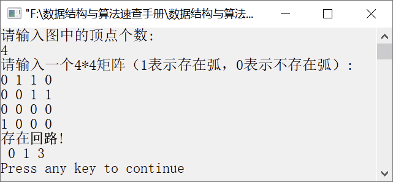
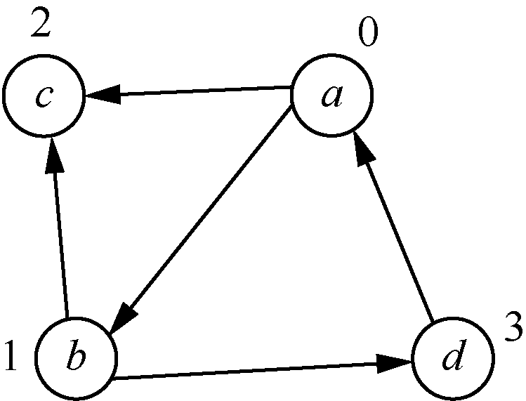

### 8.2.1　判断有向图中是否存在回路


**问题描述**


实现算法，判断在给定的有向图中是否存在一个回路。若存在，则以顶点序列的方式输出该回路（找到一条即可）（注：图中不存在顶点到自身的弧）。


**【分析】**

这是清华大学的考研试题。为了判断有向图中是否存在回路，可通过深度优先搜索遍历的方法实现。从编号为0的顶点出发，若两个顶点间存在路径，则记录起始顶点，并将该顶点标记为已访问（标记为−1）。在遍历的过程中，若有顶点与起始顶点相同，则说明存在回路。


第8章\实例8-04.cpp

```c
/********************************************
*实例说明：判断有向图中是否存在回路
*********************************************/
#include<iostream.h>
#include<stdlib.h>
#include<stdio.h>
#include<string.h>
#include<conio.h>
const int N=100;
int G[N][N];//0表示不存在弧，1表示存在弧
int path[N], visited[N],n,cycle;
int DFS(int u,int start)
//深度优先搜索遍历有向图
{
    int i;
    visited[u] =-1;            //顶点u标记为已访问
    path[u] =start;            //记录起始顶点
    for(i=0;i<n;i++)
    {
        if(G[u][i]&&i!=start)   
        {
            if(visited[i]<0)
            {
            cycle =u;
            return 0;
            }
    if(!DFS(i,u))              //若存在路径，则继续深度优先搜索遍历
    return 0;
    }
    }
    visited[u] =1;
    return 1;              
}
void DisPath(int u)
//输出回路中的顶点
{
    if(u<0)
    return;
    DisPath(path[u]);
    cout<<" "<<u;
}
void main()
{
    int i,j;
    cout<<"请输入图中的顶点个数:"<<endl;
    cin>>n;
 memset(G,0,sizeof(G));
    cout<<"请输入一个"<<n<<"*"<<n<<"矩阵（1表示存在弧，0表示不存在弧）:"<<endl;
for(i = 0;i < n;i++)
{
    for(j = 0;j < n;j++)
    {
        cin>>G[i][j];
}
 }
cycle =-1;
for(i=0;i<n;i++)
{
    if(!visited[i]&&!DFS(i,-1))       //顶点i还没有被访问
    break;
}
if(cycle<0)
    cout<<"不存在回路!"<<endl;
else
{
    cout<<"存在回路!"<<endl;
    DisPath(cycle);
    cout<<endl;
}
}
```

运行结果如图8.11所示。


<center class="my_markdown"><b class="my_markdown">图8.11　运行结果</b></center>

创建的4×4矩阵对应的有向图如图8.12所示。


<center class="my_markdown"><b class="my_markdown">图8.12　有向图</b></center>

其中，a、b、c、d对应的编号分别为0、1、2、3。有向图有5条弧，分别是<a,b>、<a,c>、<b,c>、<b,d>和<d,a>。因此存在回路——a→b→d→a。

