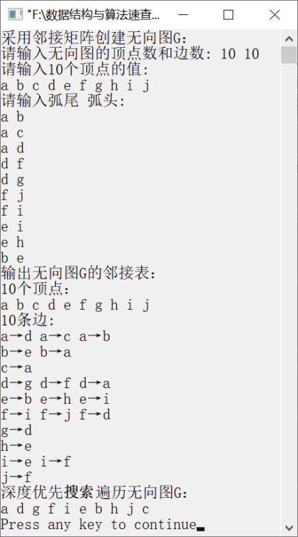

### 8.2.2　深度优先搜索遍历无向图


**问题描述**


实现一个递归算法，采用深度优先搜索对无向图进行遍历，并对算法中的无向图的存储结构予以简单说明。


**【分析】**

这是大连理工大学的考研试题。

在无向图的深度优先搜索遍历过程中，无向图中可能存在回路。因此，在访问了某个顶点之后，沿着某条路径遍历，有可能又回到该顶点。例如，对于图8.9所示的无向图G，在访问了顶点a之后，接着访问顶点b、e、h、i、f、j、d、g、c。顶点d的邻接顶点是顶点a，沿着边(d,a)遍历会再次访问顶点a。为了避免再次访问已访问过的顶点，需设置一个数组visited，记录顶点是否已被访问。

定义一个数组visited，记录顶点是否被访问过，初始时为0，访问过为1。然后对每个没有被访问过的顶点进行深度优先搜索遍历。若某个顶点u未被访问，则输出该顶点，并将该顶点标记为已访问，接着准备遍历u的第一个邻接顶点v；若u的这个邻接顶点v还没有被访问，则对该邻接顶点v进行深度优先搜索遍历；若v的所有邻接顶点已经被访问，则开始遍历u的其他邻接顶点。重复以上过程，直到所有顶点都已被访问。

例如，图8.10中的无向图G的深度优先搜索遍历序列有a、b、e、h、i、f、j、d、g、c和a、d、g、f、i、e、b、h、j、c。


第8章\实例8-05.cpp

```c
/********************************************
*实例说明：深度优先搜索遍历无向图
*********************************************/
#include<stdlib.h>
#include<stdio.h>
#include<malloc.h>
#include<string.h>
#include<iostream.h>
/*图的邻接表类型定义*/
typedef char VertexType[4];
typedef char InfoPtr;
typedef int VRType;
#define MAXSIZE 100                     
typedef enum{DG,DN,UG,UN}GraphKind;     
typedef struct ArcNode                  
{
    int adjvex;                         
    InfoPtr *info;                      
    struct ArcNode *nextarc;            
}ArcNode;
typedef struct VNode                    
{
    VertexType data;                    
    ArcNode *firstarc;                  
}VNode,AdjList[MAXSIZE];
typedef struct                          
{
    AdjList vertex;
    int vexnum,arcnum;
    GraphKind kind;   
}AdjGraph;
int LocateVertex(AdjGraph G,VertexType v);
void CreateGraph(AdjGraph *G);
void DisplayGraph(AdjGraph G);
void DestroyGraph(AdjGraph *G);
void DFSTraverse(AdjGraph G);
int LocateVertex(AdjGraph G,VertexType v)
//返回无向图中顶点对应的位置
{
    int i;
    for(i=0;i<G.vexnum;i++)
        if(strcmp(G.vertex[i].data,v)==0)
        return i;
    return -1;
}
void CreateGraph(AdjGraph *G)
//采用邻接表创建无向图G
{
        int i,j,k;
        VertexType v1,v2;                     //定义两个顶点v1和v2
        ArcNode *p;
        cout<<"请输入无向图的顶点数和边数: ";
        cin>>(*G).vexnum>>(*G).arcnum;
        cout<<"请输入"<<G->vexnum<<"个顶点的值:"<<endl;
    for(i=0;i<G->vexnum;i++)                 //将顶点存储在表头节点中
    {
        cin>>G->vertex[i].data;
        G->vertex[i].firstarc=NULL;          //将相关联的顶点置为空
    }
    cout<<"请输入弧尾  弧头:"<<endl;
    for(k=0;k<G->arcnum;k++)                 //建立边表
    {
        cin>>v1>>v2;
        i=LocateVertex(*G,v1);               /*确定v1对应的编号*/
        j=LocateVertex(*G,v2);               /*确定v2对应的编号*/
        //以j为弧头、i为弧尾创建邻接表
        p=(ArcNode*)malloc(sizeof(ArcNode));
        p->adjvex=j;
        p->info=NULL;
        p->nextarc=G->vertex[i].firstarc;
        G->vertex[i].firstarc=p;
        //以i为弧头、j为弧尾创建邻接表
        p=(ArcNode*)malloc(sizeof(ArcNode));
        p->adjvex=i;
        p->info=NULL;
        p->nextarc=G->vertex[j].firstarc;
        G->vertex[j].firstarc=p;
    }
     (*G).kind=UG;
}
void DestroyGraph(AdjGraph *G)
//销毁无向图G
{
    int i;
    ArcNode *p,*q;
    for(i=0;i<(*G).vexnum;i++)      
    {
        p=G->vertex[i].firstarc;    
        if(p!=NULL)                 
    {
        q=p->nextarc;
        free(p);
        p=q;
        }
        }
        (*G).vexnum=0;           
        (*G).arcnum=0;           
}
void DFS(AdjGraph G,int i,int visited[])
//从顶点v出发递归深度优先搜索遍历无向图G
{
    ArcNode *p;
    if(!visited[i])
           cout<<G.vertex[i].data<<" ";
           visited[i]=1;
           p=G.vertex[i].firstarc;  //得到i号顶点的第一个邻接顶点
    while(p!=NULL)
    {
        if(!visited[p->adjvex])
        DFS(G,p->adjvex,visited);
        p=p->nextarc;               //得到i号顶点的下一个邻接顶点
    }
    }
    void DFSTraverse(AdjGraph G)
    //从v=0出发深度优先搜索遍历整个无向图
    {
        int v,u,visited[MAXSIZE];
        for(v=0;v<G.vexnum;v++)
    visited[v]=0;
    for(u=0;u<G.vexnum;u++)
    if(!visited[u])
        DFS(G,u,visited);
}
void DisplayGraph(AdjGraph G)
//输出无向图的邻接矩阵G
{
    int i;
    ArcNode *p;
    cout<<G.vexnum<<"个顶点："<<endl;
    for(i=0;i<G.vexnum;i++)
        cout<<G.vertex[i].data<<" ";
        cout<<endl<<G.arcnum<<"条边:"<<endl;
    for(i=0;i<G.vexnum;i++)
    {
        p=G.vertex[i].firstarc;
    while(p)
    {
        cout<<G.vertex[i].data<<"→"<<G.vertex[p->adjvex].data<<" ";
        p=p->nextarc;
    }
    cout<<endl;
}
}
void main()
{
    AdjGraph G;
    cout<<"采用邻接矩阵创建无向图G："<<endl;
    CreateGraph(&G);
    cout<<"输出无向图G的邻接表："<<endl;
    DisplayGraph(G);
    cout<<"深度优先搜索遍历无向图G："<<endl;
    DFSTraverse(G);
    cout<<endl;
    DestroyGraph(&G);
}
```

运行结果如图8.13所示。


<center class="my_markdown"><b class="my_markdown">图8.13　运行结果</b></center>

**【说明】**

创建无向图和有向图的邻接表的区别仅在于：对于有向图，只需要创建以i为弧尾、j为弧头的链表；对于无向图，还需要创建一个以i为弧头、j为弧尾的链表。

