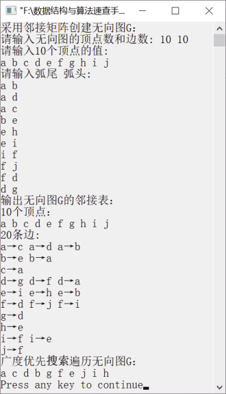

### 8.2.3　图的广度优先搜索遍历


**问题描述**


假设一个无向图以邻接表方式存储，编写一个广度优先搜索遍历图的算法。


**【分析】**

定义一个数组visited，用来标记顶点是否已被访问。初始时，数组初始化为0，表示顶点未被访问；数组初始化为1，表示顶点已被访问。从第1个顶点v<sub class="my_markdown">0</sub>出发，访问该顶点并置visited[v<sub class="my_markdown">0</sub>]为1，然后将v<sub class="my_markdown">0</sub>入队。若队列不为空，则将队头元素（即顶点）出队，依次访问该顶点的所有邻接顶点，同时将这些顶点标记为已访问，并将其邻接顶点依次入队。重复以上操作，直到无向图中的所有顶点都已被访问过。


第8章\实例8-06.cpp

```c
/********************************************
*实例说明：图的广度优先搜索遍历
*********************************************/
#include<stdlib.h>
#include<stdio.h>
#include<malloc.h>
#include<string.h>
#include<iostream.h>
/*图的邻接表类型定义*/
typedef char VertexType[4];
typedef char InfoPtr;
typedef int VRType;
#define MAXSIZE 100                    
typedef enum{DG,DN,UG,UN}GraphKind;    
typedef struct ArcNode                 
{
    int adjvex;                        
    InfoPtr *info;                     
    struct ArcNode *nextarc;           
}ArcNode;
typedef struct VNode                   
{
    VertexType data;                   
    ArcNode *firstarc;                 
}VNode,AdjList[MAXSIZE];
typedef struct                         
{
    AdjList vertex;
    int vexnum,arcnum;                 
    GraphKind kind;                    
}AdjGraph;
int LocateVertex(AdjGraph G,VertexType v);
void CreateGraph(AdjGraph *G);
void DisplayGraph(AdjGraph G);
void DestroyGraph(AdjGraph *G);
void DFSTraverse(AdjGraph G);
int LocateVertex(AdjGraph G,VertexType v)
//返回无向图中顶点对应的位置
{
    int i;
    for(i=0;i<G.vexnum;i++)
        if(strcmp(G.vertex[i].data,v)==0)
            return i;
    return -1;
}
void CreateGraph(AdjGraph *G)
//采用邻接表创建无向图G
{
    int i,j,k; 
    VertexType v1,v2;                      //定义两个顶点v1和v2
    ArcNode *p;
    cout<<"请输入无向图的顶点数和边数: ";
    cin>>(*G).vexnum>>(*G).arcnum;
    cout<<"请输入"<<G->vexnum<<"个顶点的值:"<<endl;
    for(i=0;i<G->vexnum;i++)              //将顶点存储在表头节点中
    {
        cin>>G->vertex[i].data;
        G->vertex[i].firstarc=NULL;       //将相关联的顶点置为空
    }
    cout<<"请输入弧尾  弧头:"<<endl;
    for(k=0;k<G->arcnum;k++)              //建立边表
    {
        cin>>v1>>v2;
        i=LocateVertex(*G,v1);            /*确定v1对应的编号*/
        j=LocateVertex(*G,v2);            /*确定v2对应的编号*/
        //以j为弧头、i为弧尾创建邻接表
        p=(ArcNode*)malloc(sizeof(ArcNode));
        p->adjvex=j;
        p->info=NULL;
        p->nextarc=G->vertex[i].firstarc;
        G->vertex[i].firstarc=p;
        //以i为弧头、j为弧尾创建邻接表
        p=(ArcNode*)malloc(sizeof(ArcNode));
        p->adjvex=i;
        p->info=NULL;
        p->nextarc=G->vertex[j].firstarc;
        G->vertex[j].firstarc=p;
    }
    (*G).kind=UG;
}
void DestroyGraph(AdjGraph *G)
//销毁无向图G
{
    int i;
    ArcNode *p,*q;
    for(i=0;i<(*G).vexnum;i++)           
    {
        p=G->vertex[i].firstarc;         
        if(p!=NULL)                      
        {
            q=p->nextarc;
            free(p);
            p=q;
        }
    }
     (*G).vexnum=0;                     
     (*G).arcnum=0;                     
}
void BFSTraverse(AdjGraph G)
//非递归广度优先搜索遍历无向图G
{
    int v,front,rear,visited[MAXSIZE];
    int queue[MAXSIZE];                  
    ArcNode *p;
    front=rear=-1;                       
    for(v=0;v<G.vexnum;v++)              
        visited[v]=0;    
    v=0;
    visited[v]=1;                        
    cout<<G.vertex[v].data<<" ";
    rear=(rear+1)%MAXSIZE;
    queue[rear]=v;                       
    while(front<rear)                    
    {
        front=(front+1)%MAXSIZE;
        v=queue[front];                
        p=G.vertex[v].firstarc;
        while(p!=NULL)                  
        {
            if(visited[p->adjvex]==0)   
            {
                visited[p->adjvex]=1;
                cout<<G.vertex[p->adjvex].data<<" ";
                rear=(rear+1)%MAXSIZE;
                queue[rear]=p->adjvex;
            }
            p=p->nextarc;             
        }
    }
}
void DisplayGraph(AdjGraph G)
//输出无向图的邻接矩阵G
{
    int i;
    ArcNode *p;
    cout<<G.vexnum<<"个顶点："<<endl;
    for(i=0;i<G.vexnum;i++)
        cout<<G.vertex[i].data<<" ";
    cout<<endl<<2*G.arcnum<<"条边:"<<endl;
    for(i=0;i<G.vexnum;i++)
    {
        p=G.vertex[i].firstarc;
        while(p)
        {
            cout<<G.vertex[i].data<<"→"<<G.vertex[p->adjvex].data<<" ";
            p=p->nextarc;
        }
        cout<<endl;
    }
}
void main()
{
    AdjGraph G;
    cout<<"采用邻接矩阵创建无向图G："<<endl;
    CreateGraph(&G);
    cout<<"输出无向图G的邻接表："<<endl;
    DisplayGraph(G);
    cout<<"广度优先搜索遍历无向图G："<<endl;
    BFSTraverse(G);
    cout<<endl;
    DestroyGraph(&G);
}
```

运行结果如图8.14所示。


<center class="my_markdown"><b class="my_markdown">图8.14　运行结果</b></center>

