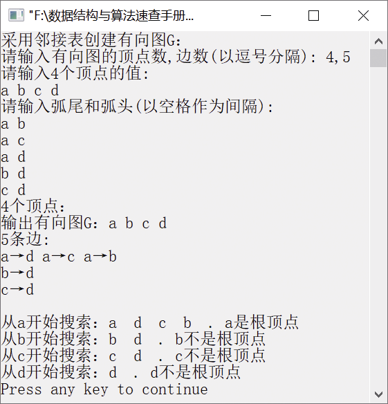

### 8.2.4　判断有向图中是否有根顶点


**问题描述**


在有向图G中，如果顶点r到G中每个顶点都有路径可达，则称顶点r为有向图G的根顶点。编写一个算法判断有向图G中是否有根顶点，如果有，则输出所有根顶点的值。


**【分析】**

这是东北大学和浙江大学的考研试题，主要考查对图的深度优先搜索遍历的理解。若从某个顶点出发可遍历到所有其他顶点，则该顶点为根顶点；否则，不是根顶点。对每个顶点遍历一次即可完成任务。


第8章\实例8-07.cpp

```c
/********************************************
*实例说明：判断有向图中是否有根顶点
*********************************************/
#include<stdlib.h>
#include<stdio.h>
#include<malloc.h>
#include<string.h>
#include<iostream.h>
//图的邻接表类型定义
typedef char VertexType[4];
typedef char InfoPtr;
typedef int VRType;
#define MAXSIZE 100                  
typedef enum{DG,DN,UG,UN}GraphKind;  
typedef struct ArcNode               
{
    int adjvex;                      
    InfoPtr *info;                   
    struct ArcNode *nextarc;         
}ArcNode;
typedef struct VNode                 
{
    VertexType data;                 
    ArcNode *firstarc;               
}VNode,AdjList[MAXSIZE];
typedef struct                       
{
    AdjList vertex;
    int vexnum,arcnum;               
    GraphKind kind;                  
}AdjGraph;
//函数声明
int LocateVertex(AdjGraph G,VertexType v);
void CreateGraph(AdjGraph *G);
void DisplayGraph(AdjGraph G);
void DestroyGraph(AdjGraph *G);
void DFSTraverse(AdjGraph G);
int LocateVertex(AdjGraph G,VertexType v)
//返回无向图中顶点对应的位置
{
    int i;
    for(i=0;i<G.vexnum;i++)
        if(strcmp(G.vertex[i].data,v)==0)
            return i;
        return -1;
}
void CreateGraph(AdjGraph *G)
//采用邻接表创建有向图G
{
    int i,j,k;
    VertexType v1,v2;                  //定义两个顶点v1和v2
    ArcNode *p;
    printf("请输入有向图的顶点数,边数(以逗号分隔): ");
    scanf("%d,%d",&(*G).vexnum,&(*G).arcnum);
    printf("请输入%d个顶点的值:\n",G->vexnum);
    for(i=0;i<G->vexnum;i++)           //将顶点存储在表头节点中
    {
        scanf("%s",G->vertex[i].data);
        G->vertex[i].firstarc=NULL;    //将相关联的顶点置为空
    }
    printf("请输入弧尾和弧头(以空格作为间隔):\n");
    for(k=0;k<G->arcnum;k++)           //建立边表
    {
        scanf("%s%s",v1,v2);
        i=LocateVertex(*G,v1);
        j=LocateVertex(*G,v2);
        //以j为弧头、i为弧尾创建邻接表
        p=(ArcNode*)malloc(sizeof(ArcNode));
        p->adjvex=j;
        p->info=NULL;
        p->nextarc=G->vertex[i].firstarc;
        G->vertex[i].firstarc=p;
    }
     (*G).kind=DG;
}
void DestroyGraph(AdjGraph *G)
//销毁有向图G
{
    int i;
    ArcNode *p,*q;
    for(i=0;i<(*G).vexnum;++i)          
    {
        p=G->vertex[i].firstarc;        
        if(p!=NULL)                     
        {
            q=p->nextarc;
            free(p);
            p=q;
        }
    }
     (*G).vexnum=0;                    
     (*G).arcnum=0;                    
}
void DisplayGraph(AdjGraph G)
//输出有向图的邻接矩阵
{
    int i;
    ArcNode *p;
    printf("%d个顶点：\n",G.vexnum);
    for(i=0;i<G.vexnum;i++)
        cout<<G.vertex[i].data<<" ";
    cout<<endl<<G.arcnum<<"条边:"<<endl;
    for(i=0;i<G.vexnum;i++)
    {
        p=G.vertex[i].firstarc;
        while(p)
        {
            cout<<G.vertex[i].data<<"→"<<G.vertex[p->adjvex].data;
            p=p->nextarc;
        }
        cout<<endl;
    }
}
void visitvex(AdjGraph G,int i)
//输出有向图中第i个顶点
{
    cout<<G.vertex[i].data<<"  ";
}
void DFS(AdjGraph G,int i,int visited[],int *n)
//从顶点v出发深度优先搜索遍历有向图G
{
    ArcNode *p;
    visited[i]=1;
     (*n)++;
    visitvex(G,i);
    p=G.vertex[i].firstarc;                //得到i号顶点的第一个邻接顶点
    while(p!=NULL)
    {
        if(!visited[p->adjvex])
            DFS(G,p->adjvex,visited,n);
        p=p->nextarc;                      //得到i号顶点的下一个邻接顶点
    }
}
void DFSTraverse(AdjGraph G)
//从v=0出发深度优先搜索遍历整个有向图
{
    int v,u,n,visited[MAXSIZE];
    for(v=0;v<G.vexnum;v++)
    {
        cout<<"从"<<G.vertex[v].data<<"开始搜索：";
        for(u=0;u<G.vexnum;u++)
            visited[u]=0;
        n=0;
        DFS(G,v,visited,&n);
        if(n==G.vexnum)
            cout<<". "<<G.vertex[v].data<<"是根顶点"<<endl;
        else
            cout<<". "<<G.vertex[v].data<<"不是根顶点"<<endl;
    }
}
void main()
{
    AdjGraph G;
    cout<<"采用邻接表创建有向图G："<<endl;
    CreateGraph(&G);
    cout<<"输出有向图G：";
    DisplayGraph(G);
    DFSTraverse(G);
    DestroyGraph(&G);
}
```

运行结果如图8.15所示。


<center class="my_markdown"><b class="my_markdown">图8.15　运行结果</b></center>

