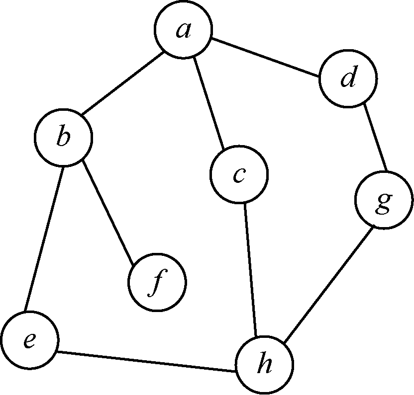
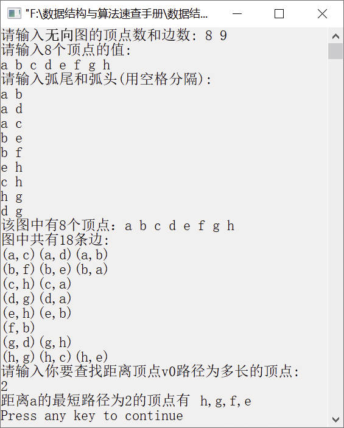

### 8.2.5　求距离顶点v0的最短路径长度为k的所有顶点


**问题描述**


实现算法，求出无向图中距离顶点v<sub class="my_markdown">0</sub>的最短路径长度（最短路径长度以边数为单位计算）为k的所有顶点，要求尽可能地节省时间。


**【分析】**

这是西北大学的考研试题。本题应用广度优先搜索遍历求解，若以顶点v<sub class="my_markdown">0</sub>作为生成树的根，即第1层，则距离顶点v<sub class="my_markdown">0</sub>的最短路径长度为k的顶点均在第（k+1）层。可用队列存放顶点，将遍历访问顶点的操作改为入队操作。队列中设头尾指针分别为f和r，用level表示层数。

本题主要考察图的遍历。可以采用图的广度优先搜索遍历，找出第k层的所有顶点。一个无向图如图8.16所示，该图具有8个顶点和9条边。


<center class="my_markdown"><b class="my_markdown">图8.16　无向图</b></center>

利用广度优先搜索遍历对图进行遍历。从v<sub class="my_markdown">0</sub>开始，依次访问与v<sub class="my_markdown">0</sub>相邻接的各个顶点，利用一个队列存储所有已经访问过的顶点和该顶点与v<sub class="my_markdown">0</sub>之间的最短路径，并将该顶点的标志位置为1，表示已经访问过。依次取出队列的各个顶点，如果该顶点存在未访问过的邻接顶点，则首先判断该顶点是否距离v<sub class="my_markdown">0</sub>的最短路径长度为k。如果满足条件，则将该邻接顶点输出；否则，将该邻接顶点入队，并将距离v<sub class="my_markdown">0</sub>的路径长度加1。重复执行以上操作，直到队列为空或者存在满足条件的顶点为止。


第8章\实例8-08.cpp

```c
/********************************************
*实例说明：求距离顶点v0的最短路径长度为k的所有顶点
*********************************************/
#include<stdlib.h>
#include<stdio.h>
#include<malloc.h>
#include<string.h>
#include<iostream.h>
/*图的邻接表类型定义*/
typedef char VertexType[4];
typedef char InfoPtr;
typedef int VRType;
#define MAXSIZE 100                     /*最大顶点个数*/
typedef enum{DG,DN,UG,UN}GraphKind;     
typedef struct ArcNode                  
{
    int adjvex;                         
    InfoPtr *info;                      
    struct ArcNode *nextarc;            
}ArcNode;
typedef struct VNode                    
{
    VertexType data;                    
    ArcNode *firstarc;                  
}VNode,AdjList[MAXSIZE];
typedef struct                          
{
    AdjList vertex;
    int vexnum,arcnum;                 
    GraphKind kind;                    
}AdjGraph;
void BsfLevel(AdjGraph G,int v0,int k)
/*在无向图G中，求距离顶点v0最短路径长度为k的所有顶点*/
{
    int visited[MAXSIZE];     
    int queue[MAXSIZE][2];    
    的路径长度*/
    int front=0,rear=-1,v,i,level,yes=0;
    ArcNode *p;
    for(i=0;i<G.vexnum;i++)
        visited[i]=0;
    rear=(rear+1)% MAXSIZE;
    queue[rear][0]=v0;
    queue[rear][1]=1;
    visited[v0]=1;         
    level=1;               
    do{
        v=queue[front][0];
        level=queue[front][1];
        front=(front+1)% MAXSIZE;
        p=G.vertex[v].firstarc;         /*p指向v的第一个邻接点*/
        while(p!=NULL)
        {
            if(visited[p->adjvex]==0)   /*如果该邻接顶点未被访问*/
            {
                if(level==k)
                {
                    if(yes==0)
                        cout<<"距离"<<G.vertex[v0].data<<"的最短路径为"<<k<<"的顶点有
                        "<<G.vertex[p->adjvex].data;
                    else
                        cout<<","<<G.vertex[p->adjvex].data;
                    yes=1;
                }
                visited[p->adjvex]=1;     /*访问标志置为1*/
                rear=(rear+1)% MAXSIZE;   /*并将该顶点入队*/
                queue[rear][0]=p->adjvex;
                queue[rear][1]=level+1;    
            }
            p=p->nextarc;
        }
    }while(front!=rear&&level<k+1);
    cout<<endl;
}
void DisplayGraph(AdjGraph G)
/*无向图G的邻接表的输出*/
{
    int i;
    ArcNode *p;
    cout<<"该图中有"<<G.vexnum<<"个顶点：";
    for(i=0;i<G.vexnum;i++)
        cout<<G.vertex[i].data<<" ";
    cout<<endl<<"图中共有"<<2*G.arcnum<<"条边:"<<endl;
    for(i=0;i<G.vexnum;i++)
    {
        p=G.vertex[i].firstarc;
        while(p)
        {
    cout<<"("<<G.vertex[i].data<<","<<G.vertex[p->adjvex].data<<")";
    p=p->nextarc;
        }
        cout<<endl;
    }
}
int LocateVertex(AdjGraph G,VertexType v)
/*返回无向图中顶点对应的位置*/
{
    int i;
    for(i=0;i<G.vexnum;i++)
        if(strcmp(G.vertex[i].data,v)==0)
            return i;
        return -1;
}
void CreateGraph(AdjGraph *G)
/*采用邻接表创建无向图G*/
{
    int i,j,k;
    VertexType v1,v2;                    /*定义两个顶点v1和v2*/
    ArcNode *p;
    cout<<"请输入无向图的顶点数和边数: ";
    cin>>(*G).vexnum>>(*G).arcnum;
    cout<<"请输入"<<G->vexnum<<"个顶点的值:"<<endl;
    for(i=0;i<G->vexnum;i++)             /*将顶点存储在表头节点中*/
    {
        cin>>G->vertex[i].data;
        G->vertex[i].firstarc=NULL;      /*将相关联的顶点置为空*/
    }
    cout<<"请输入弧尾和弧头(用空格分隔):"<<endl;
    for(k=0;k<G->arcnum;k++)             /*建立边表*/
    {
        cin>>v1>>v2;
        i=LocateVertex(*G,v1);
        j=LocateVertex(*G,v2);
        /*以j为弧头、i为弧尾创建邻接表*/
        p=(ArcNode*)malloc(sizeof(ArcNode));
        p->adjvex=j;
        p->info=NULL;
        p->nextarc=G->vertex[i].firstarc;
        G->vertex[i].firstarc=p;
        /*以i为弧头、j为弧尾创建邻接表*/
        p=(ArcNode*)malloc(sizeof(ArcNode));
        p->adjvex=i;
        p->info=NULL;
        p->nextarc=G->vertex[j].firstarc;
        G->vertex[j].firstarc=p;
    }
     (*G).kind=UG;
}
void DestroyGraph(AdjGraph *G)
/*销毁无向图G*/
{
    int i;
    ArcNode *p,*q;
    for(i=0;i<(*G).vexnum;++i)         /*释放无向图中的边表节点*/
    {
        p=G->vertex[i].firstarc;      
        if(p!=NULL)                   
        {
            q=p->nextarc;
            free(p);
            p=q;
        }
    }
     (*G).vexnum=0;                   
     (*G).arcnum=0;                   
}
void main()
{
    int k;
    AdjGraph G;
    CreateGraph(&G);                   /*采用邻接表创建无向图G*/
    DisplayGraph(G);                   /*输出无向图G*/
    cout<<"请输入你要查找距离顶点v0路径为多长的顶点:"<<endl;
    cin>>k;
    BsfLevel(G,0,k);                  
    DestroyGraph(&G);                 
}
```

运行结果如图8.17所示。


<center class="my_markdown"><b class="my_markdown">图8.17　运行结果</b></center>

