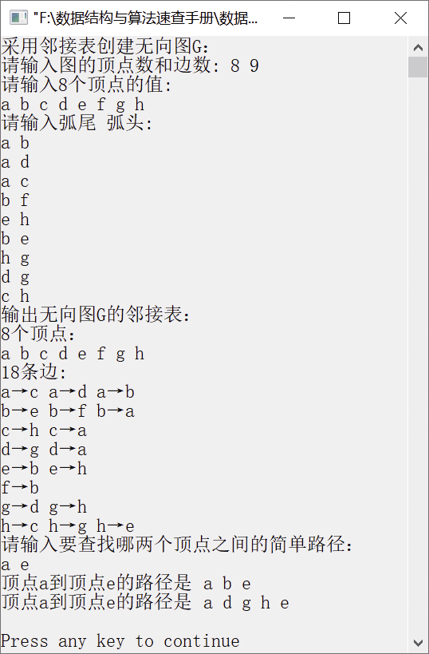

### 8.2.6　判断顶点u和顶点v之间是否存在简单路径


**问题描述**


已有用邻接表表示的无向图，设计算法判断顶点u和顶点v之间是否存在简单路径，若存在，则输出该路径上的顶点。要求先描述无向图的存储结构，并简述算法思路。查找邻接顶点等图的算法要自己实现（尽量采用非递归算法）。


**【分析】**

这是浙江大学考研试题，主要考查无向图的广度优先搜索遍历。从顶点u开始对有向图进行广度优先搜索遍历，如果访问到顶点v，则说明顶点u和顶点v之间存在一条路径。因为在有向图的遍历过程中，要求每个顶点只能访问一次，所以该路径一定是简单路径。在遍历过程中，将当前访问到的顶点都记录下来，就得到了从顶点u到顶点v的简单路径。可以利用一个一维数组parent记录访问过的顶点，如path[u]=w，则表示顶点w是顶点u的前驱顶点。如果顶点u到顶点v是一条简单路径，则输出该路径。


第8章\实例8-09.cpp

```c
/********************************************
*实例说明：判断顶点u和顶点v之间是否存在简单路径
*********************************************/
#include<stdlib.h>
#include<stdio.h>
#include<malloc.h>
#include<string.h>
#include<iostream.h>
#include"SeqStack.h"
/*图的邻接表类型定义*/
typedef char VertexType[4];
typedef char InfoPtr;
typedef int VRType;
#define MAXSIZE 100                   
typedef enum{DG,DN,UG,UN}GraphKind;   
typedef struct ArcNode                
{
    int adjvex;                       
    InfoPtr *info;                    
    struct ArcNode *nextarc;          
}ArcNode;
typedef struct VNode                  
{
    VertexType data;                  
    ArcNode *firstarc;                
}VNode,AdjList[MAXSIZE];
typedef struct                        
{
    AdjList vertex;
    int vexnum,arcnum;                
    GraphKind kind;                   
}AdjGraph;
int LocateVertex(AdjGraph G,VertexType v);
void CreateGraph(AdjGraph *G);
void DisplayGraph(AdjGraph G);
void DestroyGraph(AdjGraph *G);
void DFSTraverse(AdjGraph G);
int LocateVertex(AdjGraph G,VertexType v)
//返回有向图中顶点对应的位置
{
    int i;
    for(i=0;i<G.vexnum;i++)
        if(strcmp(G.vertex[i].data,v)==0)
            return i;
        return -1;
}
void CreateGraph(AdjGraph *G)
//采用邻接表创建无向图G
{
    int i,j,k;
    VertexType v1,v2;                  //定义两个顶点v1和v2
    ArcNode *p;
    cout<<"请输入图的顶点数和边数: ";
    cin>>(*G).vexnum>>(*G).arcnum;
    cout<<"请输入"<<G->vexnum<<"个顶点的值:"<<endl;
    for(i=0;i<G->vexnum;i++)           //将顶点存储在表头节点中
    {
        cin>>G->vertex[i].data;
        G->vertex[i].firstarc=NULL;    //将相关联的顶点置为空
    }
    cout<<"请输入弧尾  弧头:"<<endl;
    for(k=0;k<G->arcnum;k++)           //建立边表
    {
        cin>>v1>>v2;
        i=LocateVertex(*G,v1);         /*确定v1对应的编号*/
        j=LocateVertex(*G,v2);         /*确定v2对应的编号*/
        //以j为弧头、i为弧尾创建邻接表
        p=(ArcNode*)malloc(sizeof(ArcNode));
        p->adjvex=j;
        p->info=NULL;
        p->nextarc=G->vertex[i].firstarc;
        G->vertex[i].firstarc=p;
        //以i为弧头、j为弧尾创建邻接表
        p=(ArcNode*)malloc(sizeof(ArcNode));
        p->adjvex=i;
        p->info=NULL;
        p->nextarc=G->vertex[j].firstarc;
        G->vertex[j].firstarc=p;
    }
    (*G).kind=UG;
}
void DestroyGraph(AdjGraph *G)
//销毁无向图G
{
    int i;
    ArcNode *p,*q;
    for(i=0;i<(*G).vexnum;i++)         //释放有向图中的边表节点的空间
    {
        p=G->vertex[i].firstarc;       //p指向边表的第一个节点
        if(p!=NULL)                    //如果边表不为空，则释放边表的节点空间
        {
            q=p->nextarc;
            free(p);
            p=q;
        }
    }
    (*G).vexnum=0;                     //将顶点数目置为0
    (*G).arcnum=0;                     //将边的数目置为0
}
void DisplayGraph(AdjGraph G)
//输出无向图的邻接矩阵
{
    int i;
    ArcNode *p;
    cout<<G.vexnum<<"个顶点："<<endl;
    for(i=0;i<G.vexnum;i++)
        cout<<G.vertex[i].data<<" ";
    cout<<endl<<2*G.arcnum<<"条边:"<<endl;
    for(i=0;i<G.vexnum;i++)
    {
        p=G.vertex[i].firstarc;
        while(p)
        {
            cout<<G.vertex[i].data<<"→"<<G.vertex[p->adjvex].data<<" ";
            p=p->nextarc;
        }
        cout<<endl;
    }
}
void BriefPath(AdjGraph G,int u,int v)
/*求无向图G中从顶点u到顶点v的一条简单路径*/
{
    int k,i;
    SeqStack S,T;
    ArcNode *p;
    int visited[MAXSIZE];
    int parent[MAXSIZE];                
    InitStack(&S);
    InitStack(&T);
    for(k=0;k<G.vexnum;k++)             
        visited[k]=0;
    PushStack(&S,u);                    
    visited[u]=1;                       
    while(!StackEmpty(S))               
    {
        PopStack(&S,&k);
        p=G.vertex[k].firstarc;
        while(p!=NULL)
        {
            if(p->adjvex==v)             /*如果找到顶点v*/
            {
                parent[p->adjvex]=k;    
                printf("顶点%s到顶点%s的路径是",G.vertex[u].data,G.vertex[v].data);
                i=v;
                do                       /*从顶点v开始将路径中的顶点依次入栈*/
                {
                    PushStack(&T,i);
                    i=parent[i];
                }while(i!=u);
                PushStack(&T,u);
                while(!StackEmpty(T))   
                {
                    PopStack(&T,&i);
                    printf("%s ",G.vertex[i].data);
                }
                printf("\n");
            }
            else if(visited[p->adjvex]==0) 
            {
                visited[p->adjvex]=1;
                parent[p->adjvex]=k;
                PushStack(&S,p->adjvex);
            }
            p=p->nextarc;
        }    
    }    
}
void main()
{
    AdjGraph G;
    VertexType u,v;
    int i,j;
    cout<<"采用邻接表创建无向图G："<<endl;
    CreateGraph(&G);
    cout<<"输出无向图G的邻接表："<<endl;
    DisplayGraph(G);
    cout<<"请输入要查找哪两个顶点之间的简单路径："<<endl;
    cin>>u>>v;
    i=LocateVertex(G,u);
    j=LocateVertex(G,v);
    BriefPath(G,i,j);
    cout<<endl;
    DestroyGraph(&G);
}
```

运行结果如图8.18所示。


<center class="my_markdown"><b class="my_markdown">图8.18　运行结果</b></center>

注意，在BriefPath(AdjGraph G,int u,int v)中，需要定义两个栈S和T，S用来存储广度优先搜索遍历过的上一层顶点，T用来存储顶点u到顶点v之间经过的顶点；若只用一个栈S，就会出现莫名其妙的输出结果。

当然，广度优先搜索遍历的过程也可以利用队列来实现。这里栈和队列并没有本质区别，区别仅在于访问顶点的先后顺序，但这并不影响最终的结果。

