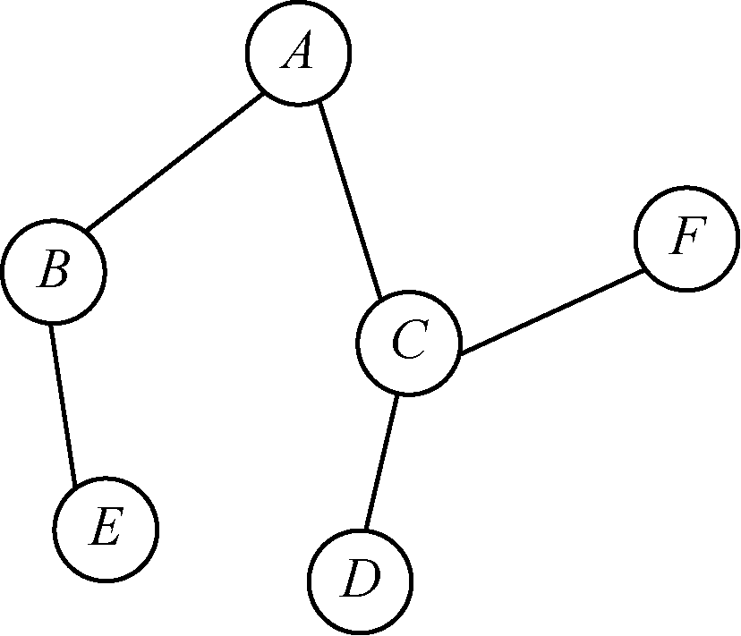
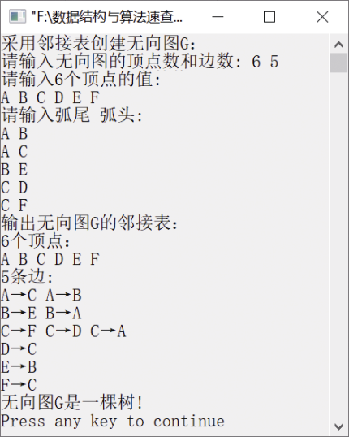

### 8.2.7　判断无向图是否为一棵树


**问题描述**


实现算法，判断一个无向图是否为一棵树。


**【分析】**

一个无向图G是一棵树的条件是G必须是无回路的连通图（即任意两个顶点都能够连通的无向图）或是有（n−1）条边的连通图。这里我们采用后者作为判断条件。例如，图8.19所示的无向图就是一棵树，它有6个顶点，5条边。


<center class="my_markdown"><b class="my_markdown">图8.19　无向图</b></center>


第8章\实例8-10.cpp

```c
/********************************************
*实例说明：判断一个无向图是否为一棵树
*********************************************/
#include<stdlib.h>
#include<stdio.h>
#include<malloc.h>
#include<string.h>
#include<iostream.h>
/*图的邻接表类型定义*/
typedef char VertexType[4];
typedef char InfoPtr;
typedef int VRType;
#define MAXSIZE 100                    
typedef enum{DG,DN,UG,UN}GraphKind;    
typedef struct ArcNode                 
{
    int adjvex;                        
    InfoPtr *info;                     
    struct ArcNode *nextarc;           
}ArcNode;
typedef struct VNode                   
{
    VertexType data;                   
    ArcNode *firstarc;                 
}VNode,AdjList[MAXSIZE];
typedef struct                         
{
    AdjList vertex;
    int vexnum,arcnum;                 
    GraphKind kind;                    
}AdjGraph;
int LocateVertex(AdjGraph G,VertexType v);
void CreateGraph(AdjGraph *G);
void DisplayGraph(AdjGraph G);
void DestroyGraph(AdjGraph *G);
void DFS(AdjGraph *G,int v,int *vNum,int *eNum,int visited[]);
int LocateVertex(AdjGraph G,VertexType v)
//返回无向图中顶点对应的位置
{
    int i;
    for(i=0;i<G.vexnum;i++)
        if(strcmp(G.vertex[i].data,v)==0)
            return i;
    return -1;
}
void CreateGraph(AdjGraph *G)
//采用邻接表创建无向图G
{
    int i,j,k;
    VertexType v1,v2;                   //定义两个顶点v1和v2
    ArcNode *p;
    cout<<"请输入无向图的顶点数和边数: ";
    cin>>(*G).vexnum>>(*G).arcnum;
    cout<<"请输入"<<G->vexnum<<"个顶点的值:"<<endl;
    for(i=0;i<G->vexnum;i++)            //将顶点存储在表头节点中
    {
        cin>>G->vertex[i].data;
        G->vertex[i].firstarc=NULL;     //将相关联的顶点置为空
    }
    cout<<"请输入弧尾 弧头:"<<endl;
    for(k=0;k<G->arcnum;k++)            //建立边表
    {
        cin>>v1>>v2;
        i=LocateVertex(*G,v1);          /*确定v1对应的编号*/
        j=LocateVertex(*G,v2);          /*确定v2对应的编号*/
        //以j为弧头、i为弧尾创建邻接表
        p=(ArcNode*)malloc(sizeof(ArcNode));
        p->adjvex=j;
        p->info=NULL;
        p->nextarc=G->vertex[i].firstarc;
        G->vertex[i].firstarc=p;
        //以i为弧头、j为弧尾创建邻接表
        p=(ArcNode*)malloc(sizeof(ArcNode));
        p->adjvex=i;
        p->info=NULL;
        p->nextarc=G->vertex[j].firstarc;
        G->vertex[j].firstarc=p;
    }
    (*G).kind=UG;
}
void DestroyGraph(AdjGraph *G)
//销毁无向图G
{
    int i;
    ArcNode *p,*q;
    for(i=0;i<(*G).vexnum;i++)          //释放无向图中的边表节点的空间
    {
        p=G->vertex[i].firstarc;        
        if(p!=NULL)                     
        {
            q=p->nextarc;
            free(p);
            p=q;
        }
    }
    (*G).vexnum=0;                      //将顶点数目置为0
    (*G).arcnum=0;                      //将边的数目置为0
}
void DisplayGraph(AdjGraph G)
//输出无向图的邻接矩阵
{
    int i;
    ArcNode *p;
    cout<<G.vexnum<<"个顶点："<<endl;
    for(i=0;i<G.vexnum;i++)
        cout<<G.vertex[i].data<<" ";
    cout<<endl<<G.arcnum<<"条边:"<<endl;
    for(i=0;i<G.vexnum;i++)
    {
        p=G.vertex[i].firstarc;
        while(p)
        {
            cout<<G.vertex[i].data<<"→"<<G.vertex[p->adjvex].data<<" ";
            p=p->nextarc;
        }
        cout<<endl;
    }
}
int IsTree(AdjGraph *G)
{
    int vNum=0,eNum=0,i,visited[MAXSIZE];
    for(i=0;i<G->vexnum;i++)
        visited[i]=0;
    DFS(G,0,&vNum,&eNum,visited);
    if(vNum==G->vexnum && eNum==2*(G->vexnum-1))
        return 1;
    else
        return 0;
}
void DFS(AdjGraph *G,int v,int *vNum,int *eNum,int visited[])
{
    ArcNode *p;
    visited[v]=1;
    (*vNum)++;
    p=G->vertex[v].firstarc;
    while(p!=NULL)
    {
        (*eNum)++;
        if(visited[p->adjvex]==0)
            DFS(G,p->adjvex,vNum,eNum,visited);
        p=p->nextarc;
    }
}
void main()
{
    AdjGraph G;
    cout<<"采用邻接表创建无向图G："<<endl;
    CreateGraph(&G);
    cout<<"输出无向图G的邻接表："<<endl;
    DisplayGraph(G);
    if(IsTree(&G))
        cout<<"无向图G是一棵树!"<<endl;
    else
        cout<<"无向图G不是一棵树!"<<endl;
    DestroyGraph(&G);
}
```

运行结果如图8.20所示。


<center class="my_markdown"><b class="my_markdown">图8.20　运行结果</b></center>


