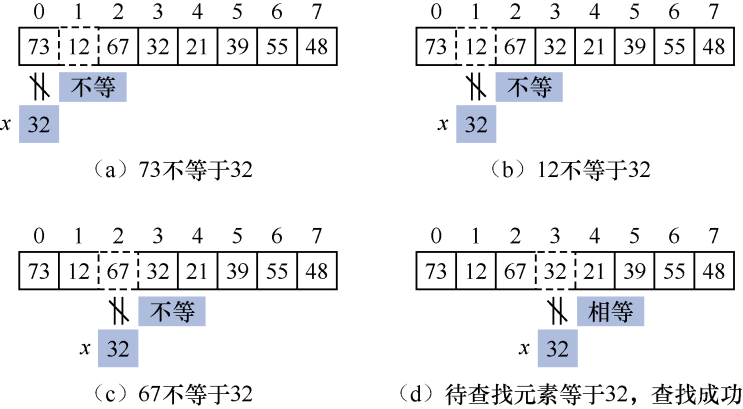
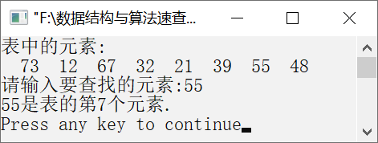
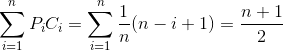

### 9.2.1　顺序查找


**问题描述**


利用顺序查找，在元素序列{73,12,67,32,21,39,55,48}中查找指定的元素。


**【分析】**

顺序查找是指从顺序表的一端开始，逐个将待查找元素与表中的每个元素进行比较。如果某个元素与待查找元素相等，则查找成功，函数返回该元素所在的顺序表的位置；否则，查找失败，返回0。

**【示例】**

假设有一个元素序列{73,12,67,32,21,39,55,48}，待查找元素为32。顺序查找元素32的过程如图9.1（a）～（d）所示。


<center class="my_markdown"><b class="my_markdown">图9.1　顺序查找元素32的过程</b></center>

将待查找元素32与第1个元素（即下标为0的）元素进行比较。如果不等，则继续比较下一个元素，直到遇到第4个元素，查找成功。


第9章\实例9-01.cpp

```c
/********************************************
*实例说明：顺序查找
*********************************************/
#include<stdio.h>
#define MaxSize 100
typedef struct
{
    int list[MaxSize];
    int length;
}Table;
int SeqSearch(Table S,int x)
/*在顺序表中查找元素x*/
{
    int i=0;
    while(i<S.length&&S.list[i]!=x)    /*从表的第1个元素开始查找*/
        i++;
    if(S.list[i]==x)        /*如果找到x，则返回元素的位置*/
        return i+1;
    else                    /*否则，返回0*/
        return 0;
}
void main()
{
    Table T={{73,12,67,32,21,39,55,48},8};
    int i,position,x;
    printf("表中的元素:\n");
    for(i=0;i<T.length;i++)
        printf("%4d",T.list[i]);
        printf("\n请输入要查找的元素:");
        scanf("%d",&x);
        position=SeqSearch(T,x);
    if(position)
        printf("%d是表的第%d个元素.\n",x,position);    
    else
        printf("没有找到%d.",x);    
}
```

运行结果如图9.2所示。


<center class="my_markdown"><b class="my_markdown">图9.2　运行结果</b></center>

**【特点】**

+ 顺序查找所需时间少，但是效率较低，主要用于对效率要求不高的情况。
+ 顺序查找可以利用顺序结构实现，也可以利用链式结构实现。

**【效率分析】**

假设顺序表中有n个元素，则查找第i个元素需要进行（n−i+1）次比较。如果元素在顺序表中出现的概率都相等，即
，则顺序表在查找成功时的平均查找长度如下。

ASL<sub class="my_markdown">成功</sub>=


即查找成功时平均比较次数约为表长的一半。

