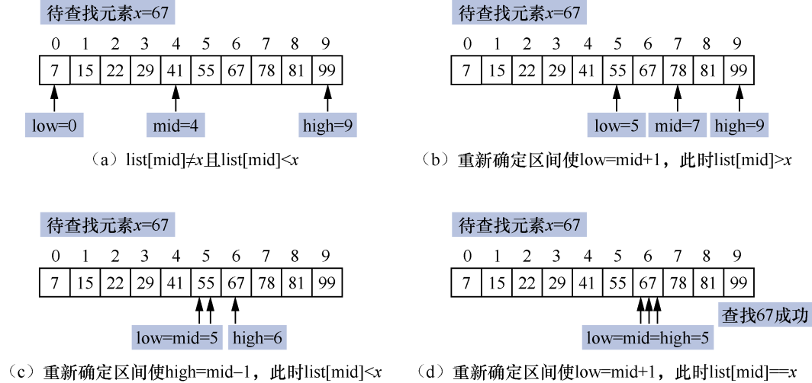
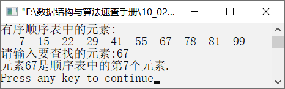
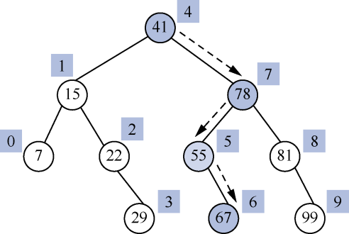
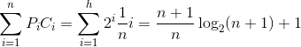
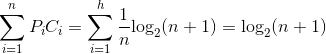

### 9.2.2　折半查找


**问题描述**


编写算法，要求利用折半查找算法查找给定的元素。


**【分析】**

折半查找又称为二分查找，这种查找算法要求待查找的元素序列必须是从小到大排列的有序序列。折半查找的算法描述如下。

将待查找元素与顺序表中间位置的元素进行比较。如果两者相等，则说明查找成功；否则，利用中间位置将顺序表分成两部分。如果待查找元素小于中间位置的元素值，则继续与前一个子表的中间位置元素进行比较；否则，与后一个子表的中间位置元素进行比较。不断重复以上操作，直到找到与待查找元素相等的元素，表明查找成功。如果子表变为空表，则表明查找失败。

**【示例】**

一个有序顺序表为{7,15,22,29,41,55,67,78,81,99}，这里查找元素67。利用折半查找算法的思想，查找元素67的折半查找过程如图9.3（a）～（d）所示。


<center class="my_markdown"><b class="my_markdown">图9.3　折半查找过程</b></center>

其中，low和high表示两个指针，分别指向待查找顺序表的下界和上界，指针mid指向low和high的中间位置，即mid=(low+high)/2。

初始时，low=0，high=9，mid=(0+9)/2=4，因为list[mid]<x，所以需要在右半区间继续查找67。此时low=5，high=9，mid=(5+9)/2=7，因为list[mid]>x，所以需要在左半区间继续查找67。此时low=5，high=6，mid=5，因为list[mid]<x，所以需要在右半区间继续查找67。此时low=6，high=6，mid=6，因为有list[mid]==x，所以查找67成功。


第9章\实例9-02.cpp

```c
/********************************************
*实例说明：折半查找
*********************************************/
1  #include<stdio.h>
2  #define MaxSize 100
3  typedef struct
4  {
5      int list[MaxSize];
6      int length;
7  }Table;
8  int BinarySearch(Table S,int x);
9  void main()
10 {
11     Table T={{7,15,22,29,41,55,67,78,81,99},10};
12     int i,find,x;
13     printf("有序顺序表中的元素:\n");
14     for(i=0;i<T.length;i++)
15         printf("%4d",T.list[i]);
16     printf("\n请输入要查找的元素:");
17     scanf("%d",&x);
18     find=BinarySearch(T,x);
19     if(find)
20         printf("元素%d是顺序表中的第%d个元素.\n",x,find);
21     else
22         printf("没有找到该元素.\n");
23 }
24 int BinarySearch(Table S,int x)
25 /*在有序顺序表中折半查找元素x*/
26 {
27     int low,high,mid;
28     low=0,high=S.length-1;         /*设置待查找顺序表的下界和上界*/
29     while(low<=high)
30     {
31         mid=(low+high)/2;
32         if(S.list[mid]==x)
33             return mid+1;
34         else if(S.list[mid]<x)
35             low=mid+1;
36         else if(S.list[mid]>x)
37             high=mid-1;
38     }
39     return 0;
40 }
```

运行结果如图9.4所示。


<center class="my_markdown"><b class="my_markdown">图9.4　运行结果</b></center>

**【特点】**

+ 折半查找算法要求待排序元素必须是一个有序的序列。
+ 折半查找算法的查找效率高于顺序查找算法的效率。

**【效率分析】**

折半查找过程可以用一个判定树来描述。例如，用折半查找算法查找41需要比较1次，查找元素78需要比较两次，查找元素55需要比较3次，查找元素67需要比较4次。整个查找过程可以用二叉判定树来表示，如图9.5所示。


<center class="my_markdown"><b class="my_markdown">图9.5　折半查找元素67的二叉判定树示意</b></center>

其中，节点旁边的序号为该元素在序列中的下标。从图9.5所示的二叉判定树不难看出，折半查找元素67的路径正好是从根节点到元素值为67的节点的路径。查找元素67的比较次数正好是该元素在二叉判定树中的层次。因此，如果顺序表中有n个元素，那么折半查找成功时，至多需要比较的次数为
+1。

对于具有n个节点的有序表（恰好构成一个深度为h的满二叉树）来说，有
，二叉树中第i层的节点个数是2<sup class="my_markdown">i</sup>−1。假设有序表中每个元素的查找概率相等，即，则有序表在折半查找成功时的平均查找长度如下。

ASL<sub class="my_markdown">成功</sub>=


折半查找失败时，有序表的平均查找长度如下。

ASL<sub class="my_markdown">失败</sub>=


