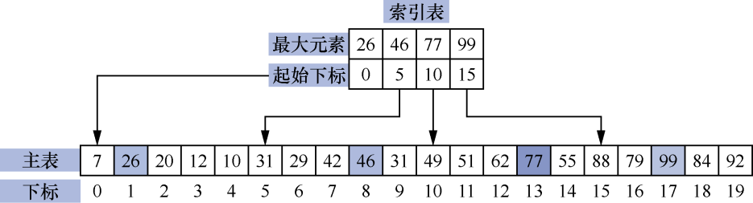
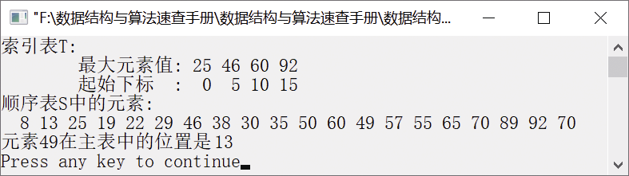
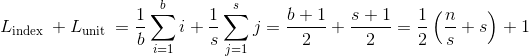
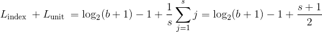
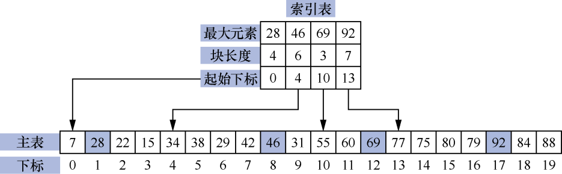

### 9.2.3　分块查找


**问题描述**


对给定的元素序列{8, 13, 25, 19, 22, 29, 46, 38, 30, 35, 50, 60, 49, 57, 55, 65, 70, 89, 92, 70}，设计一个分块查找算法，查找指定的元素。


**【分析】**

分块查找也称为索引顺序表查找。分块查找就是将顺序表（主表）分成若干个块，然后为每个块建立一个索引表，利用索引表在其中一个块中进行查找。其中，索引表分为两部分。一部分用来存储每块中的最大的元素值，另一部分用来存储每块中第1个元素的下标。

索引表中的元素必须是有序的，顺序表中的元素可以是有序排列的，也可以是块内无序但块之间是有序的，即后一个块中的所有元素值都大于前一个块中的所有元素值。例如，一个索引顺序表如图9.6所示。


<center class="my_markdown"><b class="my_markdown">图9.6　索引顺序表</b></center>

从图9.6可以看出，索引表将主表分为4块，每块包含5个元素。查找主表中的某个元素，需要分两步。首先需要确定要查找元素所在的块，然后在该块查找指定的元素。例如，要查找元素62，首先需要将62与索引表中的元素进行比较，因为46<62<77，所以需要在第3个块中查找，该块的起始下标是10。因此，从主表中下标为10的位置开始查找62，直到找到该元素为止。如果在该块中没有找到62，则说明主表中不存在该元素，查找失败。


第9章\实例9-03.cpp

```c
/********************************************
*实例说明：分块查找
*********************************************/
1  #include<stdio.h>
2  #define TableSize 100
3  #define IndexSize 20
4  typedef struct           /*顺序表类型*/
5  {
6     int list[TableSize];
7     int length;
8  }Table;
9  typedef struct           /*索引表类型*/
10 {
11    int maxvalue;
12    int index;
13 }IndexTable[IndexSize];
14 int SeqIndexSearch(Table S,IndexTable T,int m,int x);
15 void main()
16 {
17    Table S={{8,13,25,19,22,29,46,38,30,35,50,60,49,57,55,65,70,89,92,70},20};
18    IndexTable T={{25,0},{46,5},{60,10},{92,15}};
19    int x=49,pos,i;
20    printf("索引表T:\n");
21    printf("\t最大元素值:");
22    for(i=0;i<4;i++)
23        printf("%3d",T[i].maxvalue);
24    printf("\n\t起始下标  :");
25    for(i=0;i<4;i++)
26        printf("%3d",T[i].index);
27    printf("\n顺序表S中的元素:\n");
28    for(i=0;i<S.length;i++)
29        printf("%3d",S.list[i]);
30    if((pos=SeqIndexSearch(S,T,4,x))!=0)
31        printf("\n元素%d在主表中的位置是%2d\n",x,pos);
32    else
33        printf("\n查找失败!\n");
34 }
35 int SeqIndexSearch(Table S,IndexTable T,int m,int x)
36 /*在主表S中查找元素x，T为索引表*/
37 {
38     int i,j,bl;    
39     for(i=0;i<m;i++)        /*通过索引表确定要查找元素在主表中的块*/
40         if(T[i].maxvalue>=x)
41             break;
42     if(i>=m)                /*如果要查找的元素不在主表S中，则返回0*/
43         return 0;
44     j=T[i].index;          
45     if(i<m-1)              
46         bl=T[i+1].index-T[i].index;
47     else
48         bl=S.length-T[i].index;
49     while(j<T[i].index+bl)
50         if(S.list[j]==x)    /*如果找到元素x，则返回x在主表中所在的位置*/
51             return j+1;
52         else
53             j++;
54     return 0;
55 }
```

运行结果如图9.7所示。


<center class="my_markdown"><b class="my_markdown">图9.7　运行结果</b></center>

**【特点】**

+ 索引顺序表由主表和索引表构成，主表中的元素不一定有序，但索引表中的元素一定是有序的。
+ 当待查找的元素较多时，利用分块查找可以快速确定待查找元素的大体位置，这样可以减少比较次数，从而提高查找效率。

**【效率分析】**

索引表中的元素是有序排列的。在确定元素所在的块时，可以用顺序查找算法查找索引表，也可以用折半查找算法查找索引表。若主表中的元素是无序的，则只能采用顺序查找算法查找。

索引顺序表的平均查找长度可以表示为ASL=L<sub class="my_markdown">index</sub>+L<sub>unit</sub>。其中，L<sub class="my_markdown">index</sub>是索引表的平均查找长度，L<sub>unit</sub>是块中元素的平均查找长度。

如果主表中的元素个数为n，并将该主表平均分为b个块，且每个块有s个元素，则有b=n/s。在主表中的元素查找概率相等的情况下，每个块中元素的查找概率是1/s，主表中每个块的查找概率是1/b。如果用顺序查找法查找索引表中的元素，则索引顺序表查找成功时的平均查找长度如下。

ASL<sub class="my_markdown">成功</sub>=


如果用折半查找法查找索引表中的元素，则有L<sub class="my_markdown">index</sub>=
+1≈log<sub>2</sub>(b+1)−1。将其代入ASL<sub>成功</sub>= L<sub class="my_markdown">index</sub>+L<sub>unit</sub>中，则索引顺序表查找成功时的平均查找长度如下。

ASL<sub class="my_markdown">成功</sub>=


≈log<sub class="my_markdown">2</sub>(n/s+1)+

**【特殊情况】**

一般情况下，每个块中的元素个数是相等的。当每个块中的元素个数不相等时，就需要在索引表中增加一项，用来存储主表中每个块中元素的个数。我们把这种索引顺序表称为不等长索引顺序表。例如，不等长索引顺序表如图9.8所示。


<center class="my_markdown"><b class="my_markdown">图9.8　不等长索引顺序表</b></center>

