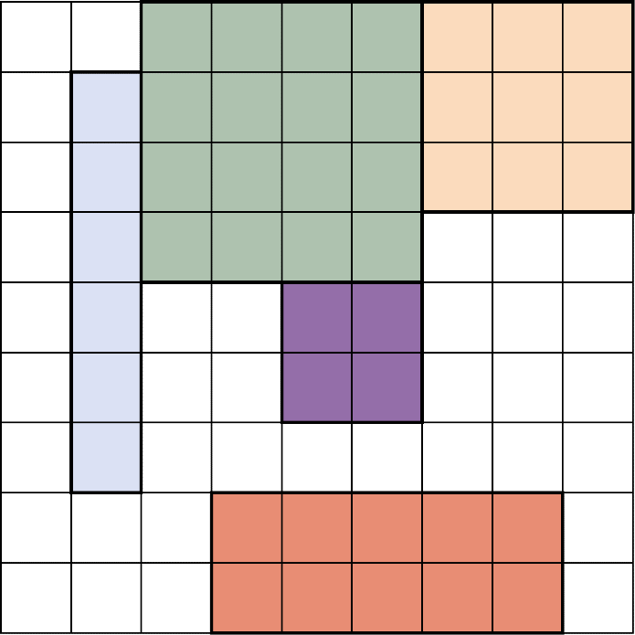

### 3.6　电路板布局

制造商需要将某些矩形的芯片装到矩形电路板上。这个问题在本质上就是如何把几个大小不同的矩形严丝合缝地放置于另一个矩形内？约束满足问题的求解程序可以找到解决方案。此问题如图3-5所示。

<b class="my_markdown">图3-5　电路板布局问题与单词搜索问题非常
 相似，只不过矩形可以是不同宽度的</b>

电路板布局问题类似于单词搜索问题，但不是1×N的矩形（单词），而是存在M×N的矩形。像单词搜索问题一样，矩形不能重叠。这些矩形不能放在对角线上，所以从这个意义上来说本问题实际上要比单词搜索简单一些。

请自行尝试重写单词搜索求解程序，使其适用于电路板布局问题。大部分代码都可以复用，包括表示网格的代码。

