### 1.2　妙不可言——算法复杂性

我们首先看一道某跨国公司的招聘试题。

写一个算法，求下面序列之和：

−1，1，−1，1，…，(−1)<sup class="my_markdown">n</sup>

当你看到这个题目时，你会怎么想？for语句？while循环？

先看算法1-1：

```c
//算法1-1 
sum=0;
for(i=1; i<=n; i++)
{
  sum=sum+(-1)^n;
}
```

这段代码可以实现求和运算，但是为什么不这样算?！

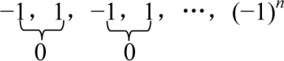
再看算法1-2：

```c
//算法1-2
if(n%2==0)  //判断n是不是偶数，%表示求余数
  sum =0;
else
  sum=-1;
```

有的人看到这个代码后恍然大悟，原来可以这样啊？这不就是数学家高斯使用的算法吗？

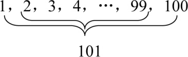
一共50对数，每对之和均为101，那么总和为：

（1+100）×50=5050

1787年，10岁的高斯用了很短的时间算出了结果，而其他孩子却要算很长时间。

可以看出，算法1-1需要运行n+1次，如果n=100 00，就要运行100 01次，而算法1-2仅仅需要运行1次！是不是有很大差别？

> 高斯的方法我也知道，但遇到类似的题还是……我用的笨办法也是算法吗？

**答：是算法。**

**算法是指对特定问题求解步骤的一种描述。**

算法只是对问题求解方法的一种描述，它不依赖于任何一种语言，既可以用自然语言、程序设计语言（C、C++、Java、Python等）描述，也可以用流程图、框图来表示。一般为了更清楚地说明算法的本质，我们去除了计算机语言的语法规则和细节，采用“伪代码”来描述算法。“伪代码”介于自然语言和程序设计语言之间，它更符合人们的表达方式，容易理解，但不是严格的程序设计语言，如果要上机调试，需要转换成标准的计算机程序设计语言才能运行。

算法具有以下特性。

（1） **有穷性** ：算法是由若干条指令组成的有穷序列，总是在执行若干次后结束，不可能永不停止。

（2） **确定性** ：每条语句有确定的含义，无歧义。

（3） **可行性** ：算法在当前环境条件下可以通过有限次运算实现。

（4） **输入输出** ：有零个或多个输入，一个或多个输出。

> 算法1-2的确算得挺快的，但如何知道我写的算法好不好呢？

**“好”算法的标准如下。**

（1）正确性：正确性是指算法能够满足具体问题的需求，程序运行正常，无语法错误，能够通过典型的软件测试，达到预期的需求。

（2）易读性：算法遵循标识符命名规则，简洁易懂，注释语句恰当适量，方便自己和他人阅读，便于后期调试和修改。

（3）健壮性：算法对非法数据及操作有较好的反应和处理。例如，在学生信息管理系统中登记学生年龄时，若将21岁误输入为210岁，系统应该提示出错。

（4）高效性：高效性是指算法运行效率高，即算法运行所消耗的时间短。算法时间复杂度就是算法运行需要的时间。现代计算机一秒钟能计算数亿次，因此不能用秒来具体计算算法消耗的时间，由于相同配置的计算机进行一次基本运算的时间是一定的，我们可以用算法基本运算的执行次数来衡量算法的效率。因此，将算法基本运算的执行次数作为时间复杂度的衡量标准。

（5）低存储性：低存储性是指算法所需要的存储空间低。对于像手机、平板电脑这样的嵌入式设备，算法如果占用空间过大，则无法运行。算法占用的空间大小称为 **空间复杂度** 。

除了（1）～（3）中的基本标准外，我们对好的算法的评判标准就是 **高效率** 、 **低存储** 。

> （1）～（3）中的标准都好办，但时间复杂度怎么算呢？

**时间复杂度** ：算法运行需要的时间，一般将 **算法的执行次数** 作为时间复杂度的度量标准。

看算法1-3，并分析算法的时间复杂度。

```c
//算法1-3 
sum=0;                     //运行1次
total=0;                   //运行1次
for(i=1; i<=n; i++)        //运行n次
{
  sum=sum+i;               //运行n次
  for(j=1; j<=n; j++)      //运行n*n次
    total=total+i*j;       //运行n*n次
}
```

把算法的所有语句的运行次数加起来：1+1+n+n+n×n+n×n，可以用一个函数T(n)表达：

T(n)=2n<sup class="my_markdown">2</sup>+2n+2

当n足够大时，例如n=10<sup class="my_markdown">5</sup>时，T(n)=2×10<sup>10</sup>+2×10<sup class="my_markdown">5</sup>+2，我们可以看到算法运行时间主要取决于第一项，后面的甚至可以忽略不计。

用极限表示为：

，C为不等于0的常数

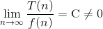
如果用 **时间复杂度的渐近上界** 表示，如图1-1所示。

从图1-1中可以看出，当nn<sub class="my_markdown">0</sub>时，T(n)Cf (n)，当n足够大时，T(n)和f (n)近似相等。因此，我们用О(f (n))来表示时间复杂度渐近上界，通常用这种表示法衡量算法时间复杂度。算法1-3的时间复杂度渐近上界为О(f (n))＝О(n<sup class="my_markdown">2</sup>)，用极限表示为：

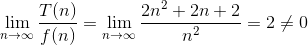
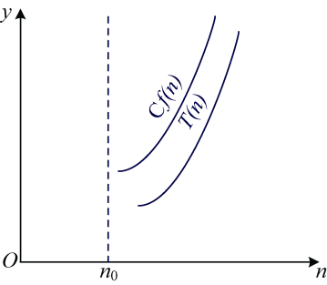
<center class="my_markdown"><b class="my_markdown">图1-1　渐近时间复杂度上界</b></center>

还有 **渐近下界** 符号Ω(T(n)Cf (n))，如图1-2所示。


<center class="my_markdown"><b class="my_markdown">图1-2　渐近时间复杂度下界</b></center>

从图1-2可以看出，当nn<sub class="my_markdown">0</sub>时，T(n)Cf (n)，当n足够大时，T(n)和f (n)近似相等，因此，我们用Ω(f (n))来表示时间复杂度渐近下界。

**渐近精确界** 符号Θ(C<sub class="my_markdown">1</sub>f (n)T(n)C<sub>2</sub>f (n))，如图1-3所示。

从图1-3中可以看出，当nn<sub class="my_markdown">0</sub>时，C<sub>1</sub>f (n)T(n)C<sub>2</sub>f (n)，当n足够大时，T(n)和f (n)近似相等。这种两边逼近的方式，更加精确近似，因此，用Θ (f (n))来表示时间复杂度渐近精确界。

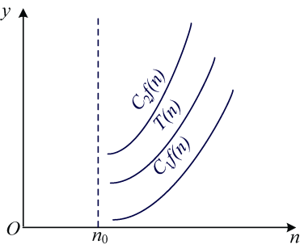
<center class="my_markdown"><b class="my_markdown">图1-3　渐进时间复杂度精确界</b></center>

我们通常使用时间复杂度渐近上界О(f (n))来表示时间复杂度。

看算法1-4，并分析算法的时间复杂度。

```c
//算法1-4
i=1;              //运行1次
while(i<=n)     //可假设运行x次
{
  i=i*2;         //可假设运行x次
}
```

观察算法1-4，无法立即确定while 及i=i*2运行了多少次。这时可假设运行了x次，每次运算后i值为2，2<sup class="my_markdown">2</sup>，2<sup>3</sup>，…，2<sup>x</sup>，当i=n时结束，即2<sup>x</sup>＝n时结束，则x=log<sub class="my_markdown">2</sub>n，那么算法1-4的运算次数为1+2log<sub class="my_markdown">2</sub>n，时间复杂度渐近上界为О(f (n))＝О(log<sub class="my_markdown">2</sub>n)。

在算法分析中，渐近复杂度是对算法运行次数的粗略估计，大致反映问题规模增长趋势，而不必精确计算算法的运行时间。在计算渐近时间复杂度时，可以只考虑对算法运行时间贡献大的语句，而忽略那些运算次数少的语句，循环语句中处在循环内层的语句往往运行次数最多，即为对运行时间贡献最大的语句。例如在算法1-3中，total=total+i*j是对算法贡献最大的语句，只计算该语句的运行次数即可。

**注意：** 不是每个算法都能直接计算运行次数。

例如算法1-5，在a[n]数组中顺序查找x，返回其下标i，如果没找到，则返回−1。

```c
//算法1-5 
findx(int x)      //在a[n]数组中顺序查找x
{ 
for(i=0; i<n; i++)  
{
   if (a[i]==x)  
     return i;    //返回其下标i
   ｝
  return -1;
}
```

我们很难计算算法1-5中的程序到底执行了多少次，因为运行次数依赖于x在数组中的位置，如果第一个元素就是x，则执行1次（最好情况）；如果最后一个元素是x，则执行n次（最坏情况）；如果分布概率均等，则平均执行次数为（n+1）/2。

有些算法，如排序、查找、插入等算法，可以分为 **最好** 、 **最坏** 和 **平均** 情况分别求算法渐近复杂度，但我们考查一个算法通常考查最坏的情况，而不是考查最好的情况， **最坏情况对衡量算法的好坏具有实际的意义** 。

> 我明白了，那空间复杂度应该就是算法占了多大存储空间了？

**空间复杂度** ：算法占用的空间大小。一般将算法的 **辅助空间** 作为衡量空间复杂度的标准。

空间复杂度的本意是指算法在运行过程中占用了多少存储空间。算法占用的存储空间包括：

（1）输入/输出数据；

（2）算法本身；

（3）额外需要的辅助空间。

输入/输出数据占用的空间是必需的，算法本身占用的空间可以通过精简算法来缩减，但这个压缩的量是很小的，可以忽略不计。而在运行时使用的辅助变量所占用的空间，即辅助空间是衡量空间复杂度的关键因素。

看算法1-6，将两个数交换，并分析其空间复杂度。

```c
//算法1-6 
swap(int x,int y)  //x与y交换 
{ 
  int temp;
  temp=x;  //temp为辅助空间 ①
  x=y;   ②
  y=temp; ③
}
```

两数的交换过程如图1-4所示。

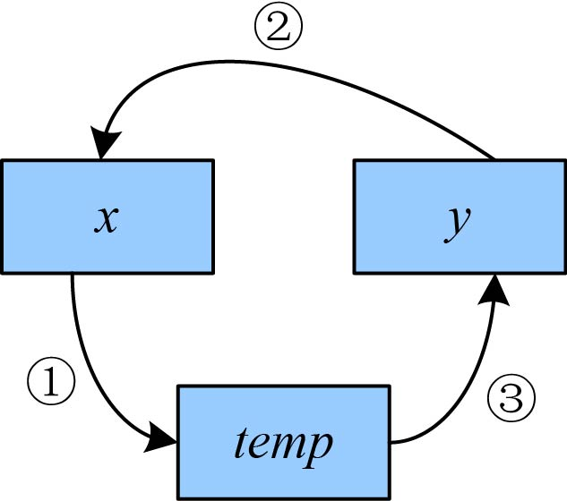
<center class="my_markdown"><b class="my_markdown">图1-4　两数交换过程</b></center>

图1-4中的步骤标号与算法1-6中的语句标号一一对应，该算法使用了一个辅助空间temp，空间复杂度为О(1)。

**注意：** 递归算法中，每一次递推需要一个栈空间来保存调用记录，因此，空间复杂度需要计算递归栈的辅助空间。

看算法1-7，计算n的阶乘，并分析其空间复杂度。

```c
//算法1-7 
fac(int n)  //计算n的阶乘
{  
  if(n<0)   //小于零的数无阶乘值
  {  
     printf("n<0,data error!"); 
     return -1;
  }
  else if(n= =0 || n= =1) 
           return 1; 
         else 
           return n*fac(n-1); 
}
```

阶乘是典型的递归调用问题，递归包括递推和回归。递推是将原问题不断分解成子问题，直到达到结束条件，返回最近子问题的解；然后逆向逐一回归，最终到达递推开始的原问题，返回原问题的解。

**思考：** 试求5的阶乘，程序将怎样计算呢？

5的阶乘的递推和回归过程如图1-5和图1-6所示。

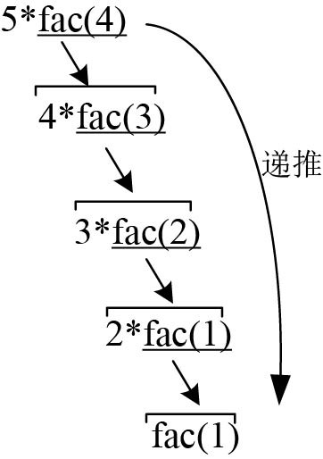
<center class="my_markdown"><b class="my_markdown">图1-5　5的阶乘递推过程</b></center>

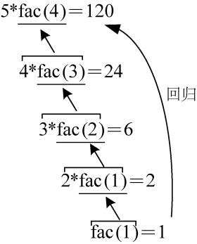
<center class="my_markdown"><b class="my_markdown">图1-6　5的阶乘回归过程</b></center>

图1-5和图1-6的递推、回归过程是我们从逻辑思维上推理，用图的方式形象地表达出来的，但计算机内部是怎样处理的呢？计算机使用一种称为“栈”的数据结构，它类似于一个放一摞盘子的容器，每次从顶端放进去一个，拿出来的时候只能从顶端拿一个，不允许从中间插入或抽取，因此称为“后进先出”（last in first out）。

5的阶乘进栈过程如图1-7所示。

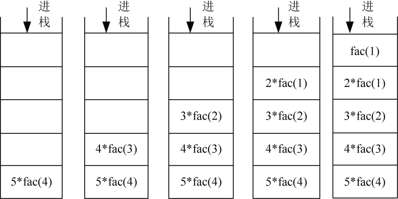
<center class="my_markdown"><b class="my_markdown">图1-7　5的阶乘进栈过程</b></center>

5的阶乘出栈过程如图1-8所示。

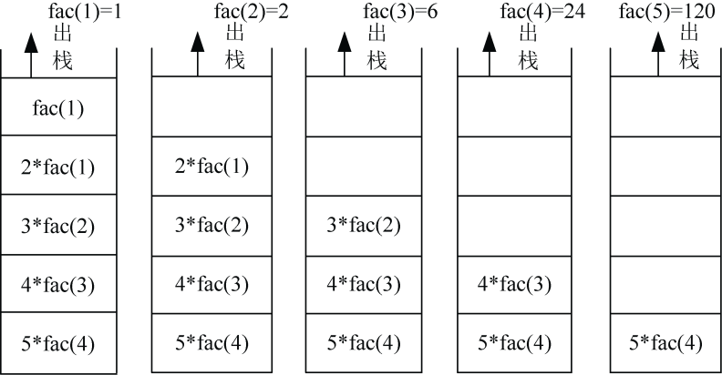
<center class="my_markdown"><b class="my_markdown">图1-8　5的阶乘出栈过程</b></center>

从图1-7和图1-8的进栈、出栈过程中，我们可以很清晰地看到，首先把子问题一步步地压进栈，直到得到返回值，再一步步地出栈，最终得到递归结果。在运算过程中，使用了n个栈空间作为辅助空间，因此阶乘递归算法的空间复杂度为О(n)。在算法1-7中，时间复杂度也为О(n)，因为n的阶乘仅比n−1的阶乘多了一次乘法运算，fac(n)=n*fac(n−1)。如果用T(n)表示fac(n)的时间复杂度，可表示为：

T(n)= T(n−1)+1

= T(n−2)+1+1

……

= T(1)+…+1+1

=n

