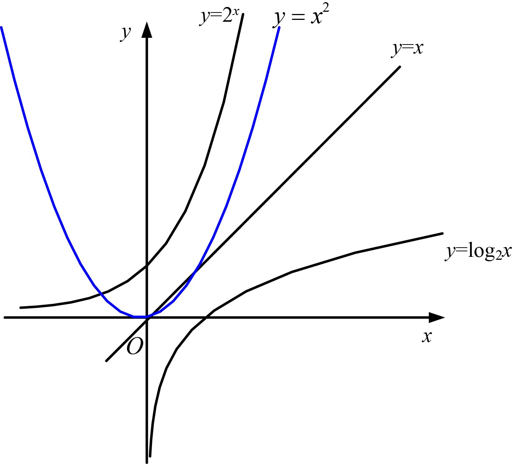
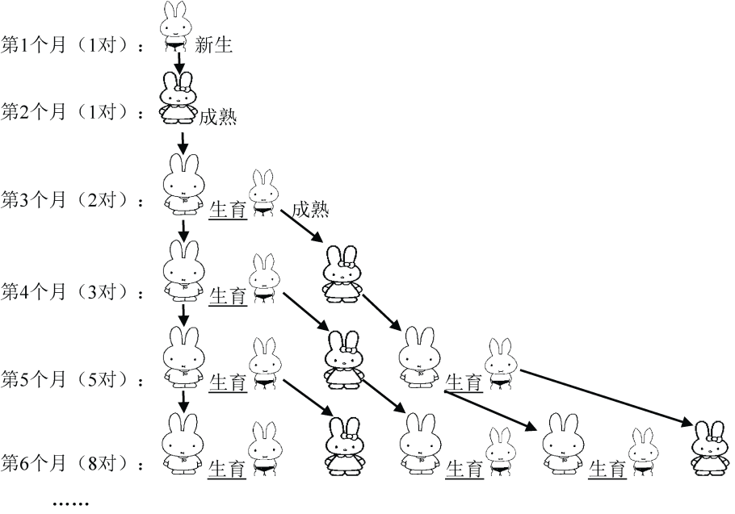
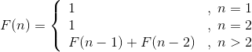
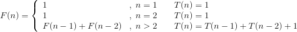
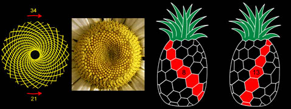
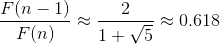

### 1.3　美不胜收——魔鬼序列

#### 趣味故事1-1：一棋盘的麦子

有一个古老的传说，有一位国王的女儿不幸落水，水中有很多鳄鱼，国王情急之下下令：“谁能把公主救上来，就把女儿嫁给他。”很多人纷纷退让，一个勇敢的小伙子挺身而出，冒着生命危险把公主救了上来，国王一看是个穷小子，想要反悔，说：“除了女儿，你要什么都可以。”小伙子说：“好吧，我只要一棋盘的麦子。您在第1个格子里放1粒麦子，在第2个格子里放2粒，在第3个格子里放4粒，在第4个格子里放8粒，以此类推，每一格子里的麦子粒数都是前一格的两倍。把这64个格子都放好了就行，我就要这么多。”国王听后哈哈大笑，觉得小伙子的要求很容易满足，满口答应。结果发现，把全国的麦子都拿来，也填不完这64格……国王无奈，只好把女儿嫁给了这个小伙子。

**解析**

棋盘上的64个格子究竟要放多少粒麦子？

把每一个放的麦子数加起来，总和为S，则：

S=1+2<sup class="my_markdown">1</sup>+2<sup>2</sup>+2<sup>3</sup>+…+2<sup>63</sup>　　 ①

我们把式①等号两边都乘以2，等式仍然成立：

2S=2<sup class="my_markdown">1</sup>+2<sup>2</sup>+2<sup>3</sup>+…+2<sup>63</sup>+2<sup>64</sup>　　 ②

式 ②减去式①，则：

S=2<sup class="my_markdown">64</sup>−1 ＝18 446 744 073 709 551 615

据专家统计，每个麦粒的平均重量约41.9毫克，那么这些麦粒的总重量是：

18 446 744 073 709 551 615×41.9＝772 918 576 688 430 212 668.5（毫克）

≈7729（亿吨）

全世界人口按60亿计算，每人可以分得128吨！

我们称这样的函数为 **爆炸增量函数** ，想一想，如果算法时间复杂度是О(2<sup class="my_markdown">n</sup>) 会怎样？随着n的增长，这个算法会不会“爆掉”？经常见到有些算法调试没问题，运行一段也没问题，但关键的时候宕机（shutdown）。例如，在线考试系统，50个人考试没问题，100人考试也没问题，如果全校1万人考试就可能出现宕机。

**注意：** 宕机就是死机，指电脑不能正常工作了，包括一切原因导致的死机。计算机主机出现意外故障而死机，一些服务器（如数据库）死锁，服务器的某些服务停止运行都可以称为宕机。

常见的算法时间复杂度有以下几类。

（1）常数阶。

常数阶算法运行的次数是一个常数，如5、20、100。常数阶算法时间复杂度通常用О(1)表示，例如算法1-6，它的运行次数为4，就是常数阶，用О(1)表示。

（2）多项式阶。

很多算法时间复杂度是多项式，通常用О(n)、О(n<sup class="my_markdown">2</sup>)、О(n<sup>3</sup>)等表示。例如算法1-3就是多项式阶。

（3）指数阶。

指数阶时间复杂度运行效率极差，程序员往往像躲“恶魔”一样避开它。常见的有О(2<sup class="my_markdown">n</sup>)、О(n！)、О(n<sup class="my_markdown">n</sup>)等。使用这样的算法要慎重，例如趣味故事1-1。

（4）对数阶。

对数阶时间复杂度运行效率较高，常见的有О(logn)、О(nlogn)等，例如算法1-4。

常见时间复杂度函数曲线如图1-9所示。


<center class="my_markdown"><b class="my_markdown">图1-9　常见函数增量曲线</b></center>

从图1-9中可以看出，指数阶增量随着x的增加而急剧增加，而对数阶增加缓慢。它们之间的关系为：

О(1)< О(logn)< О(n)< О(nlogn) < О(n<sup class="my_markdown">2</sup>)< О(n<sup class="my_markdown">3</sup>)< О(2<sup class="my_markdown">n</sup>) < О(n!)< О(n<sup class="my_markdown">n</sup>)

我们在设计算法时要注意算法复杂度增量的问题，尽量避免爆炸级增量。

#### 趣味故事1-2：神奇兔子数列

假设第1个月有1对刚诞生的兔子，第2个月进入成熟期，第3个月开始生育兔子，而1对成熟的兔子每月会生1对兔子，兔子永不死去……那么，由1对初生兔子开始，12个月后会有多少对兔子呢？

兔子数列即斐波那契数列，它的发明者是意大利数学家列昂纳多•斐波那契（Leonardo Fibonacci，1170—1250）。1202年，他撰写了《算盘全书》（《Liber Abaci》）一书，该书是一部较全面的初等数学著作。书中系统地介绍了印度—阿拉伯数码及其演算法则，介绍了中国的“盈不足术”；引入了负数，并研究了一些简单的一次同余式组。

（1）问题分析

我们不妨拿新出生的1对小兔子分析：

第1个月，小兔子①没有繁殖能力，所以还是1对。

第2个月，小兔子①进入成熟期，仍然是1对。

第3个月，兔子①生了1对小兔子②，于是这个月共有2（1+1=2）对兔子。

第4个月，兔子①又生了1对小兔子③。因此共有3（1+2=3）对兔子。

第5个月，兔子①又生了1对小兔子④，而在第3个月出生的兔子②也生下了1对小兔子⑤。共有5（2+3=5）对兔子。

第6个月，兔子①②③各生下了1对小兔子。新生3对兔子加上原有的5对兔子这个月共有8（3+5=8）对兔子。

……

为了表达得更清楚，我们用图示来分别表示新生兔子、成熟期兔子和生育期兔子，兔子的繁殖过程如图1-10所示。


<center class="my_markdown"><b class="my_markdown">图1-10　兔子繁殖过程</b></center>

这个数列有十分明显的特点，从第3个月开始， **当月的兔子数** = **上月兔子数** + **当月新生兔子数** ，而当月新生的兔子正好是 **上上月的兔子数** 。因此，前面相邻两项之和，构成了后一项，即：

**当月的兔子数** = **上月兔子数** + **上上月的兔子数**

斐波那契数列如下：

1，1，2，3，5，8，13，21，34，…

递归式表达式：


那么我们该怎么设计算法呢？

> 哈哈，这太简单了，用递归算法很快就算出来了！

（2）算法设计

首先按照递归表达式设计一个递归算法，见算法1-8。

```c
//算法1-8 
Fib1(int n) 
{  
  if(n<1)   
     return -1;
if(n==1||n==2)   
     return 1;
  return Fib1(n-1)+Fib1(n-2);
}
```

写得不错，那么算法设计完成后，我们有3个问题：

+ 算法是否正确？
+ 算法复杂度如何？
+ 能否改进算法？

（3）算法验证分析

第一个问题毋庸置疑，因为算法1-8是完全按照递推公式写出来的，所以正确性没有问题。那么算法复杂度呢？假设T(n)表示计算Fib1(n)所需要的基本操作次数，那么：

```c
n=1时，T(n)=1；
n=2时，T(n)=1；
n=3时，T(n)=3；//调用Fib1(2)、Fib1(1)和执行一次加法运算Fib1(2)+Fib1(1)
```

因此，n>2时要分别调用Fib1(n−1)、Fib1(n−2)和执行一次加法运算，即：

```c
n>2时，T(n)= T(n-1)+ T(n-2)+1；
```

递归表达式和时间复杂度T(n)之间的关系如下：


由此可得：。


那么怎么计算F(n)呢？

有兴趣的读者可以看本书附录A中通项公式的求解方法，也可以看下文中的简略解释。

斐波那契数列通项为：


当n趋近于无穷时，


由于，这是一个指数阶的算法！

如果我们今年计算出了F(100)，那么明年才能算出F(101)，多算一个斐波那契数需要一年的时间， **爆炸增量函数** 是算法设计的噩梦！算法1-8的时间复杂度属于 **爆炸增量函数** ，这在算法设计时是应当避开的，那么我们能不能改进它呢？

（4）算法改进

既然斐波那契数列中的每一项是前两项之和，如果记录前两项的值，只需要一次加法运算就可以得到当前项，时间复杂度会不会更低一些？我们用数组试试看，见算法1-9。

```c
//算法1-9 
Fib2(int n) 
{  
  if(n<1)   
     return -1;
  int *a=new int[n];//定义一个数组
  a[1]=1；
  a[2]=1;
  for(int i=3;i<=n;i++)
     a[i]=a[i-1]+a[i-2];
  return a[n];
}
```

很明显，算法1-9的时间复杂度为О(n)。算法仍然是按照F(n)的定义，所以正确性没有问题，而 **时间复杂度** 却从算法1-8的 **指数阶降到了多项式阶** ，这是算法效率的一个巨大突破！

算法1-9使用了一个辅助数组记录中间结果，空间复杂度也为О(n)，其实我们只需要得到第n个斐波那契数，中间结果只是为了下一次使用，根本不需要记录。因此，我们可以采用 **迭代法** 进行算法设计，见算法1-10。

```c
//算法1-10 
Fib3(int n) 
{
  int i,s1,s2; 
  if(n<1)   
     return -1;
  if(n==1||n==2)   
     return 1;
  s1=1;
  s2=1;
  for(i=3; i<=n; i++)
  {
     s2=s1+s2; //辗转相加法
     s1=s2-s1; //记录前一项
  }
  return s2;
}
```

迭代过程如下。

初始值：s<sub class="my_markdown">1</sub>=1；s<sub>2</sub>=1；

当前解　　　 记录前一项

i=3时　　 s<sub class="my_markdown">2</sub>= s<sub>1</sub>+s<sub class="my_markdown">2</sub>=2　　 s<sub>1</sub>=s<sub class="my_markdown">2</sub>−s<sub>1</sub>=1

i=4时　　 s<sub class="my_markdown">2</sub>= s<sub>1</sub>+s<sub class="my_markdown">2</sub>=3　　 s<sub>1</sub>= s<sub class="my_markdown">2</sub>−s<sub>1</sub>=2

i=5时　　 s<sub class="my_markdown">2</sub>= s<sub>1</sub>+s<sub class="my_markdown">2</sub>=5　　 s<sub>1</sub>= s<sub class="my_markdown">2</sub>−s<sub>1</sub>=3

i=6时　　 s<sub class="my_markdown">2</sub>= s<sub>1</sub>+s<sub class="my_markdown">2</sub>=8　　 s<sub>1</sub>= s<sub class="my_markdown">2</sub>−s<sub>1</sub>=5

……　　　　　 ……　　　　　 ……

算法1-10使用了若干个辅助变量，迭代辗转相加，每次记录前一项，时间复杂度为О(n)，但 **空间复杂度** 降到了О(1)。

**问题的进一步讨论** ：我们能不能继续降阶，使算法时间复杂度更低呢？实质上，斐波那契数列时间复杂度还可以降到对数阶О(logn)，有兴趣的读者可以查阅相关资料。想想看，我们把一个算法从 **指数阶** 降到 **多项式阶** ，再降到 **对数阶** ，这是一件多么振奋人心的事！

（5）惊人大发现

科学家经研究在植物的叶、枝、茎等排列中发现了斐波那契数！例如，在树木的枝干上选一片叶子，记其为数1，然后依序点数叶子（假定没有折损），直到到达与那片叶子正对的位置，则其间的叶子数多半是斐波那契数。叶子从一个位置到达下一个正对的位置称为一个循回。叶子在一个循回中旋转的圈数也是斐波那契数。在一个循回中，叶子数与叶子旋转圈数的比称为叶序（源自希腊词，意即叶子的排列）比。多数植物的叶序比呈现为斐波那契数的比，例如，蓟的头部具有13条顺时针旋转和21条逆时针旋转的斐波那契螺旋，向日葵的种子的圈数与子数、菠萝的外部排列同样有着这样的特性，如图1-11所示。


<center class="my_markdown"><b class="my_markdown">图1-11　斐波那契螺旋（图片来自网络）</b></center>

观察延龄草、野玫瑰、南美血根草、大波斯菊、金凤花、耧斗菜、百合花、蝴蝶花的花瓣，可以发现它们的花瓣数目为斐波那契数：3，5，8，13，21，…。如图1-12所示。


<center class="my_markdown"><b class="my_markdown">图1-12　植物花瓣（图片来自网络）</b></center>

树木在生长过程中往往需要一段“休息”时间，供自身生长，而后才能萌发新枝。所以，一株树苗在一段间隔（例如一年）以后长出一条新枝；第二年新枝“休息”，老枝依旧萌发；此后，老枝与“休息”过一年的枝同时萌发，当年生的新枝则次年“休息”。这样，一株树木各个年份的枝桠数便构成斐波那契数列，这个规律就是生物学上著名的“鲁德维格定律”。

这些植物懂得斐波那契数列吗？应该并非如此，它们只是按照自然的规律才进化成这样的。这似乎是植物排列种子的“优化方式”，它能使所有种子具有相近的大小却又疏密得当，不至于在圆心处挤太多的种子而在圆周处却又很稀疏。叶子的生长方式也是如此，对于许多植物来说，每片叶子从中轴附近生长出来，为了在生长的过程中一直都能最佳地利用空间（要考虑到叶子是一片一片逐渐地生长出来，而不是一下子同时出现的），每片叶子和前一片叶子之间的角度应该是222.5°，这个角度称为“黄金角度”，因为它和整个圆周360°之比是黄金分割数0.618的倒数，而这种生长方式就导致了斐波那契螺旋的产生。向日葵的种子排列形成的斐波那契螺旋有时能达到89，甚至144。1992年，两位法国科学家通过对花瓣形成过程的计算机仿真实验，证实了在系统保持最低能量的状态下，花朵会以斐波那契数列的规律长出花瓣。

有趣的是：这样一个完全是自然数的数列，通项公式却是用无理数来表达的。而且当n趋向于无穷大时，斐波那契数列前一项与后一项的比值越来越逼近黄金分割比0.618：1÷1 = 1，1÷2 = 0.5，2÷3 = 0.666，…，3÷5 = 0.6，5÷8 = 0.625，…，55÷89 = 0.617977，…，144÷233 = 0.618025，…，46368÷75025 = 0.6180339886……

越到后面，这些比值越接近黄金分割比：


斐波那契数列起源于兔子数列，这个现实中的例子让我们真切地感到数学源于生活，生活中我们需要不断地通过现象发现数学问题，而不是为了学习而学习。学习的目的是满足对世界的好奇心，如果我们怀着这样一颗好奇心，或许世界会因你而不同！斐波那契通过兔子繁殖来告诉我们这种数学问题的本质，随着数列项的增加，前一项与后一项之比越来越逼近黄金分割的数值0.618时，我彻底被震惊到了，因为数学可以表达美，这是令我们叹为观止的地方。当数学创造了更多的奇迹时，我们会发现数学本质上是可以回归到自然的，这样的事例让我们感受到数学的美，就像黄金分割、斐波那契数列，如同大自然中的一朵朵小花，散发着智慧的芳香……

