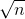

### 1.4　灵魂之交——马克思手稿中的数学题

有人抱怨：算法太枯燥、乏味了，看到公式就头晕，无法学下去了。你肯定选择了一条充满荆棘的路。选对方法，你会发现这里是一条充满鸟语花香和欢声笑语的幽径，在这里，你可以和高德纳聊聊，同爱因斯坦喝杯咖啡，与歌德巴赫和角谷谈谈想法，Dijkstra也不错。与世界顶级的大师进行灵魂之交，不问结果，这一过程已足够美妙！

如果这本书能让多一个人爱上算法，这就足够了！

#### 趣味故事1-3：马克思手稿中的数学题

马克思手稿中有一道趣味数学问题：有30个人，其中有男人、女人和小孩，这些人在一家饭馆吃饭花了50先令；每个男人花3先令，每个女人花2先令，每个小孩花1先令；问男人、女人和小孩各有几人？

（1）问题分析

设x、y、z分别代表男人、女人和小孩。按题目的要求，可得到下面的方程：

x+y+z=30　①

3x+2y+z=50 ②

两式相减，②−①得：

2x+y=20　③

从式③可以看出，因为x、y为正整数，x最大只能取9，所以x变化范围是1～9。那么我们可以让x从1到9变化，再找满足①②两个条件y、z值，找到后输入即可，答案可能不止一个。

（2）算法设计

按照上面的分析进行算法设计，见算法1-11。

```c
//算法1-11
#include<iostream> 
int main() 
{ 
  int x,y,z,count=0; //记录可行解的个数
  cout<<" Men，Women，Children"<<endl; 
  cout<<"........................................"<<endl; 
  for(x=1;x<=9;x++) 
  { 
    y=20-2*x;  //固定x值然后根据式③求得y值 
    z=30-x-y;  //由式①求得z值 
    if(3*x+2*y+z==50)  //判断当前得到的一组解是否满足式②
      cout<<++count<<"  "<<x<<y<<z<<endl; //打印出第几个解和解值x，y，z
    } 
}

```

（3）算法分析

算法完全按照题中方程设计，因此正确性毋庸置疑。那么算法复杂度怎样呢？从算法1-11中可以看出，对算法时间复杂度贡献最大的语句是for(x=1;x<=9;x++)，该语句的执行次数是9，for循环中3条语句的执行次数也为9，其他语句执行次数为1，for语句一共执行36次基本运算，时间复杂度为О(1)。没有使用辅助空间，空间复杂度也为О(1)。

（4）问题的进一步讨论

为什么让x变化来确定y、z值？让y变化来确定x、z值会怎样呢？让z变化来确定x、y值行不行？有没有更好的算法降低时间复杂度？

#### 趣味故事1-4：爱因斯坦的阶梯

爱因斯坦家里有一条长阶梯，若每步跨2阶，则最后剩1阶；若每步跨3阶，则最后剩2阶；若每步跨5阶，则最后剩4阶；若每步跨6阶，则最后剩5阶。只有每次跨7阶，最后才正好1阶不剩。请问这条阶梯共有多少阶？

（1）问题分析

根据题意，阶梯数n满足下面一组同余式：

n≡1(mod2)

n≡2(mod3)

n≡4(mod5)

n≡5(mod6)

n≡0(mod7)

**注意：** 两个整数a、b，若它们除以整数m所得的余数相等，则称a、b对于模m同余，记作a≡b(mod m)，读作a同余于b模m，或读作a与b关于模m同余。那么只需要判断一个整数值是否满足这5个同余式即可。

（2）算法设计

按照上面的分析进行算法设计，见算法1-12。

```c
//算法1-12
#include<iostream> 
int main() 
{ 
  int n=1; //n为所设的阶梯数 
  while(!((n%2==1)&&(n%3==2)&&(n%5==4)&&(n%6==5)&&(n%7==0))) 
      n++;      //判别是否满足一组同余式
  cout<<"Count the stairs= "<<n<<endl;  //输出阶梯数
}
```

（3）算法分析

算法的运行结果：

```c
Count the stairs =119
```

因为n从1开始，找到第一个满足条件的数就停止，所以算法1-12中的while语句运行了119次。有的算法从算法本身无法看出算法的运行次数，例如算法1-12，我们很难知道while语句执行了多少次，因为它是满足条件时停止，那么多少次才能满足条件呢？每个问题具体的次数是不同的，所以不能看到程序中有n，就简单地说它的时间复杂度为n。

> 我们从1开始一个一个找结果的办法是不是太麻烦了？

（4）算法改进

因为从上面的5个同余式来看，这个数一定是7的倍数n≡0(mod 7)，除以6余5，除以5余4，除以3余2，除以2余1，我们为什么不从7的倍数开始判断呢？算法改进见算法1-13。

```c
//算法1-13
#include<iostream> 
int main() 
{ 
  int n=7; //n为所设的阶梯数 
  while(!((n%2==1)&&(n%3==2)&&(n%5==4)&&(n%6==5)&&(n%7==0))) 
  n=n+7;      //判别是否满足一组同余式
  cout<<"Count the stairs="<<n<<endl;  //输出阶梯数
}
```

算法的运行结果：

```c
Count the stairs =119
```

算法1-13中的while语句执行了119/7=17次，可见运行次数减少了不少呢！

（5）问题的进一步讨论

此题算法还可考虑求1、2、4、5的最小公倍数n，然后令t=n−1，判断t≡0(mod 7)是否成立，若不成立则t=t+n，再进行判别，直到选出满足条件的t为止。

1、2、4、5的最小公倍数n=20。

t=n-1=19，t≡0(mod 7)不成立；

t= t+n=39，t≡0(mod 7)不成立；

t= t+n=59，t≡0(mod 7)不成立；

t= t+n=79，t≡0(mod 7)不成立；

t= t+n=99，t≡0(mod 7)不成立；

t= t+n=119，t≡0(mod 7)成立。

我们可以看到这一算法判断6次即成功，但是，求多个数的最小公倍数需要多少时间复杂度，是不是比上面的算法更优呢？结果如何请大家动手试一试。

#### 趣味故事1-5：哥德巴赫猜想

哥德巴赫猜想：任一大于2的偶数，都可表示成两个素数之和。

验证：2000以内大于2的偶数都能够分解为两个素数之和。

（1）问题分析

为了验证哥德巴赫猜想对2000以内大于2的偶数都是成立的，要将整数分解为两部分（两个整数之和），然后判断分解出的两个整数是否均为素数。若是，则满足题意；否则重新进行分解和判断。素数测试的算法可采用试除法，即用2，3，4，…，去除n，如果能被整除则为合数，不能被整除则为素数。

（2）算法设计

按照上面的分析进行算法设计，见算法1-14。

```c
//算法1-14
#include<iostream>
#include<math.h> 
int prime(int n); //判断是否均为素数
int main() 
{ 
  int i,n; 
  for(i=4;i<=2000;i+=2) //对2000大于2的偶数分解判断，从4开始，每次增2
  {
    for(n=2;n<i;n++)  //将偶数i分解为两个整数，一个整数是n，一个是i-n
      if(prime(n))    //判断第一个整数是否均为素数 
         if(prime(i-n))   //判断第二个整数是否均为素数 
         { 
            cout<< i <<"=" << n <<"+"<<i-n<<endl;  //若均是素数则输出 
            break; 
         } 
     if(n==i) 
        cout<<"error "<<endl; 
  } 
} 
int prime(int i) //判断是否为素数 
{ 
  int j; 
  if(i<=1) return 0; 
  if(i==2) return 1; 
  for(j=2;j<=(int)(sqrt((double)i);j++) 
    if(!(i%j)) return 0; 
  return 1;  
}
```

（3）算法分析

要验证哥德巴赫猜想对2000以内大于2的偶数都是成立的，我们首先要看看这个范围的偶数有多少个。1～2000中有1000个偶数，1000个奇数，那么大于2的偶数有999个，即i=4，6，8，…，2000。再看偶数分解和素数判断，这就要看最好情况和最坏情况了。最好的情况是一次分解，两次素数判断即可成功，最坏的情况要i−2次分解（即n=2，3，…，i−1的情况），每次分解分别执行2～sqrt(n)次、2～sqrt(i−n)次判断。

这个程序看似简单合理，但存在下面两个问题。

1）偶数分解存在重复。

+ i=4：分解为（2，2），（3，1），从n=2，3，…，i−1分解，每次得到一组数（n，i−n）。
+ i=6：分解为（2，4），（3，3），（4，2），（5，1）。
+ i=8：分解为（2，6），（3，5），（4，4），（5，3），（6，2），（7，1）。

除了最后一项外，每组分解都在i/2处对称分布。最后一组中有一个数为1，1既不是素数也不是合数，因此去掉最后一组，那么我们就可以从n=2，3，…，i/2进行分解，省掉了一半的多余判断。

2）素数判断存在重复。

+ i=4：分解为（2，2），（3，1），要判断2是否为素数，然后判断第二个2是否为素数。判断成功，返回。
+ i=6：分解为（2，4），（3，3），（4，2），（5，1），要判断2是否为素数，然后判断4是否为素数，不是继续下一个分解。再判断3是否为素数，然后判断第二个3是否为素数。判断成功，返回。

每次判断素数都要调用prime函数，那么可以先判断分解有可能得到的数是否为素数，然后把结果存储下来，下次判断时只需要调用上次的结果，不需要再重新判断是否为素数。例如（2，2），第一次判断结果2是素数，那第二个2就不用判断，直接调用这个结果，后面所有的分解，只要遇到这个数就直接认定为这个结果。

（4）算法改进

先判断所有分解可能得到的数是否为素数，然后把结果存储下来，有以下两种方法。

1）用布尔型数组 flag[2..1998]记录分解可能得到的数（2～1998）所有数是不是素数，分解后的值作为下标，调用该数组即可。时间复杂度减少，但空间复杂度增加。

2）用数值型数组data[302]记录2～1998中所有的素数（302个）。

+ 分解后的值，采用折半查找（素数数组为有序存储）的办法在素数数组中查找，找到就是素数，否则不是。
+ 不分解，直接在素数数组中找两个素数之和是否为i，如果找到，验证成功。因为素数数组为有序存储，当两个数相加比i大时，不需要再判断后面的数。

（5）问题的进一步讨论

上面的方法可以写出3个算法，大家可以尝试写一写，然后分析时间复杂度、空间复杂度如何？哪个算法更优一些？是不是还可以做到更好？

