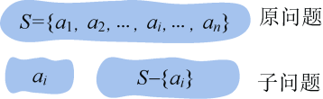

### 2.1.2　贪亦有道

“君子爱财，取之有道”，我们在贪心算法中“贪亦有道”。通常我们在遇到具体问题时，往往分不清哪些问题该用贪心策略求解，哪些问题不能使用贪心策略。经过实践我们发现，利用贪心算法求解的问题往往具有两个重要的特性：贪心选择性质和最优子结构性质。如果满足这两个性质就可以使用贪心算法了。

（1）贪心选择

所谓贪心选择性质是指原问题的整体最优解可以通过一系列局部最优的选择得到。应用同一规则，将原问题变为一个相似的但规模更小的子问题，而后的每一步都是当前最佳的选择。这种选择依赖于已做出的选择，但不依赖于未做出的选择。运用贪心策略解决的问题在程序的运行过程中无回溯过程。关于贪心选择性质，读者可在后续的贪心策略状态空间图中得到深刻的体会。

（2）最优子结构

当一个问题的最优解包含其子问题的最优解时，称此问题具有最优子结构性质。问题的最优子结构性质是该问题是否可用贪心算法求解的关键。例如原问题S={a1，a2，…，ai，…，an}，通过贪心选择选出一个当前最优解{ai}之后，转化为求解子问题S−{ai}，如果原问题的最优解包含子问题的最优解，则说明该问题满足最优子结构性质，如图2-1所示。

<b class="my_markdown">图2-1　原问题和子问题</b>

