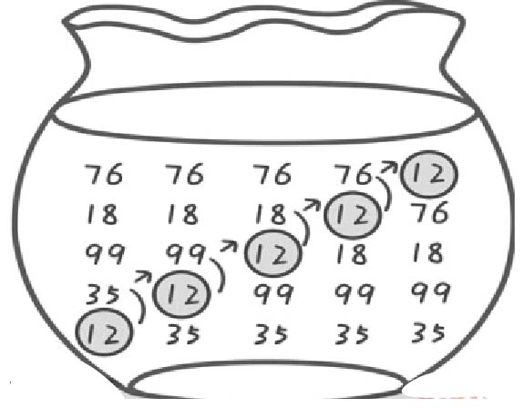

### 2.1.3　贪心算法秘籍

武林中有武功秘籍，算法中也有贪心秘籍。上面我们已经知道了具有贪心选择和最优子结构性质就可以使用贪心算法，那么如何使用呢？下面介绍贪心算法秘籍。

（1）贪心策略

首先要确定贪心策略，选择当前看上去最好的一个方案。例如，挑选苹果，如果你认为个大的是最好的，那你每次都从苹果堆中拿一个最大的，作为局部最优解，贪心策略就是选择当前最大的苹果；如果你认为最红的苹果是最好的，那你每次都从苹果堆中拿一个最红的，贪心策略就是选择当前最红的苹果。因此根据求解目标不同，贪心策略也会不同。

（2）局部最优解

根据贪心策略，一步一步地得到局部最优解。例如，第一次选一个最大的苹果放起来，记为a1，第二次再从剩下的苹果堆中选择一个最大的苹果放起来，记为a2，以此类推。

（3）全局最优解

把所有的局部最优解合成为原来问题的一个最优解（a1，a2，…）。

> 怎么有点儿像冒泡排序啊？

“不是六郎似荷花，而是荷花似六郎”！不是贪心算法像冒泡排序，而是冒泡排序使用了贪心算法，它的贪心策略就是每一次从剩下的序列中选一个最大的数，把这些选出来的数放在一起，就得到了从大到小的排序结果，如图2-2所示。

<b class="my_markdown">图2-2　冒泡排序</b>

