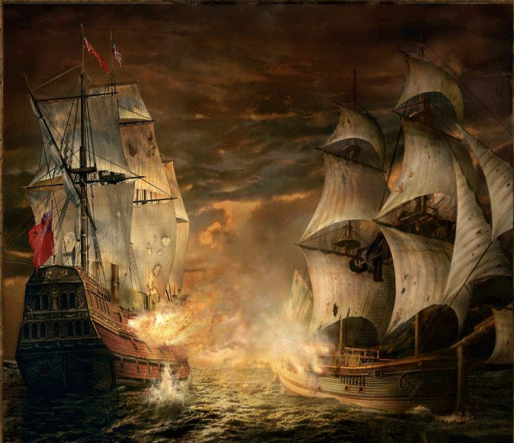

### 2.2　加勒比海盗船——最优装载问题

在北美洲东南部，有一片神秘的海域，那里碧海蓝天、阳光明媚，这正是传说中海盗最活跃的加勒比海（Caribbean Sea）。17世纪时，这里更是欧洲大陆的商旅舰队到达美洲的必经之地，所以当时的海盗活动非常猖獗，海盗不仅攻击过往商人，甚至攻击英国皇家舰……

有一天，海盗们截获了一艘装满各种各样古董的货船，每一件古董都价值连城，一旦打碎就失去了它的价值。虽然海盗船足够大，但载重量为C，每件古董的重量为wi，海盗们该如何把尽可能多数量的宝贝装上海盗船呢？

<b class="my_markdown">图2-3　加勒比海盗</b>

