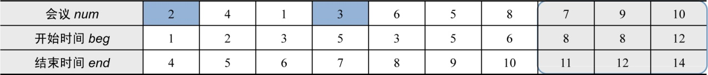
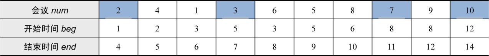

### 2.4.3　完美图解

#### 1．原始的会议时间表（见表2-7）：

<b class="my_markdown">表2-7　原始会议时间表</b>

| 会议num | 1 | 2 | 3 | 4 | 5 | 6 | 7 | 8 | 9 | 10 |
| :-----  | :-----  | :-----  | :-----  | :-----  | :-----  | :-----  | :-----  | :-----  | :-----  | :-----  | :-----  | :-----  |
| 开始时间beg | 3 | 1 | 5 | 2 | 5 | 3 | 8 | 6 | 8 | 12 |
| 结束时间end | 6 | 4 | 7 | 5 | 9 | 8 | 11 | 10 | 12 | 14 |

#### 2．排序后的会议时间表（见表2-8）：

<b class="my_markdown">表2-8　排序后的会议时间表</b>

| 会议num | 2 | 4 | 1 | 3 | 6 | 5 | 8 | 7 | 9 | 10 |
| :-----  | :-----  | :-----  | :-----  | :-----  | :-----  | :-----  | :-----  | :-----  | :-----  | :-----  | :-----  | :-----  |
| 开始时间beg | 1 | 2 | 3 | 5 | 3 | 5 | 6 | 8 | 8 | 12 |
| 结束时间end | 4 | 5 | 6 | 7 | 8 | 9 | 10 | 11 | 12 | 14 |

#### 3．贪心选择过程

（1）首先选择排序后的第一个会议即最早结束的会议（编号为2），用last记录最后一个被选中会议的结束时间，last=4。

（2）检查余下的会议，找到第一个开始时间大于等于 last（last=4）的会议，子问题转化为从该会议开始，余下的所有会议。如表2-9所示。

<b class="my_markdown">表2-9　会议时间表</b>

从子问题中，选择第一个会议即最早结束的会议（编号为3），更新last为刚选中会议的结束时间last=7。

（3）检查余下的会议，找到第一个开始时间大于等于last（last=7）的会议，子问题转化为从该会议开始，余下的所有会议。如表2-10所示。

<b class="my_markdown">表2-10　会议时间表</b>

从子问题中，选择第一个会议即最早结束的会议（编号为 7），更新 last 为刚选中会议的结束时间last=11。

（4）检查余下的会议，找到第一个开始时间大于等于last（last=11）的会议，子问题转化为从该会议开始，余下的所有会议。如表2-11所示。

<b class="my_markdown">表2-11　会议时间表</b>

从子问题中，选择第一个会议即最早结束的会议（编号为10），更新last为刚选中会议的结束时间last=14；所有会议检查完毕，算法结束。如表2-12所示。

#### 4．构造最优解

从贪心选择的结果，可以看出，被选中的会议编号为{2，3，7，10}，可以安排的会议数量最多为4，如表2-12所示。

<b class="my_markdown">表2-12　会议时间表</b>

