### 2.5.3　完美图解

现在我们有一个景点地图，如图2-10所示，假设从1号结点出发，求到其他各个结点的最短路径。

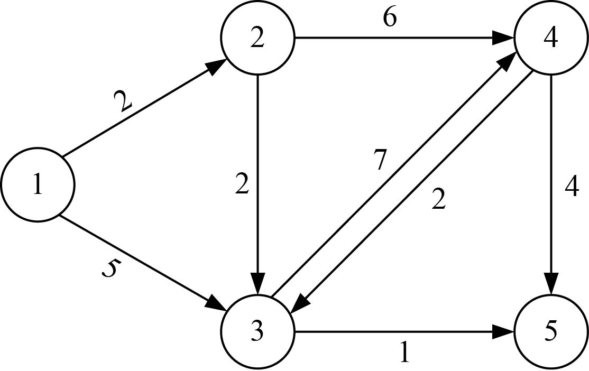

<b class="my_markdown">图2-10　景点地图</b>

算法步骤如下。

（1）数据结构

设置地图的带权邻接矩阵为**map**[][]，即如果从顶点i到顶点j有边，则**map**[i][j]等于<i，j>的权值，否则**map**[i][j]=∞（无穷大），如图2-11所示。

<b class="my_markdown">图2-11　邻接矩阵**map**[][]</b>

（2）初始化

令集合S={1}，V−S={2，3，4，5}，对于集合V−S中的所有顶点x，初始化最短距离数组dist[i]=**map**[1][i]，dist[u]=0，如图2-12所示。如果源点1到顶点i有边相连，初始化前驱数组p[i]=1，否则p[i]= −1，如图2-13所示。

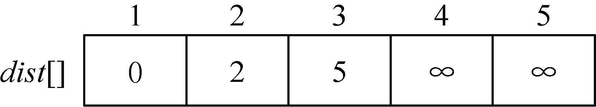

<b class="my_markdown">图2-12　最短距离数组dist[]</b>

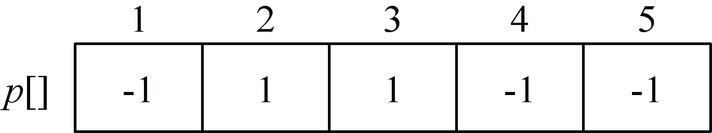

<b class="my_markdown">图2-13　前驱数组p[]</b>

（3）找最小

在集合V−S={2，3，4，5}中，依照贪心策略来寻找V−S集合中dist[]最小的顶点t，如图2-14所示。

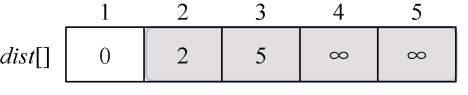

<b class="my_markdown">图2-14　最短距离数组dist[]</b>

找到最小值为2，对应的结点t=2。

（4）加入S战队

将顶点t=2加入集合S中S={1，2}，同时更新V−S={3，4，5}，如图2-15所示。

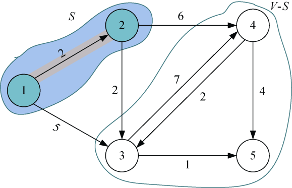

<b class="my_markdown">图2-15　景点地图</b>

（5）借东风

刚刚找到了源点到t=2的最短路径，那么对集合V−S中所有t的邻接点j，都可以借助t走捷径。我们从图或邻接矩阵都可以看出，2号结点的邻接点是3和4号结点，如图2-16所示。

<b class="my_markdown">图2-16　邻接矩阵**map**[][]</b>

先看3号结点能否借助2号走捷径：dist[2]+**map**[2][3]=2+2=4，而当前dist[3]=5>4，因此可以走捷径即2—3，更新dist[3]=4，记录顶点3的前驱为2，即p[3]= 2。

再看4号结点能否借助2号走捷径：如果dist[2]+**map**[2][4]=2+6=8，而当前dist[4]=∞>8，因此可以走捷径即2—4，更新dist[4]=8，记录顶点4的前驱为2，即p[4]= 2。

更新后如图2-17和图2-18所示。

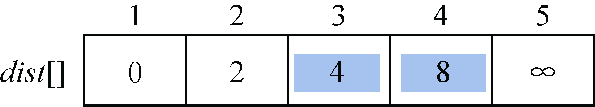

<b class="my_markdown">图2-17　最短距离数组dist[]</b>

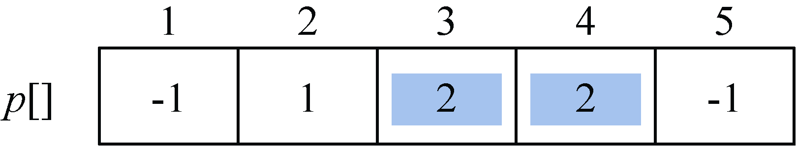

<b class="my_markdown">图2-18　前驱数组p[]</b>

（6）找最小

在集合V−S={3，4，5}中，依照贪心策略来寻找dist[]具有最小值的顶点t，依照贪心策略来寻找V−S集合中dist[]最小的顶点t，如图2-19所示。

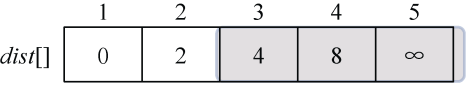

<b class="my_markdown">图2-19　最短距离数组dist[]</b>

找到最小值为4，对应的结点t=3。

（7）加入S战队

将顶点t=3加入集合S中S={1，2，3}，同时更新V−S={4，5}，如图2-20所示。

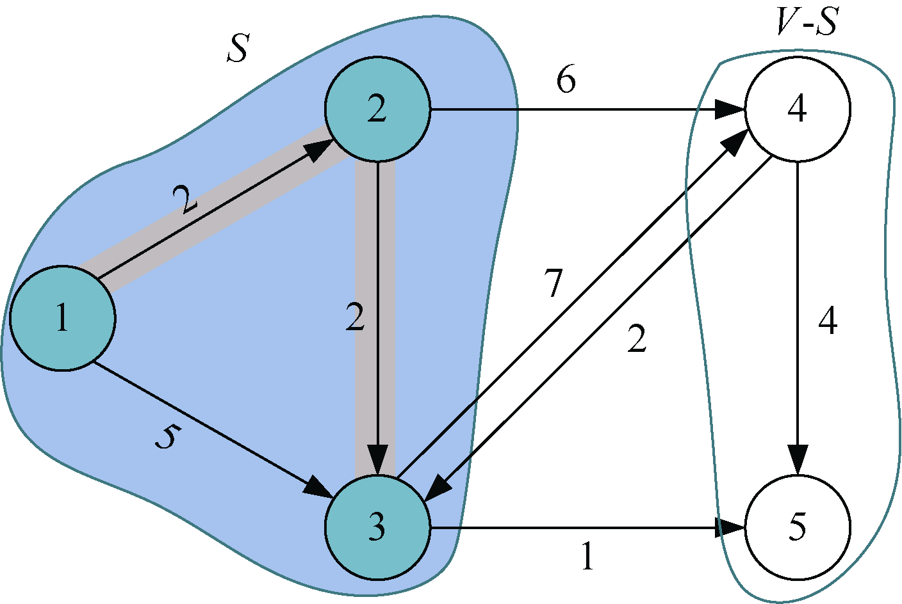

<b class="my_markdown">图2-20　景点地图</b>

（8）借东风

刚刚找到了源点到t =3的最短路径，那么对集合V−S中所有t的邻接点j，都可以借助t走捷径。我们从图或邻接矩阵可以看出，3号结点的邻接点是4和5号结点。

先看4号结点能否借助3号走捷径：dist[3]+**map**[3][4]=4+7=11，而当前dist[4]=8<11，比当前路径还长，因此不更新。

再看5号结点能否借助3号走捷径：dist[3]+**map**[3][5]=4+1=5，而当前dist[5]=∞>5，因此可以走捷径即3—5，更新dist[5]=5，记录顶点5的前驱为3，即p[5]=3。

更新后如图2-21和图2-22所示。

<b class="my_markdown">图2-21　最短距离数组dist[]</b>

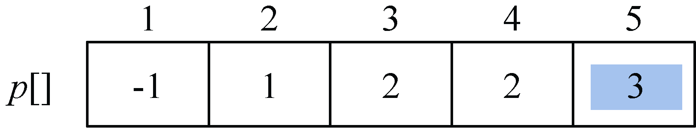

<b class="my_markdown">图2-22　前驱数组p[]</b>

（9）找最小

在集合V−S={4，5}中，依照贪心策略来寻找V−S集合中dist[]最小的顶点t，如图2-23所示。

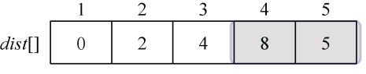

<b class="my_markdown">图2-23　最短距离数组dist[]</b>

找到最小值为5，对应的结点t=5。

（10）加入S战队

将顶点t=5加入集合S中S={1，2，3，5}，同时更新V−S={4}，如图2-24所示。

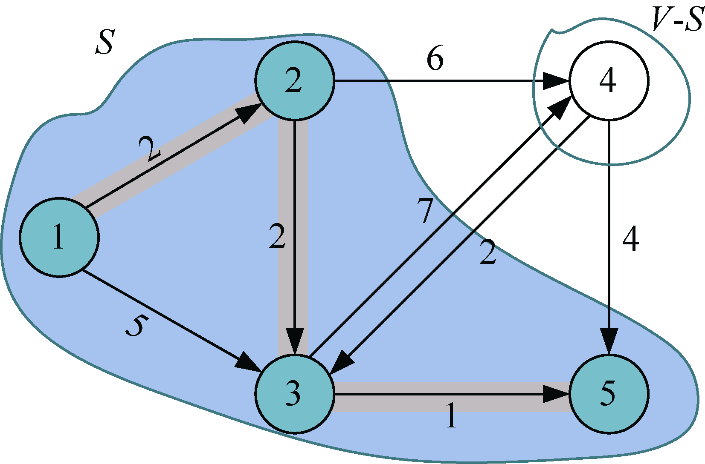

<b class="my_markdown">图2-24　景点地图</b>

（11）借东风

刚刚找到了源点到t =5的最短路径，那么对集合V−S中所有t的邻接点j，都可以借助t走捷径。我们从图或邻接矩阵可以看出，5号结点没有邻接点，因此不更新，如图2-25和图2-26所示。

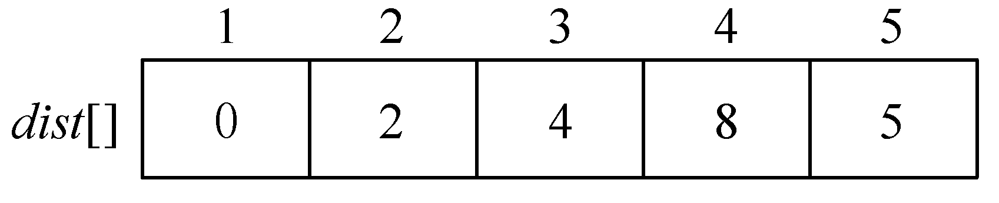

<b class="my_markdown">图2-25　最短距离数组dist[]</b>

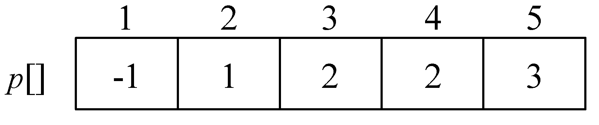

<b class="my_markdown">图2-26　前驱数组p[]</b>

（12）找最小

在集合V−S={4}中，依照贪心策略来寻找dist[]最小的顶点t，只有一个顶点，所以很容易找到，如图2-27所示。

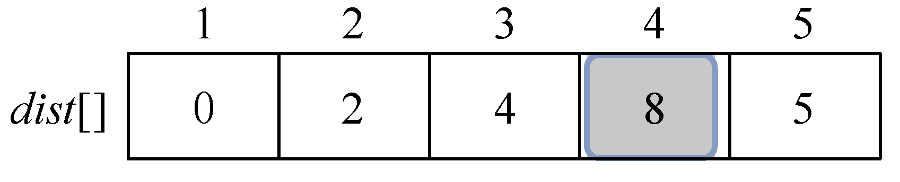

<b class="my_markdown">图2-27　最短距离数组dist[]</b>

找到最小值为8，对应的结点t=4。

（13）加入S战队

将顶点t加入集合S中S={1，2，3，5，4}，同时更新V−S={ }，如图2-28所示。

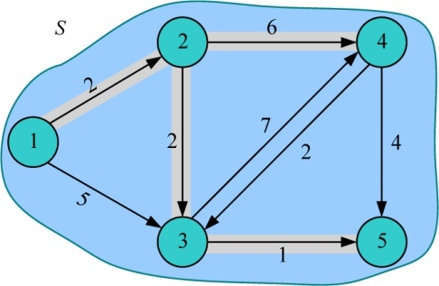

<b class="my_markdown">图2-28　景点地图</b>

（14）算法结束

V−S={ }为空时，算法停止。

由此，可求得从源点u到图**G**的其余各个顶点的最短路径及长度，也可通过前驱数组p[]逆向找到最短路径上经过的城市，如图2-29所示。

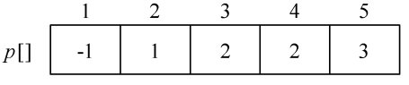

<b class="my_markdown">图2-29　前驱数组p[]</b>

例如，p[5]=3，即5的前驱是3；p[3]=2，即3的前驱是2；p[2]=1，即2的前驱是1；p[1]= −1，1没有前驱，那么从源点1到5的最短路径为1—2—3—5。

