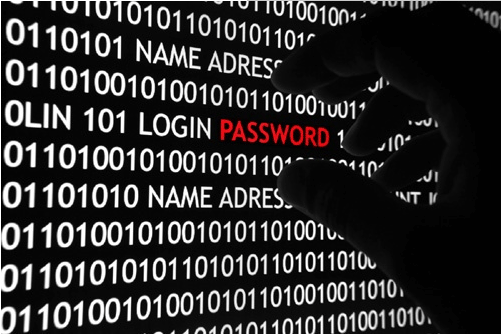

### 2.6　神秘电报密码——哈夫曼编码

看过谍战电影《风声》的观众都会对影片中神奇的消息传递惊叹不已！吴志国大队长在受了残忍的“针刑”之后躺在手术台上唱空城计，变了音调，把消息传给了护士，顾晓梦在衣服上缝补了长短不一的针脚……那么，片中无处不在的摩尔斯码到底是什么？它又有着怎样的神秘力量呢？

摩尔斯电码（Morse code）由点dot（. ）、划dash（-）两种符号组成。它的基本原理是：把英文字母表中的字母、标点符号和空格按照出现的频率排序，然后用点和划的组合来代表这些字母、标点符号和空格，使频率最高的符号具有最短的点划组合。

<b class="my_markdown">图2-30　神秘电报密码</b>

