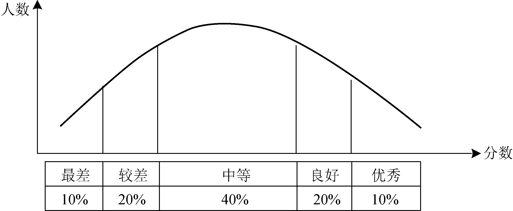
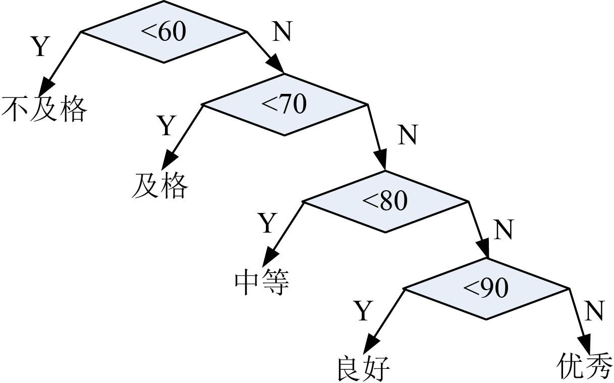
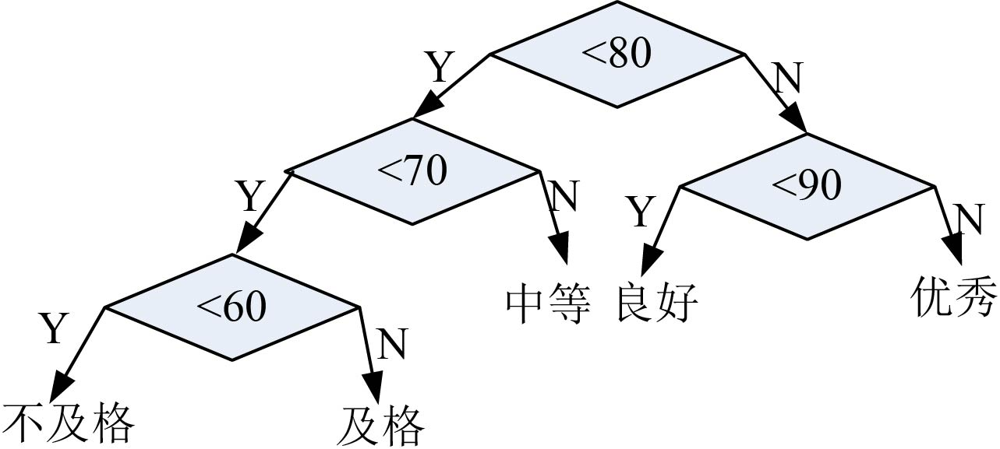
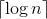

### 2.6.1　问题分析

我们先看一个生活中的例子：

有一群退休的老教授聚会，其中一个老教授带着刚会说话的漂亮小孙女，于是大家逗她：“你能猜猜我们多大了吗？猜对了有糖吃哦！”小女孩就开始猜：“你是1岁了吗？”，老教授摇摇头。“你是两岁了吗？”，老教授仍然摇摇头。“那一定是3岁了！”……大家哈哈大笑。或许我们都感觉到了小女孩的天真可爱，然而生活中的确有很多类似这样的判断。

曾经有这样一个C++设计题目：将一个班级的成绩从百分制转为等级制。一同学设计的程序为：

```c
if(score <60) cout << "不及格"<<endl;
else if (score <70) cout << "及格"<<endl;
    else if (score <80) cout << "中等"<<endl;
       else if (score <90) cout << "良好"<<endl;
          else cout << "优秀"<<endl;
```

在上面程序中，如果分数小于60，我们做1次判定即可；如果分数为60～70，需要判定2次；如果分数为70～80，需要判定3次；如果分数为80～90，需要判定4次；如果分数为90～100，需要判定5次。

这段程序貌似是没有任何问题，但是我们却犯了从1岁开始判断一个老教授年龄的错误，因为我们的考试成绩往往是呈正态分布的，如图2-31所示。


<center class="my_markdown"><b class="my_markdown">图2-31　运行结果</b></center>

也就是说，大多数（70%）人的成绩要判断3次或3次以上才能成功，假设班级人数为100人，则判定次数为：

100×10%×1+100×20%×2+100×40%×3+100×20%×4+100×10%×5=300（次）

如果我们改写程序为：

```c
if(score <80) 
   if (score <70) 
       if (score <60) cout << "不及格"<<endl;
       else cout << "及格"<<endl;
   else cout << "中等"<<endl;
else if (score <90) cout << "良好"<<endl;
   else cout << "优秀"<<endl;
```

则判定次数为：

100×10%×3+100×20%×3+100×40%×2+100×20%×2+100×10%×2=230（次）

为什么会有这样大的差别呢？我们来看两种判断方式的树形图，如图2-32所示。



<center class="my_markdown"><b class="my_markdown">图2-32　两种判断方式的树形图</b></center>

从图2-32中我们可以看到，当频率高的分数越靠近树根（先判断）时，我们只用1次猜中的可能性越大。

再看五笔字型的编码方式：

我们在学习五笔时，需要背一级简码。所谓一级简码，就是指25个汉字，对应着25个按键，打1个字母键再加1个空格键就可打出来相应的字。为什么要这样设置呢？因为根据文字统计，这25个汉字是使用频率最高的。

五笔字根之一级简码：

G 一　F 地　D 在　 S 要　 A 工

H 上　J 是　K 中　 L 国　 M 同

T 和　R 的　E 有　 W 人　Q 我

Y 主　U 产　I 不　 O 为　 P 这

N 民　B 了　V 发　C 以　 X 经

通常的编码方法有固定长度编码和不等长度编码两种。这是一个设计最优编码方案的问题，目的是使总码长度最短。这个问题利用字符的使用频率来编码，是不等长编码方法，使得经常使用的字符编码较短，不常使用的字符编码较长。如果采用等长的编码方案，假设所有字符的编码都等长，则表示n个不同的字符需要位。例如，3个不同的字符a、b、c，至少需要2位二进制数表示，a为00，b为01，c为10。如果每个字符的使用频率相等，固定长度编码是空间效率最高的方法。

不等长编码方法需要解决两个关键问题：

（1）编码尽可能短

我们可以让使用频率高的字符编码较短，使用频率低的编码较长，这种方法可以提高压缩率，节省空间，也能提高运算和通信速度。即 **频率越高，编码越短** 。

（2）不能有二义性

例如，ABCD四个字符如果编码如下。

A：0。B：1。C：01。D：10。

那么现在有一列数0110，该怎样翻译呢？是翻译为ABBA，ABD，CBA，还是CD？那么如何消除二义性呢？解决的办法是：任何一个字符的编码不能是另一个字符编码的前缀，即 **前缀码特性** 。

1952年，数学家D.A.Huffman提出了根据字符在文件中出现的频率，用0、1的数字串表示各字符的最佳编码方式，称为哈夫曼（Huffman）编码。哈夫曼编码很好地解决了上述两个关键问题，被广泛应用于数据压缩，尤其是远距离通信和大容量数据存储方面，常用的JPEG图片就是采用哈夫曼编码压缩的。

