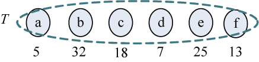
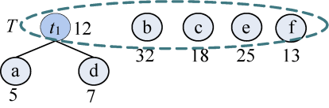
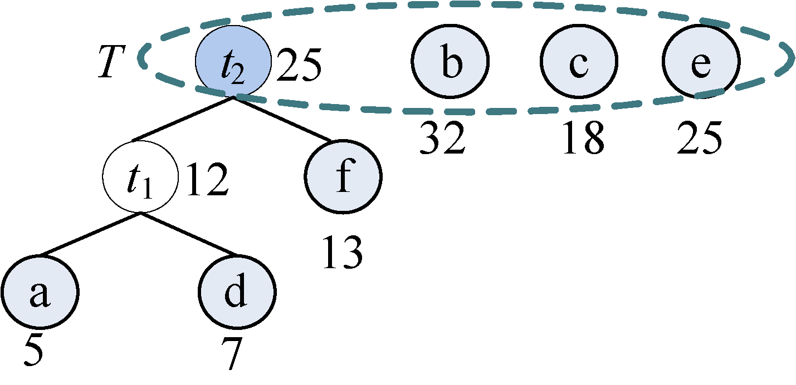
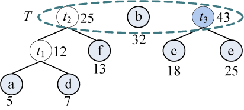
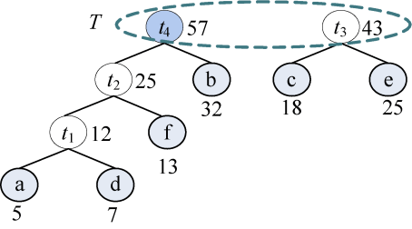
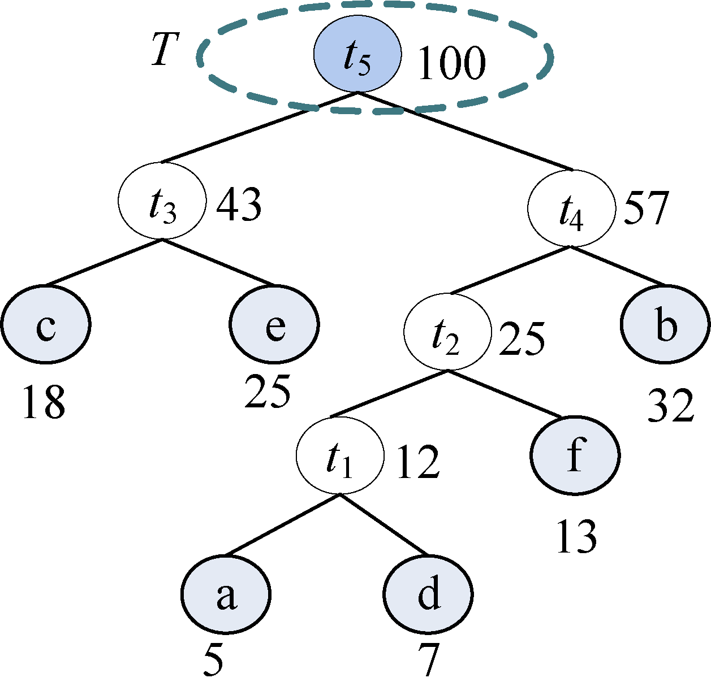

### 2.6.3　完美图解

假设我们现在有一些字符和它们的使用频率（见表2-13），如何得到它们的哈夫曼编码呢？

<b class="my_markdown">表2-13　字符频率</b>

| 字符 | a | b | c | d | e | f |
| :-----  | :-----  | :-----  | :-----  | :-----  | :-----  | :-----  | :-----  | :-----  |
| 频率 | 0.05 | 0.32 | 0.18 | 0.07 | 0.25 | 0.13 |

我们可以把每一个字符作为叶子，它们对应的频率作为其权值，为了比较大小方便，可以对其同时扩大100倍，得到a～f分别对应5、32、18、7、25、13。

（1）初始化。构造n棵结点为n个字符的单结点树集合T={a，b，c，d，e，f}，如图2-33所示。

<b class="my_markdown">图2-33　叶子结点</b>

（2）从集合T中取出没有双亲的且权值最小的两棵树a和d，将它们合并成一棵新树t1，新树的左孩子为a，右孩子为d，新树的权值为a和d的权值之和为12。新树的树根t1加入集合T，a和d从集合T中删除，如图2-34所示。

<b class="my_markdown">图2-34　构建新树</b>

（3）从集合T中取出没有双亲的且权值最小的两棵树t1和f，将它们合并成一棵新树t2，新树的左孩子为t1，右孩子为f，新树的权值为t1和f的权值之和为25。新树的树根t2加入集合T，将t1和f从集合T中删除，如图2-35所示。

<b class="my_markdown">图2-35　构建新树</b>

（4）从集合T中取出没有双亲且权值最小的两棵树c和e，将它们合并成一棵新树t3，新树的左孩子为c，右孩子为e，新树的权值为c和e的权值之和为43。新树的树根t3加入集合T，将c和e从集合T中删除，如图2-36所示。

<b class="my_markdown">图2-36　构建新树</b>

（5）从集合T中取出没有双亲且权值最小的两棵树t2和b，将它们合并成一棵新树t4，新树的左孩子为t2，右孩子为b，新树的权值为t2和b的权值之和为57。新树的树根t4加入集合T，将t2和b从集合T中删除，如图2-37所示。

<b class="my_markdown">图2-37　构建新树</b>

（6）从集合T中取出没有双亲且权值最小的两棵树t3和t4，将它们合并成一棵新树t5，新树的左孩子为t4，右孩子为t3，新树的权值为t3和t4的权值之和为 100。新树的树根t5加入集合T，将t3和t4从集合T中删除，如图 2-38所示。

<b class="my_markdown">图2-38　哈夫曼树</b>

（7）T中只剩下一棵树，哈夫曼树构造成功。

（8）约定左分支上的编码为“0”，右分支上的编码为“1”。从叶子结点到根结点逆向求出每个字符的哈夫曼编码，从根结点到叶子结点路径上的字符组成的字符串为该叶子结点的哈夫曼编码，如图2-39所示。

<b class="my_markdown">图2-39　哈夫曼编码</b>

