### 2.6.4　伪代码详解

在构造哈夫曼树的过程中，首先给每个结点的双亲、左孩子、右孩子初始化为−1，找出所有结点中双亲为−1、权值最小的两个结点t<sub class="my_markdown">1</sub>、t<sub>2</sub>，并合并为一棵二叉树，更新信息（双亲结点的权值为t<sub class="my_markdown">1</sub>、t<sub>2</sub>权值之和，其左孩子为权值最小的结点t<sub class="my_markdown">1</sub>，右孩子为次小的结点t<sub>2</sub>，t<sub class="my_markdown">1</sub>、t<sub>2</sub>的双亲为双亲结点的编号）。重复此过程，构造一棵哈夫曼树。

（1）数据结构

每个结点的结构包括权值、双亲、左孩子、右孩子、结点字符信息这 5 个域。如图 2-40所示，定义为结构体形式，定义结点结构体HnodeType：

```c
typedef struct
{
     double weight; //权值
     int parent;  //双亲
     int lchild;  //左孩子
     int rchild;  //右孩子
     char value; //该节点表示的字符
} HNodeType;
```


<center class="my_markdown"><b class="my_markdown">图2-40　结点结构体</b></center>

在编码结构体中，bit[]存放结点的编码，start 记录编码开始下标，逆向译码（从叶子到根，想一想为什么不从根到叶子呢？）。存储时，start从n−1开始依次递减，从后向前存储；读取时，从start+1开始到n−1，从前向后输出，即为该字符的编码。如图2-41所示。

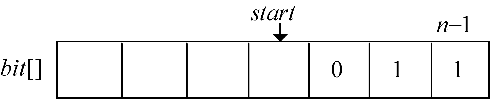
<center class="my_markdown"><b class="my_markdown">图2-41　编码数组</b></center>

编码结构体HcodeType：

```c
typedef struct
{
     int bit[MAXBIT]; //存储编码的数组
     int start;       //编码开始下标
} HCodeType;          /* 编码结构体 */
```

（2）初始化

初始化存放哈夫曼树数组HuffNode[]中的结点（见表2-14）：

```c
for (i=0; i<2*n-1; i++){
     HuffNode[i].weight = 0;//权值
     HuffNode[i].parent =-1; //双亲
     HuffNode[i].lchild =-1; //左孩子
     HuffNode[i].rchild =-1; //右孩子
}
```

<center class="my_markdown"><b class="my_markdown">表2-14　哈夫曼树构建数组</b></center>

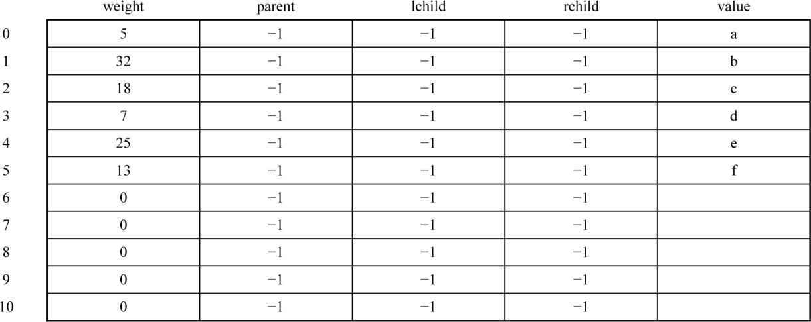
输入n个叶子结点的字符及权值：

```c
for (i=0; i<n; i++){
     cout<<"Please input value and weight of leaf node "<<i + 1<<endl;
     cin>>HuffNode[i].value>>HuffNode[i].weight;
}
```

（3）循环构造Huffman树

从集合T中取出双亲为−1且权值最小的两棵树t<sub class="my_markdown">i</sub>和t<sub class="my_markdown">j</sub>，将它们合并成一棵新树z<sub class="my_markdown">k</sub>，新树的左儿子为t<sub class="my_markdown">i</sub>，右孩子为t<sub class="my_markdown">j</sub>，z<sub class="my_markdown">k</sub>的权值为t<sub class="my_markdown">i</sub>和t<sub class="my_markdown">j</sub>的权值之和。

```c
    int i, j, x1, x2; //x1、x2为两个最小权值结点的序号。
    double m1,m2; //m1、m2为两个最小权值结点的权值。
    for (i=0; i<n-1; i++){
         m1=m2=MAXVALUE;  //初始化为最大值
         x1=x2=-1;  //初始化为-1
         //找出所有结点中权值最小、无双亲结点的两个结点
         for (j=0; j<n+i; j++){
              if (HuffNode[j].weight < m1 && HuffNode[j].parent==-1){
                   m2 = m1;
                   x2 = x1;
                   m1 = HuffNode[j].weight;
                   x1 = j;
              }
              else if (HuffNode[j].weight < m2 && HuffNode[j].parent==-1){
                   m2=HuffNode[j].weight;
                   x2=j;
              }
         }
         /* 更新新树信息 */
         HuffNode[x1].parent = n+i; //x1的父亲为新结点编号n+i
         HuffNode[x2].parent = n+i; //x2的父亲为新结点编号n+i
         HuffNode[n+i].weight =m1+m2; //新结点权值为两个最小权值之和m1+m2
         HuffNode[n+i].lchild = x1; //新结点n+i的左孩子为x1 
         HuffNode[n+i].rchild = x2; //新结点n+i的右孩子为x2
    }
}
```

图解：

（1）i=0时，j=0；j<6；找双亲为−1，权值最小的两个数：

```c
x1=0   x2=3；//x1、x2为两个最小权值结点的序号
m1=5  m2=7；//m1、m2为两个最小权值结点的权值
HuffNode[0].parent = 6;   //x1的父亲为新结点编号n+i
HuffNode[3].parent = 6;   //x2的父亲为新结点编号n+i
HuffNode[6].weight =12;   //新结点权值为两个最小权值之和m1+m2
HuffNode[6].lchild = 0;   //新结点n+i的左孩子为x1 
HuffNode[6].rchild = 3;   //新结点n+i的右孩子为x2
```

数据更新后如表2-15所示。

<center class="my_markdown"><b class="my_markdown">表2-15　哈夫曼树构建数组</b></center>

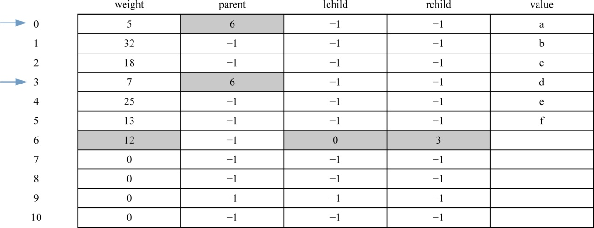
对应的哈夫曼树如图2-42所示。

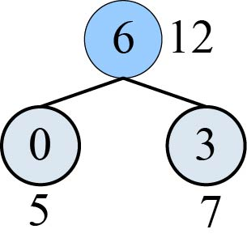
<center class="my_markdown"><b class="my_markdown">图2-42　哈夫曼树生成过程</b></center>

（2）i=1时，j=0；j<7；找双亲为−1，权值最小的两个数：

```c
x1=6    x2=5；//x1、x2为两个最小权值结点的序号
m1=12  m2=13；//m1、m2为两个最小权值结点的权值
HuffNode[5].parent = 7;   //x1的父亲为新结点编号n+i
HuffNode[6].parent = 7;   //x2的父亲为新结点编号n+i
HuffNode[7].weight =25;   //新结点权值为两个最小权值之和m1+m2
HuffNode[7].lchild = 6;   //新结点n+i的左孩子为x1 
HuffNode[7].rchild = 5;   //新结点n+i的右孩子为x2
```

数据更新后如表2-16所示。

<center class="my_markdown"><b class="my_markdown">表2-16　哈夫曼树构建数组</b></center>

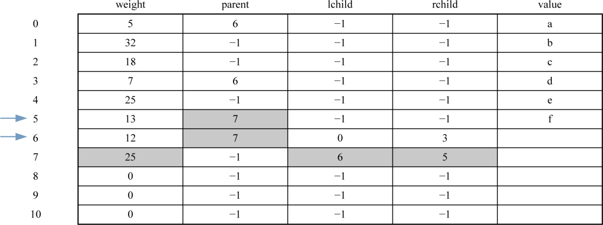
对应的哈夫曼树如图2-43所示。

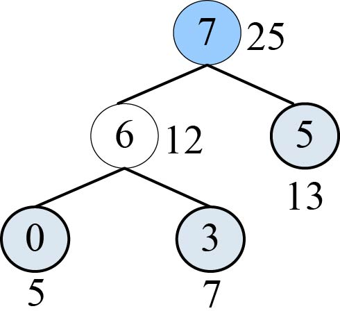
<center class="my_markdown"><b class="my_markdown">图2-43　哈夫曼树生成过程</b></center>

（3）i=2时，j=0；j<8；找双亲为−1，权值最小的两个数：

```c
x1=2    x2=4；//x1、x2为两个最小权值结点的序号
m1=18  m2=25；//m1、m2为两个最小权值结点的权值
HuffNode[2].parent = 8;   //x1的父亲为新结点编号n+i
HuffNode[4].parent = 8;   //x2的父亲为新结点编号n+i
HuffNode[8].weight =43;   //新结点权值为两个最小权值之和m1+m2
HuffNode[8].lchild = 2;   //新结点n+i的左孩子为x1 
HuffNode[8].rchild = 4;   //新结点n+i的右孩子为x2
```

数据更新后如表2-17所示。

<center class="my_markdown"><b class="my_markdown">表2-17　哈夫曼树构建数组</b></center>

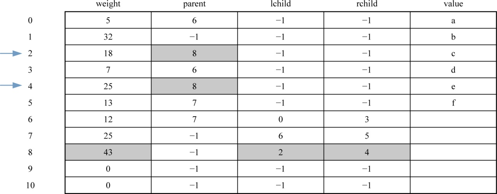
对应的哈夫曼树如图2-44所示。

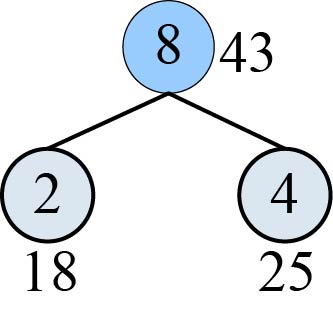
<center class="my_markdown"><b class="my_markdown">图2-44　哈夫曼树生成过程</b></center>

（4）i=3时，j=0；j<9；找双亲为−1，权值最小的两个数：

```c
x1=7    x2=1；//x1、x2为两个最小权值结点的序号
m1=25  m2=32；//m1、m2为两个最小权值结点的权值
HuffNode[7].parent = 9;    //x1的父亲为新结点编号n+i
HuffNode[1].parent = 9;     //x2的父亲为新结点编号n+i
HuffNode[8].weight =57;     //新结点权值为两个最小权值之和m1+m2
HuffNode[8].lchild = 7;     //新结点n+i的左孩子为x1 
HuffNode[8].rchild = 1;     //新结点n+i的右孩子为x2
```

数据更新后如表2-18所示。

<center class="my_markdown"><b class="my_markdown">表2-18　哈夫曼树构建数组</b></center>

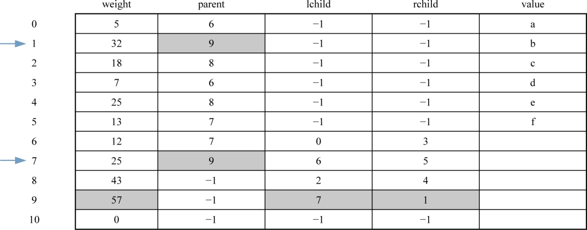
对应的哈夫曼树如图2-45所示。


<center class="my_markdown"><b class="my_markdown">图2-45　哈夫曼树生成过程</b></center>

（5）i=4时，j=0；j<10；找双亲为−1，权值最小的两个数：

```c
x1=8    x2=9；//x1、x2为两个最小权值结点的序号
m1=43  m2=57；//m1、m2为两个最小权值结点的权值
HuffNode[8].parent = 10;  //x1的父亲为生成的新结点编号n+i
HuffNode[9].parent =10;   //x2的父亲为生成的新结点编号n+i
HuffNode[10].weight =100;  //新结点权值为两个最小权值之和m1+ m2
HuffNode[10].lchild = 8; //新结点编号n+i的左孩子为x1 
HuffNode[10].rchild = 9; //新结点编号n+i的右孩子为x2
```

数据更新后如表2-19所示。

<center class="my_markdown"><b class="my_markdown">表2-19　哈夫曼树构建数组</b></center>

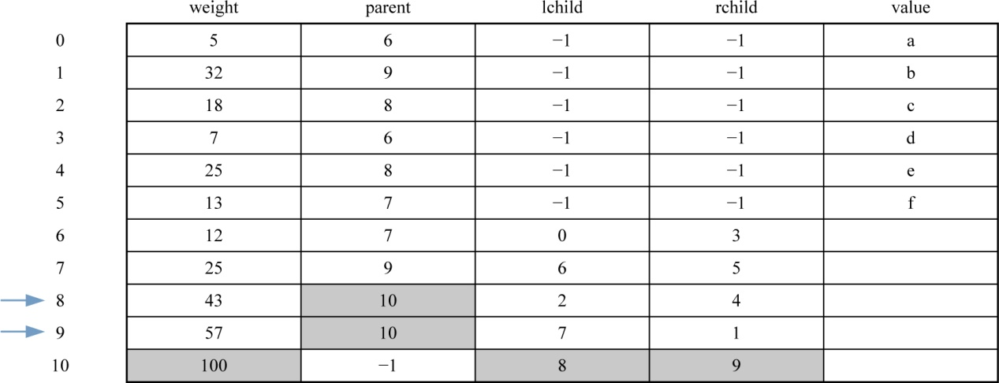
对应的哈夫曼树如图2-46所示。

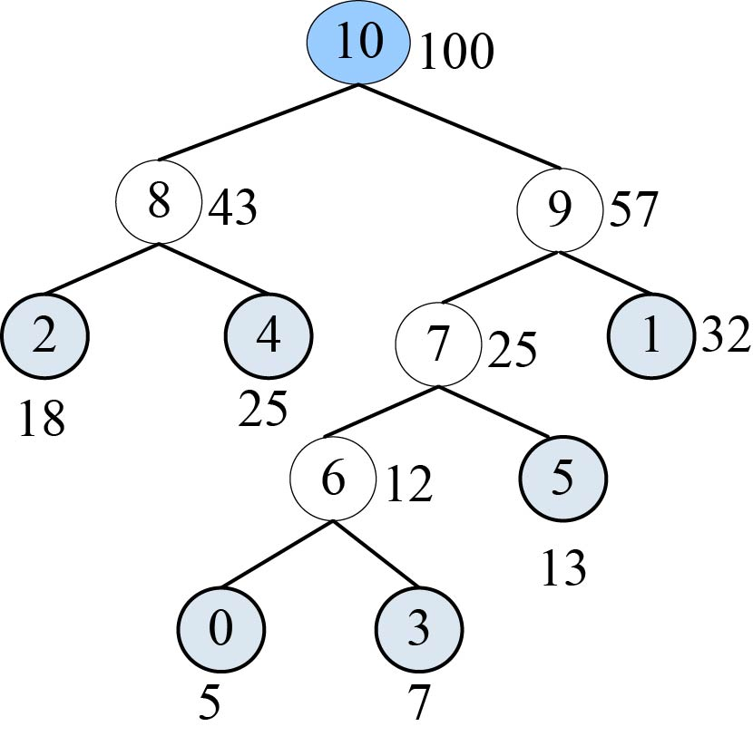
<center class="my_markdown"><b class="my_markdown">图2-46　哈夫曼树生成过程</b></center>

（6）输出哈夫曼编码

```c
    void HuffmanCode(HCodeType HuffCode[MAXLEAF],  int n)
   {
    HCodeType cd;       /* 定义一个临时变量来存放求解编码时的信息 */
    int i,j,c,p;
    for(i = 0;i < n; i++){
          cd.start = n-1;
          c = i;  //i为叶子结点编号
          p = HuffNode[c].parent;
          while(p != -1){
              if(HuffNode[p].lchild == c){
                  cd.bit[cd.start] = 0;
              }
              else
                  cd.bit[cd.start] = 1;
              cd.start--;         /* start向前移动一位 */
              c = p;              /* c,p变量上移，准备下一循环 */
              p = HuffNode[c].parent;    
          }
          /* 把叶子结点的编码信息从临时编码cd中复制出来，放入编码结构体数组 */
          for (j=cd.start+1; j<n; j++)
              HuffCode[i].bit[j] = cd.bit[j];
          HuffCode[i].start = cd.start;
    }
}
```

图解：哈夫曼编码数组如图2-47所示。

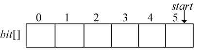
<center class="my_markdown"><b class="my_markdown">图2-47　哈夫曼编码数组</b></center>

（1）i=0时，c=0；

```c
cd.start = n-1=5;
p = HuffNode[0].parent=6;//从哈夫曼树建成后的表HuffNode[]中读出
                         //p指向0号结点的父亲6号
```

构建完成的哈夫曼树数组如表2-20所示。

<center class="my_markdown"><b class="my_markdown">表2-20　哈夫曼树构建数组</b></center>

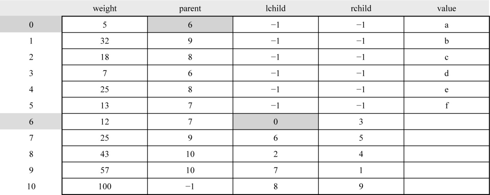
如果p != −1，那么从表HuffNode[]中读出6号结点的左孩子和右孩子，判断0号结点是它的左孩子还是右孩子，如果是左孩子编码为0；如果是右孩子编码为1。

从表2-20可以看出：

```c
HuffNode[6].lchild=0;//0号结点是其父亲6号的左孩子
cd.bit[5] = 0;//编码为0
cd.start--=4; /* start向前移动一位*/
```

哈夫曼编码树如图2-48所示，哈夫曼编码数组如图2-49所示。

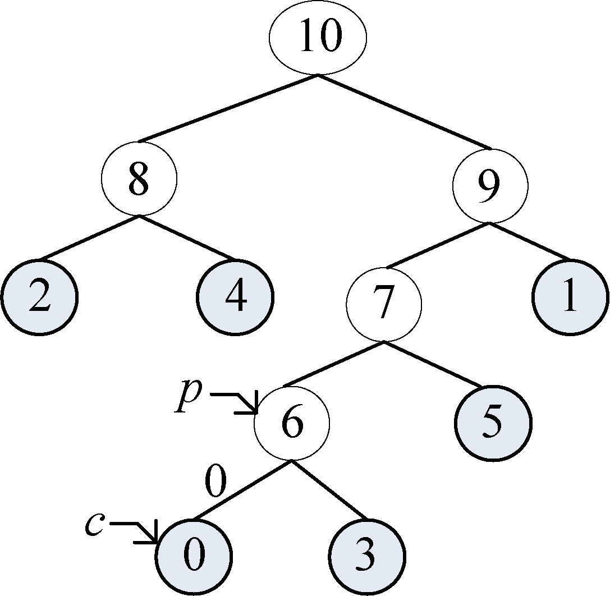
<center class="my_markdown"><b class="my_markdown">图2-48　哈夫曼编码树</b></center>

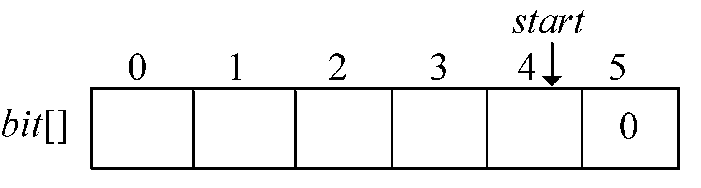
<center class="my_markdown"><b class="my_markdown">图2-49　哈夫曼编码数组</b></center>

```c
c = p=6;                      /* c、p变量上移，准备下一循环 */
p = HuffNode[6].parent=7;
```

c、p变量上移后如图2-50所示。

```c
p != -1;
HuffNode[7].lchild=6;//6号结点是其父亲7号的左孩子
cd.bit[4] = 0;//编码为0
cd.start--=3;        /* start向前移动一位*/
c = p=7;             /* c、p变量上移，准备下一循环 */
p = HuffNode[7].parent=9;
```

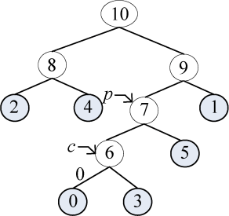
<center class="my_markdown"><b class="my_markdown">图2-50　哈夫曼编码树</b></center>

哈夫曼编码树如图2-51所示，哈夫曼编码数组如图2-52所示。

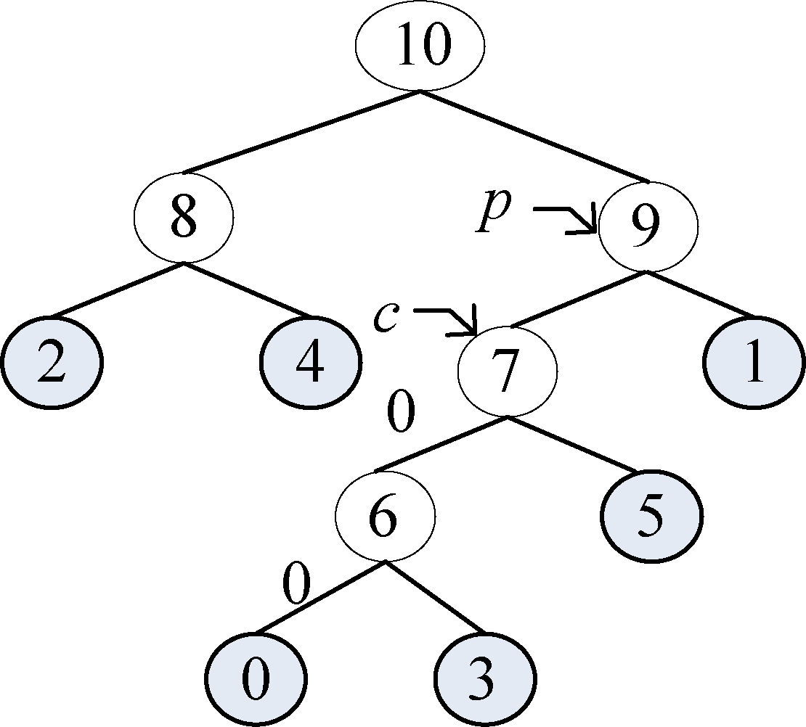
<center class="my_markdown"><b class="my_markdown">图2-51　哈夫曼编码树</b></center>

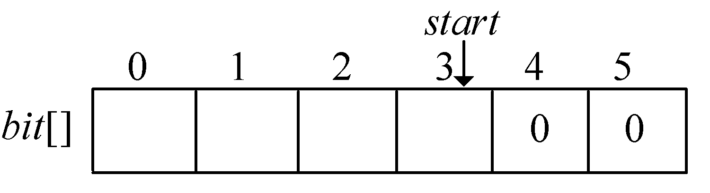
<center class="my_markdown"><b class="my_markdown">图2-52　哈夫曼编码数组</b></center>

```c
p != -1;
HuffNode[9].lchild=7;//7号结点是其父亲9号的左孩子
cd.bit[3] = 0;//编码为0
cd.start--=2;        /* start向前移动一位*/
c = p=9;             /* c、p变量上移，准备下一循环 */
p = HuffNode[9].parent=10;
```

哈夫曼编码树如图2-53所示，哈夫曼编码数组如图2-54所示。

```c
p != -1;
HuffNode[10].lchild!=9;//9号结点不是其父亲10号的左孩子
cd.bit[2] = 1;//编码为1
cd.start--=1;        /* start向前移动一位*/
c = p=10;            /* c、p变量上移，准备下一循环 */
p = HuffNode[10].parent=-1;
```


<center class="my_markdown"><b class="my_markdown">图2-53　哈夫曼编码树</b></center>

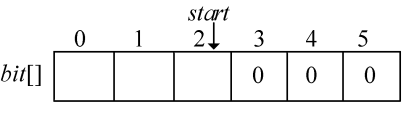
<center class="my_markdown"><b class="my_markdown">图2-54　哈夫曼编码数组</b></center>

哈夫曼编码树如图2-55所示，哈夫曼编码数组如图2-56所示。

```c
p = -1;该叶子结点编码结束。
/* 把叶子结点的编码信息从临时编码cd中复制出来，放入编码结构体数组 */
   for (j=cd.start+1; j<n; j++)
        HuffCode[i].bit[j] = cd.bit[j];
   HuffCode[i].start = cd.start;
```

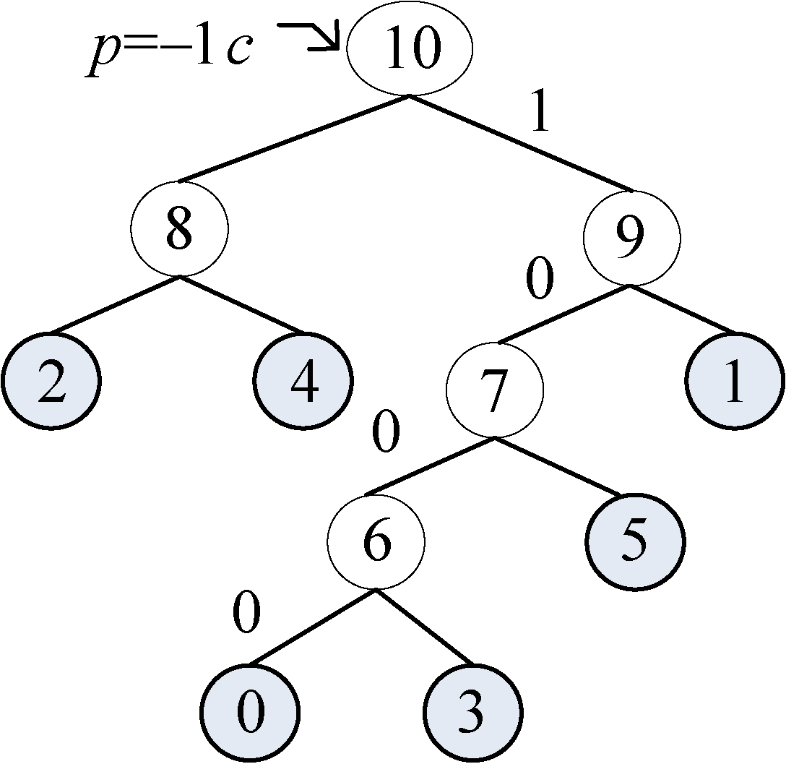
<center class="my_markdown"><b class="my_markdown">图2-55　哈夫曼编码树</b></center>

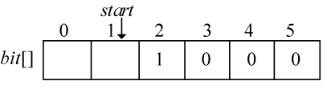
<center class="my_markdown"><b class="my_markdown">图2-56　哈夫曼编码数组</b></center>

HuffCode[]数组如图2-57所示。

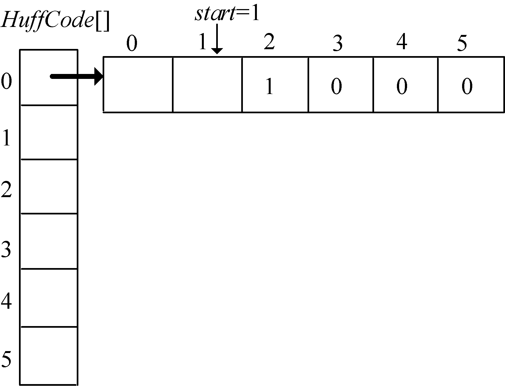
<center class="my_markdown"><b class="my_markdown">图2-57　哈夫曼编码HuffCode[]数组</b></center>

注意：图中的箭头不表示指针。

