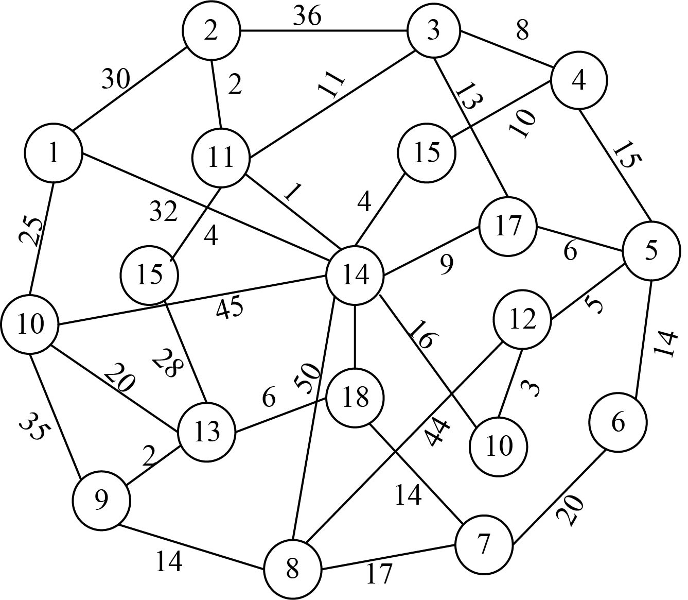

### 2.7.1　问题分析

某学校下设10个学院，3个研究所，1个大型图书馆，4个实验室。其中，1～10号节点代表10个学院，11～13号节点代表3个研究所，14号节点代表图书馆，15～18号节点代表4个实验室。该问题用无向连通图**G** =（V，E）来表示通信网络，V表示顶点集，E表示边集。把各个单位抽象为图中的顶点，顶点与顶点之间的边表示单位之间的通信网络，边的权值表示布线的费用。如果两个节点之间没有连线，代表这两个单位之间不能布线，费用为无穷大。如图2-59所示。

<b class="my_markdown">图2-59　校园网连通图</b>

那么我们如何设计网络电缆布线，将各个单位连通起来，并且费用最少呢？

对于n个顶点的连通图，只需n−1条边就可以使这个图连通，n−1条边要想保证图连通，就必须不含回路，所以我们只需要找出n−1条权值最小且无回路的边即可。

需要说明几个概念。

（1）子图：从原图中选中一些顶点和边组成的图，称为原图的子图。

（2）生成子图：选中一些边和所有顶点组成的图，称为原图的生成子图。

（3）生成树：如果生成子图恰好是一棵树，则称为生成树。

（4）最小生成树：权值之和最小的生成树，则称为最小生成树。

本题就是最小生成树求解问题。

