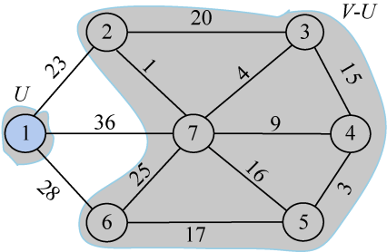
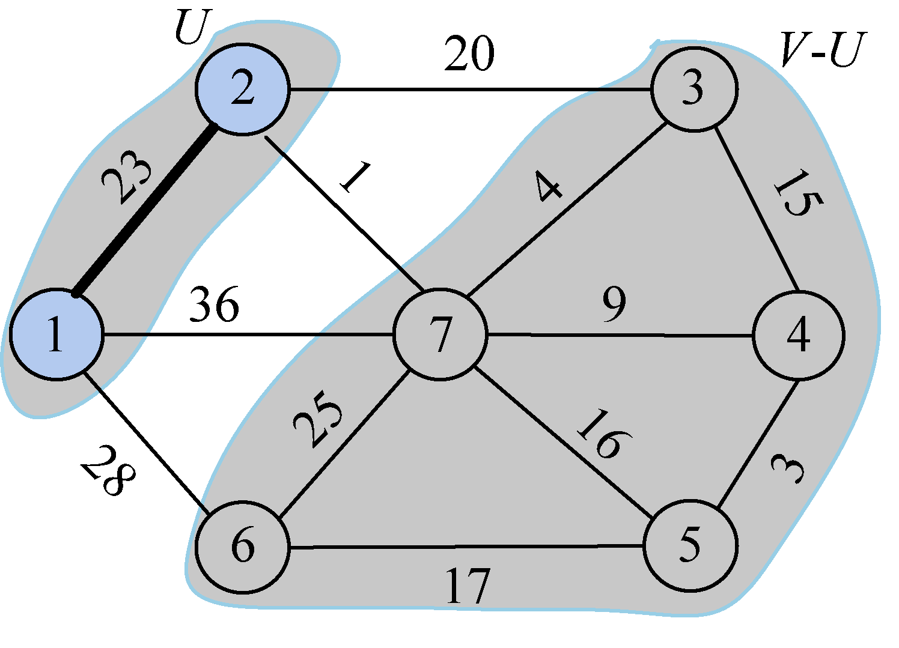
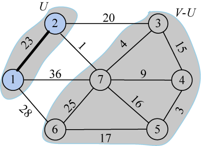
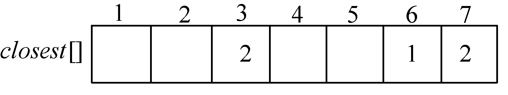
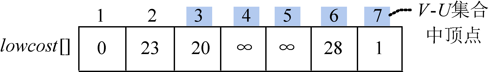

### 2.7.2　算法设计

找出n−1条权值最小的边很容易，那么怎么保证无回路呢?

如果在一个图中深度搜索或广度搜索有没有回路，是一件繁重的工作。有一个很好的办法—— **避圈法** 。在生成树的过程中，我们把已经在生成树中的结点看作一个集合，把剩下的结点看作另一个集合，从连接两个集合的边中选择一条权值最小的边即可。

首先任选一个结点，例如1号结点，把它放在集合U中，U={1}，那么剩下的结点即V−U={2，3，4，5，6，7}，V是图的所有顶点集合。如图2-60所示。

<b class="my_markdown">图2-60　最小生成树求解过程</b>

现在只需在连接两个集合（V和V−U）的边中看哪一条边权值最小，把权值最小的边关联的结点加入到集合U。从图2-68可以看出，连接两个集合的3条边中，结点1到结点2的边权值最小，选中此条边，把2号结点加入U集合U={1，2}，V−U={3，4，5，6，7}。

再从连接两个集合（V和V−U）的边中选择一条权值最小的边。从图2-61可以看出，连接两个集合的4条边中，结点2到结点7的边权值最小，选中此条边，把7号结点加入U集合U={1，2，7}，V−U={3，4，5，6}。

<b class="my_markdown">图2-61　最小生成树求解过程</b>

如此下去，直到U=V结束，选中的边和所有的结点组成的图就是最小生成树。

是不是非常简单啊？

这就是Prim算法，1957年由美国计算机科学家Robert C.Prim发现的。那么如何用算法来实现呢？

首先，令U={u0}，u0∈V，TE={}。u0可以是任何一个结点，因为最小生成树包含所有结点，所以从哪个结点出发都可以得到最小生成树，不影响最终结果。TE为选中的边集。

然后，做如下 **贪心选择** ：选取连接U和V−U的所有边中的最短边，即满足条件i∈U，j∈V−U，且边（i，j）是连接U和V−U的所有边中的最短边，即该边的权值最小。

然后，将顶点j加入集合U，边（i，j）加入TE。继续上面的贪心选择一直进行到U=V为止，此时，选取到的所有边恰好构成图**G**的一棵最小生成树T。

算法设计及步骤如下。

步骤1：确定合适的数据结构。设置带权邻接矩阵**C**存储图**G**，如果图**G**中存在边（u，x），令**C**[u][x]等于边（u，x）上的权值，否则，**C**[u][x]=∞；bool数组s[]，如果s[i]=true，说明顶点i已加入集合U。

如图2-62所示，直观地看图很容易找出 U 集合到 V−U集合的边中哪条边是最小的，但是程序中如果穷举这些边，再找最小值就太麻烦了，那怎么办呢？

<b class="my_markdown">图2-62　最小生成树求解过程</b>

可以通过设置两个数组巧妙地解决这个问题，closest[j]表示V−U中的顶点j到集合U中的最邻近点，lowcost[j]表示V−U中的顶点j到集合U中的最邻近点的边值，即边（j,closest[j]）的权值。

例如，在图2-62中，7号结点到U集合中的最邻近点是2，closest[7]=2，如图2-63所示。7号结点到最邻近点2的边值为1，即边（2，7）的权值，记为lowcost[7]=1，如图2-64所示。

<b class="my_markdown">图2-63　closest[]数组</b>

<b class="my_markdown">图2-64　lowcost[]数组</b>

只需要在V−U集合中找lowcost[]值最小的顶点即可。

步骤2：初始化。令集合U={u0}，u0∈V，并初始化数组closest[]、lowcost[]和s[]。

步骤3：在V−U集合中找lowcost值最小的顶点t，即lowcost[t]=min{lowcost[j]|j∈V−U}，满足该公式的顶点t就是集合V−U中连接集合U的最邻近点。

步骤4：将顶点t加入集合U。

步骤5：如果集合V−U，算法结束，否则，转步骤6。

步骤6：对集合V−U中的所有顶点j，更新其lowcost[]和closest[]。更新公式：if（**C**[t] [j]<lowcost [j] ) { lowcost [j]= **C** [t] [j]; closest [j] = t; }，转步骤3。

按照上述步骤，最终可以得到一棵权值之和最小的生成树。

