### 2.7.3　完美图解

设**G** =（V，E）是无向连通带权图，如图2-65所示。

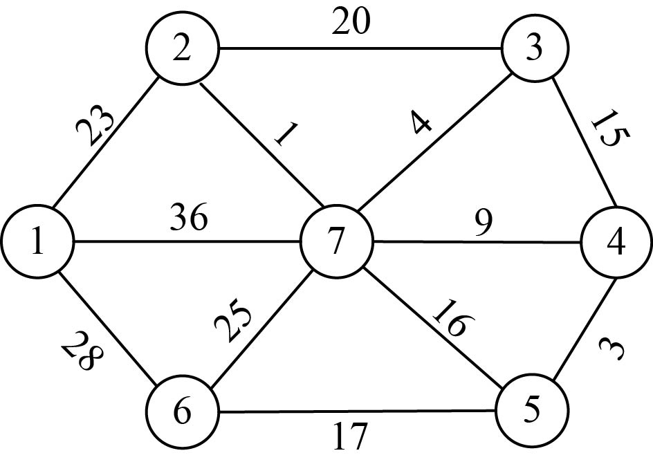

<b class="my_markdown">图2-65　无向连通带权图**G**</b>

（1）数据结构

设置地图的带权邻接矩阵为**C**[][]，即如果从顶点i到顶点j有边，就让**C**[i][j]=<i，j>的权值，否则**C**[i][j]=∞（无穷大），如图2-66所示。

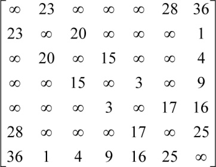

<b class="my_markdown">图2-66　邻接矩阵**C**[ ][ ]</b>

（2）初始化

假设u0=1；令集合U={1}，V−U={2，3，4，5，6，7}，TE={}，s[1]=true，初始化数组closest[]：除了1号结点外其余结点均为1，表示V−U中的顶点到集合U的最临近点均为1，如图2-67所示。lowcost[]：1号结点到V−U中的顶点的边值，即读取邻接矩阵第1行，如图2-68所示。

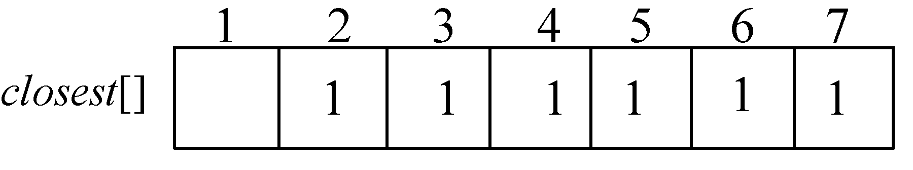

<b class="my_markdown">图2-67　closest[]数组</b>

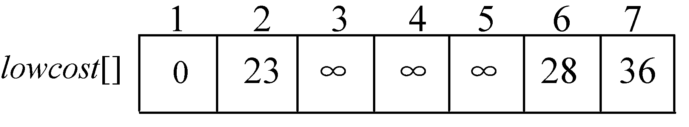

<b class="my_markdown">图2-68　lowcost[]数组</b>

初始化后如图2-69所示。

<b class="my_markdown">图2-69　最小生成树求解过程</b>

（3）找最小

在集合V−U={2，3，4，5，6，7}中，依照贪心策略寻找V−U集合中lowcost最小的顶点t，如图2-70所示。

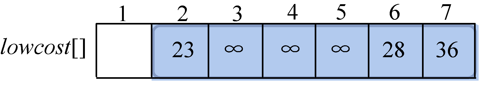

<b class="my_markdown">图2-70　lowcost[]数组</b>

找到最小值为23，对应的结点t=2。

选中的边和结点如图2-71所示。

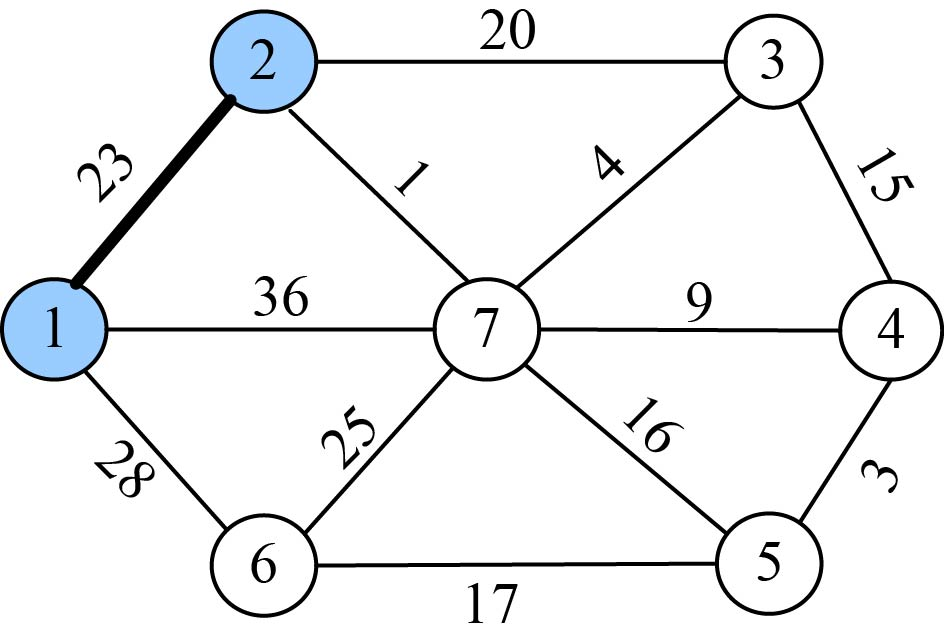

<b class="my_markdown">图2-71　最小生成树求解过程</b>

（4）加入U战队

将顶点t加入集合U={1，2}，同时更新V−U={3，4，5，6，7}。

（5）更新

刚刚找到了到U集合的最邻近点t = 2，那么对t在集合V−U中每一个邻接点j，都可以借助t更新。我们从图或邻接矩阵可以看出，2号结点的邻接点是3和7号结点：

**C**[2][3]=20<lowcost[3]=∞，更新最邻近距离lowcost[3]=20，最邻近点closest[3]=2；

**C**[2][7]=1<lowcost[7]=36，更新最邻近距离lowcost[7]=1，最邻近点closest[7]=2；

更新后的closest[j]和lowcost[j]数组如图2-72和图2-73所示。

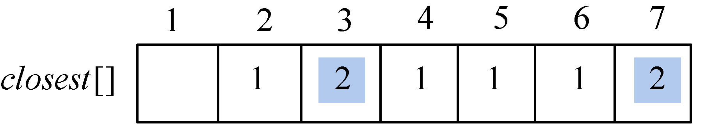

<b class="my_markdown">图2-72　closest[]数组</b>

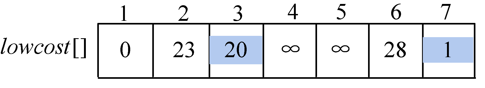

<b class="my_markdown">图2-73　lowcost[]数组</b>

更新后如图2-74所示。

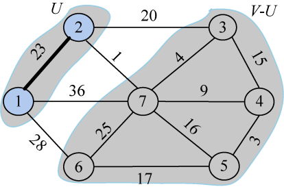

<b class="my_markdown">图2-74　最小生成树求解过程</b>

closest[j]和lowcost[j]分别表示V−U集合中顶点j到U集合的最邻近顶点和最邻近距离。3号顶点到U集合的最邻近点为2，最邻近距离为20；4、5号顶点到U集合的最邻近点仍为初始化状态1，最邻近距离为∞；6号顶点到U集合的最邻近点为1，最邻近距离为26；7号顶点到U集合的最邻近点为2，最邻近距离为1。

（6）找最小

在集合V−U={3，4，5，6，7}中，依照贪心策略寻找V−U集合中lowcost最小的顶点t，如图2-75所示。

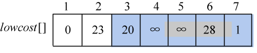

<b class="my_markdown">图2-75　lowcost[]数组</b>

找到最小值为1，对应的结点t=7。

选中的边和结点如图2-76所示。

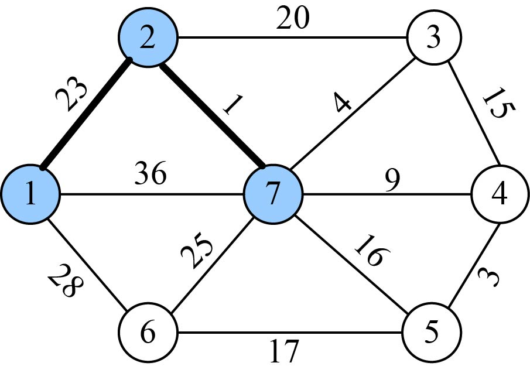

<b class="my_markdown">图2-76　最小生成树求解过程</b>

（7）加入U战队

将顶点t加入集合U={1，2，7}，同时更新V−U={3，4，5，6}。

（8）更新

刚刚找到了到U集合的最邻近点t =7，那么对t在集合V−U中每一个邻接点j，都可以借t更新。我们从图或邻接矩阵可以看出，7号结点在集合V−U中的邻接点是3、4、5、6结点：

**C**[7][3]=4<lowcost[3]=20，更新最邻近距离lowcost[3]=4，最邻近点closest[3]=7；

**C**[7][4]=9<lowcost[4]=∞，更新最邻近距离lowcost[4]=9，最邻近点closest[4]=7；

**C**[7][5]=16<lowcost[5]=∞，更新最邻近距离lowcost[5]=16，最邻近点closest[5]=7；

**C**[7][6]=25<lowcost[6]=28，更新最邻近距离lowcost[6]=25，最邻近点closest[6]=7；

更新后的closest[j]和lowcost[j]数组如图2-77和图2-78所示。

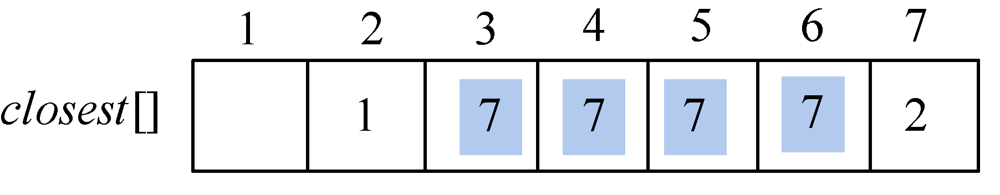

<b class="my_markdown">图2-77　closest[]数组</b>

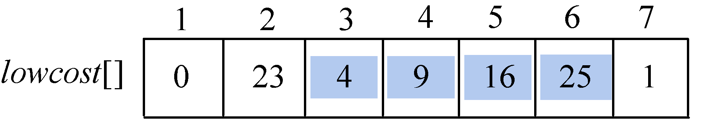

<b class="my_markdown">图2-78　lowcost[]数组</b>

更新后如图2-79所示。

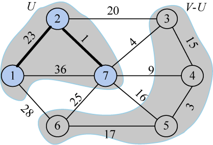

<b class="my_markdown">图2-79　最小生成树求解过程</b>

closest[j]和lowcost[j]分别表示V−U集合中顶点j到U集合的最邻近顶点和最邻近距离。3号顶点到U集合的最邻近点为7，最邻近距离为4；4号顶点到U集合的最邻近点为7，最邻近距离为9；5号顶点到U集合的最邻近点为7，最邻近距离为16；6号顶点到U集合的最邻近点为7，最邻近距离为25。

（9）找最小

在集合V−U={3，4，5，6}中，依照贪心策略寻找V−U集合中lowcost最小的顶点t，如图2-80所示。

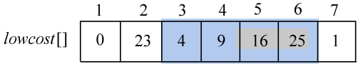

<b class="my_markdown">图2-80　lowcost[]数组</b>

找到最小值为4，对应的结点t=3。

选中的边和结点如图2-81所示。

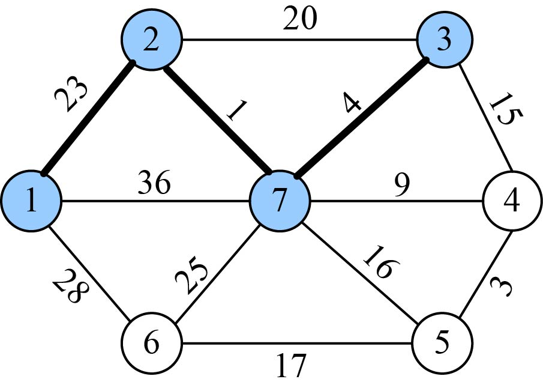

<b class="my_markdown">图2-81　最小生成树求解过程</b>

（10）加入U战队

将顶点t加入集合U ={1，2，3，7}，同时更新V−U={4，5，6}。

（11）更新

刚刚找到了到U集合的最邻近点t =3，那么对t在集合V−U中每一个邻接点j，都可以借助t更新。我们从图或邻接矩阵可以看出，3号结点在集合V−U中的邻接点是4号结点：

C[3][4]=15>lowcost[4]=9，不更新。

closest[j]和lowcost[j]数组不改变。

更新后如图2-82所示。

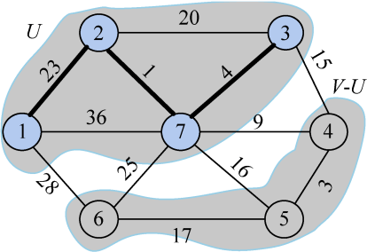

<b class="my_markdown">图2-82　最小生成树求解过程</b>

closest[j]和lowcost[j]分别表示V−U集合中顶点j到U集合的最邻近顶点和最邻近距离。4号顶点到U集合的最邻近点为7，最邻近距离为9；5号顶点到U集合的最邻近点为7，最邻近距离为16；6号顶点到U集合的最邻近点为7，最邻近距离为25。

（12）找最小

在集合V−U={4，5，6}中，依照贪心策略寻找V−U集合中lowcost最小的顶点t，如图2-83所示。

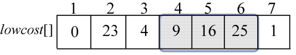

<b class="my_markdown">图2-83　lowcost[]数组</b>

找到最小值为9，对应的结点t=4。

选中的边和结点如图2-84所示。

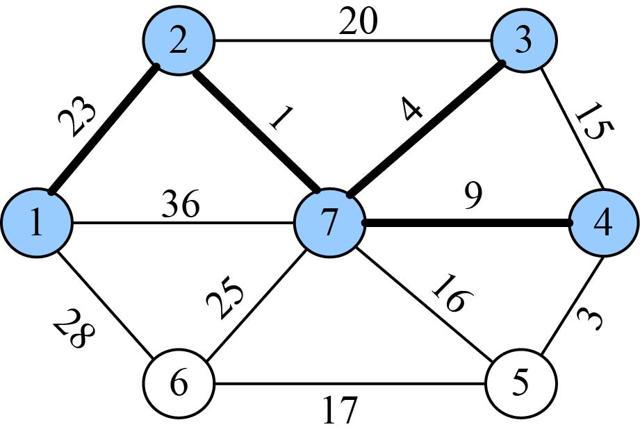

<b class="my_markdown">图2-84　最小生成树求解过程</b>

（13）加入U战队

将顶点t加入集合U ={1，2，3，4，7}，同时更新V−U={5，6}。

（14）更新

刚刚找到了到U集合的最邻近点t =4，那么对t在集合V−U中每一个邻接点j，都可以借助t更新。我们从图或邻接矩阵可以看出，4号结点在集合V−U中的邻接点是5号结点：

**C**[4][5]=3<lowcost[5]=16，更新最邻近距离lowcost[5]=3，最邻近点closest[5]=4；

更新后的closest[j]和lowcost[j]数组如图2-85和图2-86所示。

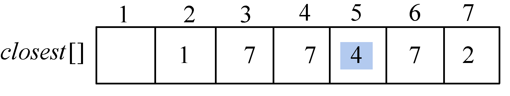

<b class="my_markdown">图2-85　closest[]数组</b>

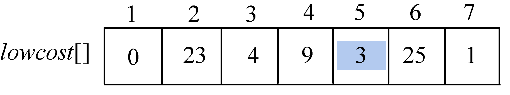

<b class="my_markdown">图2-86　lowcost[]数组</b>

更新后如图2-87所示。

<b class="my_markdown">图2-87　最小生成树求解过程</b>

closest[j]和lowcost[j]分别表示V−U集合中顶点j到U集合的最邻近顶点和最邻近距离。5号顶点到U集合的最邻近点为4，最邻近距离为3；6号顶点到U集合的最邻近点为7，最邻近距离为25。

（15）找最小

在集合V−U={5，6}中，依照贪心策略寻找V−U集合中lowcost最小的顶点t，如图2-88所示。

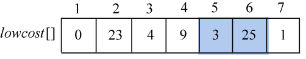

<b class="my_markdown">图2-88　lowcost[]数组</b>

找到最小值为3，对应的结点t=5。

选中的边和结点如图2-89所示。

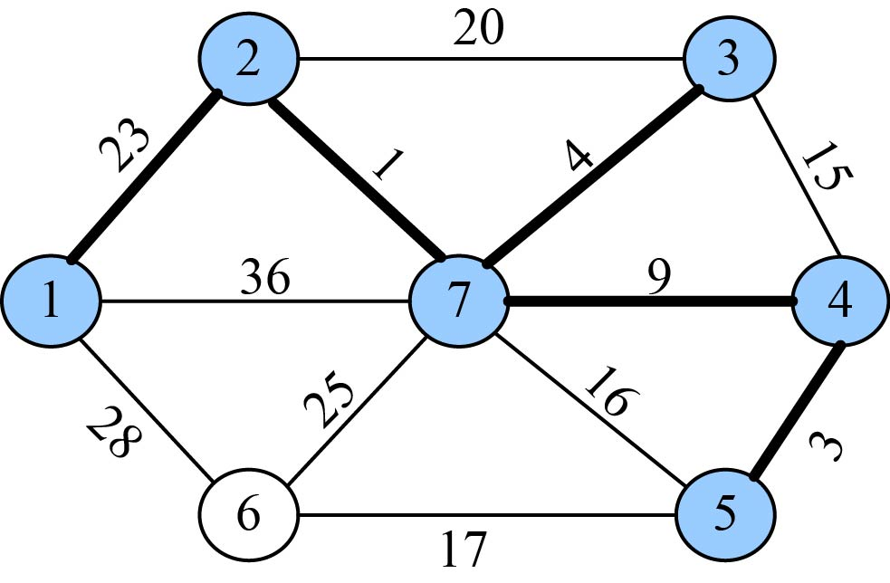

<b class="my_markdown">图2-89　最小生成树求解过程</b>

（16）加入U战队

将顶点t加入集合U={1，2，3，4，5，7}，同时更新V−U={6}。

（17）更新

刚刚找到了到U集合的最邻近点t =5，那么对t在集合V−U中每一个邻接点j，都可以借助t更新。我们从图或邻接矩阵可以看出，5号结点在集合V−U中的邻接点是6号结点：

**C**[5][6]=17<lowcost[6]=25，更新最邻近距离lowcost[6]=17，最邻近点closest[6]=5；

更新后的closest[j]和lowcost[j]数组如图2-90和图2-91所示。

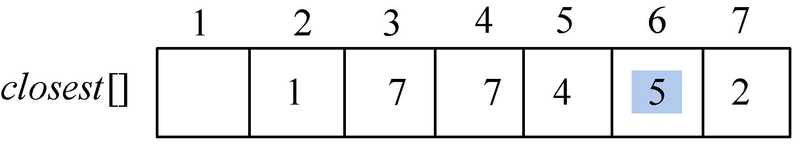

<b class="my_markdown">图2-90　closest[]数组</b>

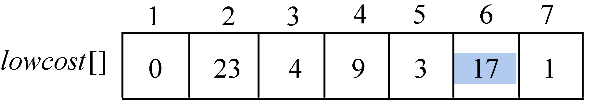

<b class="my_markdown">图2-91　lowcost[]数组</b>

更新后如图2-92所示。

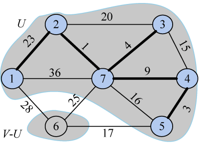

<b class="my_markdown">图2-92　最小生成树求解过程</b>

closest[j]和lowcost[j]分别表示V−U集合中顶点j到U集合的最邻近顶点和最邻近距离。6号顶点到U集合的最邻近点为5，最邻近距离为17。

（18）找最小

在集合V−U={6}中，依照贪心策略寻找V−U集合中lowcost最小的顶点t，如图2-93所示。

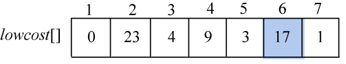

<b class="my_markdown">图2-93　lowcost[]数组</b>

找到最小值为17，对应的结点t=6。

选中的边和结点如图2-94所示。

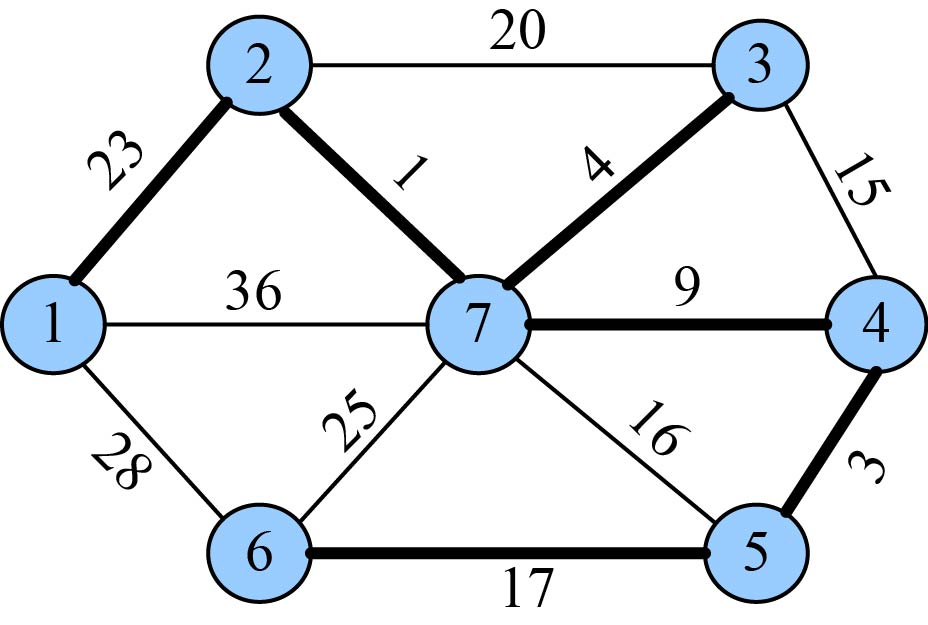

<b class="my_markdown">图2-94　最小生成树求解过程</b>

（19）加入U战队

将顶点t加入集合U ={1，2，3，4，5，6，7}，同时更新V−U={}。

（20）更新

刚刚找到了到U集合的最邻近点t =6，那么对t在集合V−U中每一个邻接点j，都可以借t更新。我们从图2-94可以看出，6号结点在集合V−U中无邻接点，因为V−U={}。

closest[j]和lowcost[j]数组如图2-95和图2-96所示。

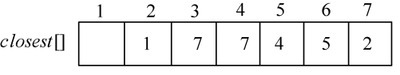

<b class="my_markdown">图2-95　closest[]数组</b>

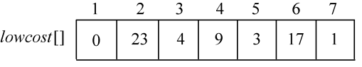

<b class="my_markdown">图2-96　lowcost[]数组</b>

得到的最小生成树如图2-97所示。

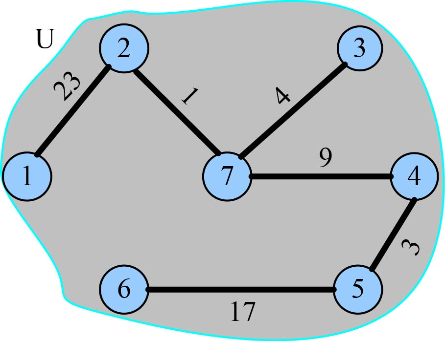

<b class="my_markdown">图2-97　最小生成树</b>

最小生成树权值之和为57，即把lowcost数组中的值全部加起来。

