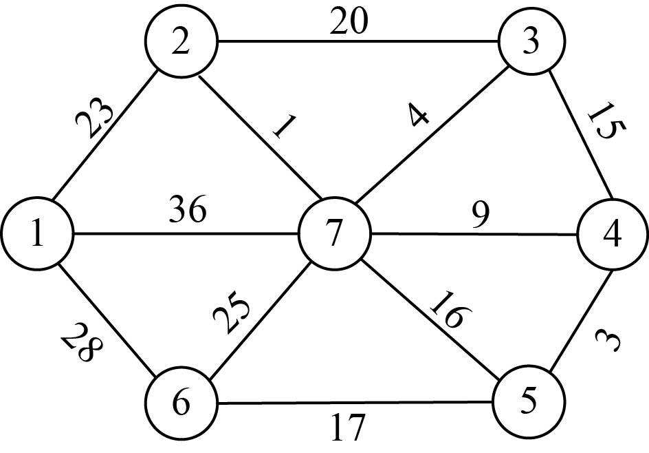
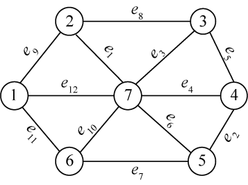
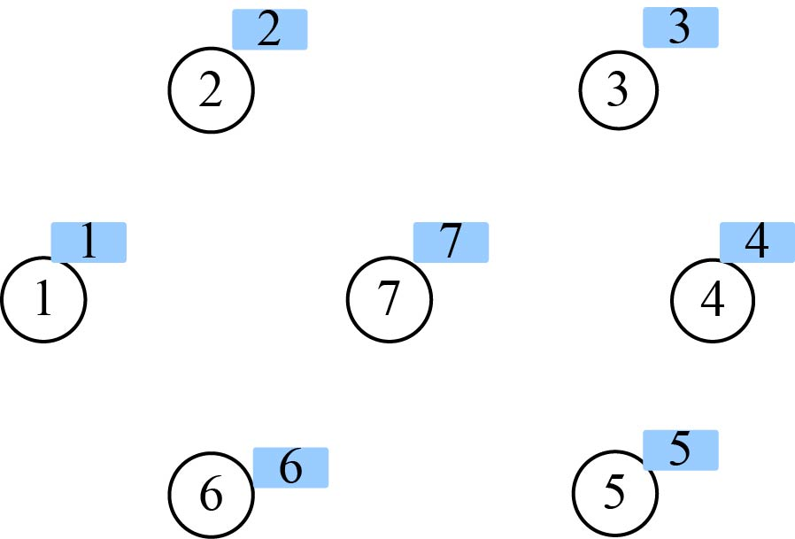
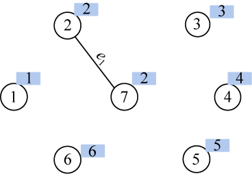
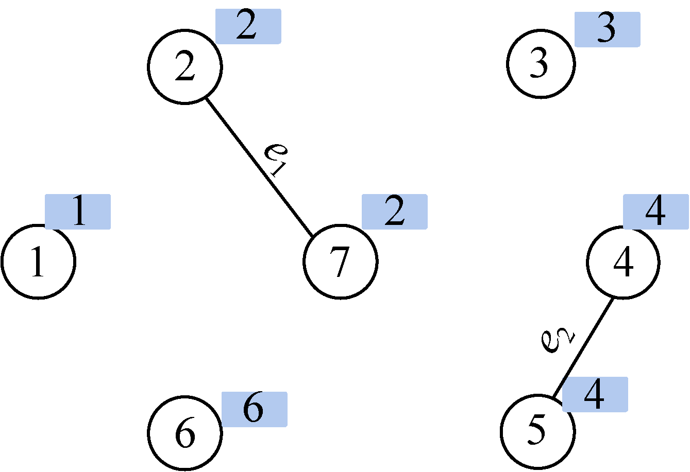
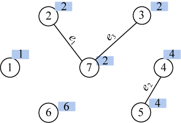
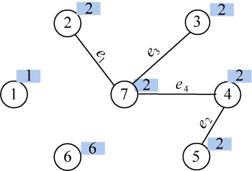
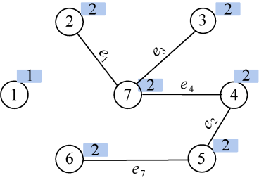
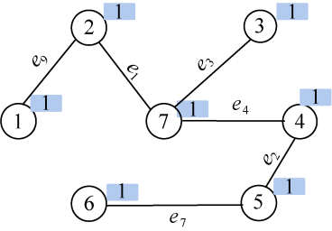

### 2.7.7　算法优化拓展

该算法可以从两个方面优化：

（1）for语句③找lowcost最小值时使用优先队列，每次出队一个最小值，时间复杂度为logn，执行n次，总时间复杂度为O( n logn)。

（2）for语句④更新lowcost和closest数据时，如果图采用邻接表存储，每次只检查t的邻接边，不用从1～n检查，检查更新的次数为E（边数），每次更新数据入队，入队的时间复杂度为logn，这样更新的时间复杂度为O( Elogn)。

#### 1．算法设计

构造最小生成树还有一种算法，Kurskal算法：设**G**=（V，E）是无向连通带权图，V={1，2，…，n}；设最小生成树**T**=（V，TE），该树的初始状态为只有n个顶点而无边的非连通图**T**=（V，{}），Kruskal算法将这n个顶点看成是n个孤立的连通分支。它首先将所有的边按权值从小到大排序，然后只要**T**中选中的边数不到n−1，就做如下的贪心选择：在边集E中选取权值最小的边（i，j），如果将边（i，j）加入集合TE中不产生回路（圈），则将边（i，j）加入边集TE中，即用边（i，j）将这两个连通分支合并连接成一个连通分支；否则继续选择下一条最短边。把边（i，j）从集合E中删去。继续上面的贪心选择，直到**T**中所有顶点都在同一个连通分支上为止。此时，选取到的n−1条边恰好构成**G**的一棵最小生成树**T**。

那么，怎样判断加入某条边后图**T**会不会出现回路呢？

该算法对于手工计算十分方便，因为用肉眼可以很容易看到挑选哪些边能够避免构成回路（避圈法），但使用计算机程序来实现时，还需要一种机制来进行判断。Kruskal算法用了一个非常聪明的方法，就是运用集合避圈：如果所选择加入的边的起点和终点都在**T**的集合中，那么就可以断定一定会形成回路（圈）。其实就是我们前面提到的“避圈法”：边的两个结点不能属于同一集合。

步骤1：初始化。将图**G**的边集E中的所有边按权值从小到大排序，边集TE={ }，把每个顶点都初始化为一个孤立的分支，即一个顶点对应一个集合。

步骤2：在E中寻找权值最小的边（i，j）。

步骤3：如果顶点i和j位于两个不同连通分支，则将边（i，j）加入边集TE，并执行合并操作，将两个连通分支进行合并。

步骤4：将边（i，j）从集合E中删去，即E=E−{（i，j）}。

步骤 5：如果选取边数小于n−1，转步骤2；否则，算法结束，生成最小生成树T。

#### 2．完美图解

设**G** =（V，E）是无向连通带权图，如图2-98所示。


<center class="my_markdown"><b class="my_markdown">图2-98　无向连通带权图**G**</b></center>

（1）初始化

将图**G**的边集E中的所有边按权值从小到大排序，如图2-99所示。


<center class="my_markdown"><b class="my_markdown">图2-99　按边权值排序后的图**G**</b></center>

边集初始化为空集，TE={ }，把每个结点都初始化为一个孤立的分支，即一个顶点对应一个集合，集合号为该结点的序号，如图2-100所示。


<center class="my_markdown"><b class="my_markdown">图2-100　每个结点初始化集合号</b></center>

（2）找最小

在E中寻找权值最小的边e<sub class="my_markdown">1</sub>（2，7），边值为1。

（3）合并

结点2和结点7的集合号不同，即属于两个不同连通分支，则将边（2，7）加入边集TE，执行合并操作（将两个连通分支所有结点合并为一个集合）；假设把小的集合号赋值给大的集合号，那么7号结点的集合号也改为2，如图2-101所示。


<center class="my_markdown"><b class="my_markdown">图2-101　最小生成树求解过程</b></center>

（4）找最小

在E中寻找权值最小的边e<sub class="my_markdown">2</sub>（4，5），边值为3。

（5）合并

结点4和结点5集合号不同，即属于两个不同连通分支，则将边（4，5）加入边集TE，执行合并操作将两个连通分支所有结点合并为一个集合；假设我们把小的集合号赋值给大的集合号，那么5号结点的集合号也改为4，如图2-102所示。


<center class="my_markdown"><b class="my_markdown">图2-102　最小生成树求解过程</b></center>

（6）找最小

在E中寻找权值最小的边e<sub class="my_markdown">3</sub>（3，7），边值为4。

（7）合并

结点3和结点7集合号不同，即属于两个不同连通分支，则将边（3，7）加入边集TE，执行合并操作将两个连通分支所有结点合并为一个集合；假设我们把小的集合号赋值给大的集合号，那么3号结点的集合号也改为2，如图2-103所示。


<center class="my_markdown"><b class="my_markdown">图2-103　最小生成树求解过程</b></center>

（8）找最小

在E中寻找权值最小的边e<sub class="my_markdown">4</sub>（4，7），边值为9。

（9）合并

结点4和结点7集合号不同，即属于两个不同连通分支，则将边（4，7）加入边集TE，执行合并操作将两个连通分支所有结点合并为一个集合；假设我们把小的集合号赋值给大的集合号，那么4、5号结点的集合号都改为2，如图2-104所示。


<center class="my_markdown"><b class="my_markdown">图2-104　最小生成树求解过程</b></center>

（10）找最小

在E中寻找权值最小的边e<sub class="my_markdown">5</sub>（3，4），边值为15。

（11）合并

结点3和结点4集合号相同，属于同一连通分支，不能选择，否则会形成回路。

（12）找最小

在E中寻找权值最小的边e<sub class="my_markdown">6</sub>（5，7），边值为16。

（13）合并

结点5和结点7集合号相同，属于同一连通分支，不能选择，否则会形成回路。

（14）找最小

在E中寻找权值最小的边e<sub class="my_markdown">7</sub>（5，6），边值为17。

（15）合并

结点5和结点6集合号不同，即属于两个不同连通分支，则将边（5，6）加入边集TE，执行合并操作将两个连通分支所有结点合并为一个集合；假设我们把小的集合号赋值给大的集合号，那么6号结点的集合号都改为2，如图2-105所示。


<center class="my_markdown"><b class="my_markdown">图2-105　最小生成树求解过程</b></center>

（16）找最小

在E中寻找权值最小的边e<sub class="my_markdown">8</sub>（2，3），边值为20。

（17）合并

结点2和结点3集合号相同，属于同一连通分支，不能选择，否则会形成回路。

（18）找最小

在E中寻找权值最小的边e<sub class="my_markdown">9</sub>（1，2），边值为23。

（19）合并

结点1和结点2集合号不同，即属于两个不同连通分支，则将边（1，2）加入边集TE，执行合并操作将两个连通分支所有结点合并为一个集合；假设我们把小的集合号赋值给大的集合号，那么2、3、4、5、6、7号结点的集合号都改为1，如图2-106所示。


<center class="my_markdown"><b class="my_markdown">图2-106　最小生成树</b></center>

（20）选中的各边和所有的顶点就是最小生成树，各边权值之和就是最小生成树的代价。

#### 3．伪码详解

（1）数据结构

```c
int nodeset[N];//集合号数组
struct Edge {//边的存储结构
     int u;
     int v;
     int w;
}e[N*N];
```

（2）初始化

```c
void Init(int n)
{
     for(int i = 1; i <= n; i++)
          nodeset[i] = i;//每个结点赋值一个集合号
}
```

（3）对边进行排序

```c
bool comp(Edge x, Edge y) 
{
     return x.w < y.w;//定义优先级，按边值进行升序排序
}
sort(e, e+m, comp);//调用系统排序函数
```

（4）合并集合

```c
int Merge(int a, int b)
{
     int p = nodeset[a];//p为a结点的集合号
     int q = nodeset[b]; //q为b结点的集合号
     if(p==q) return 0; //集合号相同，什么也不做，返回
     for(int i=1;i<=n;i++)//检查所有结点，把集合号是q的全部改为p
     {
       if(nodeset[i]==q)
          nodeset[i] = p;//a的集合号赋值给b集合号
     }
     return 1;
}
```

#### 4．实战演练

```c
//program 2-8
#include <iostream>
#include <cstdio>
#include <algorithm>
using namespace std;
const int N = 100;
int nodeset[N];
int n, m;
struct Edge {
     int u;
     int v;
     int w;
}e[N*N];
bool comp(Edge x, Edge y) 
{
     return x.w < y.w;
}
void Init(int n)
{
     for(int i = 1; i <= n; i++)
          nodeset[i] = i;
}
int Merge(int a, int b)
{
     int p = nodeset[a];
     int q = nodeset[b];
     if(p==q) return 0;
     for(int i=1;i<=n;i++)//检查所有结点，把集合号是q的改为p
     {
       if(nodeset[i]==q)
          nodeset[i] = p;//a的集合号赋值给b集合号
     }
     return 1;
}
int Kruskal(int n)
{
     int ans = 0;
     for(int i=0;i<m;i++)
          if(Merge(e[i].u, e[i].v))
          {
              ans += e[i].w;
              n--;
              if(n==1)
                  return ans;
          }
     return 0;
}
int main()
{
  cout <<"输入结点数n和边数m："<<endl;
  cin >> n >> m;
  Init(n);
  cout <<"输入结点数u,v和边值w："<<endl;
  for(int i=1;i<=m;i++)
      cin >> e[i].u>> e[i].v >>e[i].w;
  sort(e, e+m, comp);
  int ans = Kruskal(n);
  cout << "最小的花费是：" << ans << endl;
 return 0;
}
```

#### 5．算法复杂度分析

（1）时间复杂度：算法中，需要对边进行排序，若使用快速排序，执行次数为e*loge，算法的时间复杂度为O(e*loge)。而合并集合需要n−1次合并，每次为O(n)，合并集合的时间复杂度为O(n<sup class="my_markdown">2</sup>)。

（2）空间复杂度：算法所需要的辅助空间包含集合号数组 nodeset[n]，则算法的空间复杂度是O(n)。

#### 6．算法优化拓展

该算法合并集合的时间复杂度为O(n<sup class="my_markdown">2</sup>)，我们可以用并查集（见附录E）的思想优化，使合并集合的时间复杂度降为O(e*logn)，优化后的程序如下。

```c
//program 2-9
#include <iostream>
#include <cstdio>
#include <algorithm>
using namespace std;
const int N = 100;
int father[N];
int n, m;
struct Edge {
     int u;
     int v;
     int w;
}e[N*N];
bool comp(Edge x, Edge y) {
     return x.w < y.w;//排序优先级，按边的权值从小到大
}
void Init(int n)
{
     for(int i = 1; i <= n; i++)
          father[i] = i;//顶点所属集合号，初始化每个顶点一个集合号
}
int Find(int x) //找祖宗
{
     if(x != father[x])
     father[x] = Find(father[x]);//把当前结点到其祖宗路径上的所有结点的集合号改为祖宗集合号
     return father[x]; //返回其祖宗的集合号
}
int Merge(int a, int b) //两结点合并集合号
{
     int p = Find(a); //找a的集合号
     int q = Find(b); //找b的集合号
     if(p==q) return 0;
     if(p > q)
           father[p] = q;//小的集合号赋值给大的集合号
     else
           father[q] = p;
     return 1;
}
int Kruskal(int n)
{
     int ans = 0;
     for(int i=0;i<m;i++)
          if(Merge(e[i].u, e[i].v))
          {
              ans += e[i].w;
              n--;
              if(n==1)
                  return ans;
          }
     return 0;
}
int main() 
{
    cout <<"输入结点数n和边数m："<<endl;
    cin >> n >> m;
    Init(n);
    cout <<"输入结点数u，v和边值w："<<endl;
    for(int i=1;i<=m;i++)
        cin>>e[i].u>>e[i].v>>e[i].w;
    sort(e, e+m, comp);
    int ans = Kruskal(n);
    cout << "最小的花费是：" << ans << endl;
    return 0;
}
```

**算法实现和测试**

（1）运行环境

Code::Blocks

（2）输入

```c
输入结点数n和边数m：
7 12
输入结点数u，v和边值w：
1 2 23
1 6 28
1 7 36
2 3 20
2 7 1
3 4 15
3 7 4
4 5 3
4 7 9
5 6 17
5 7 16
6 7 25

```

（3）输出

```c
最小的花费是：57
```

#### 7．两种算法的比较

（1）从算法的思想可以看出，如果图**G**中的边数较小时，可以采用Kruskal算法，因为Kruskal算法每次查找最短的边；边数较多可以用Prim算法，因为它是每次加一个结点。可见，Kruskal算法适用于稀疏图，而Prim算法适用于稠密图。

（2）从时间上讲，Prim算法的时间复杂度为O(n<sup class="my_markdown">2</sup>)，Kruskal算法的时间复杂度为O(eloge)。

（3）从空间上讲，显然在Prim算法中，只需要很小的空间就可以完成算法，因为每一次都是从V−U集合出发进行扫描的，只扫描与当前结点集到U集合的最小边。但在Kruskal算法中，需要对所有的边进行排序，对于大型图而言，Kruskal算法需要占用比Prim算法大得多的空间。


