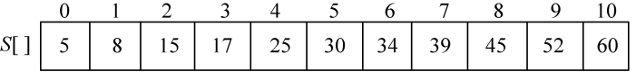
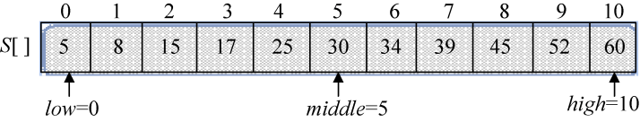
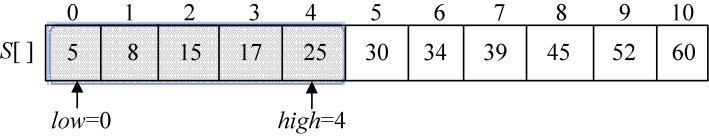
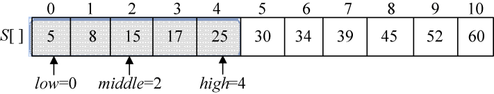
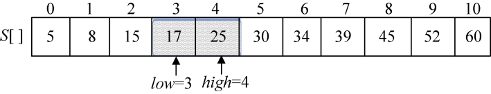
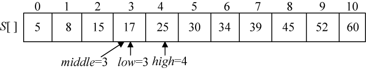

### 3.2.3　完美图解

用分治法在有序序列（5，8，15，17，25，30，34，39，45，52，60）中查找元素17。

（1）数据结构。用一维数组S[]存储该有序序列，x=17，如图3-2所示。

<b class="my_markdown">图3-2　S[]数组</b>

（2）初始化。low=0，high=10，计算middle=（low+high）/2=5，如图3-3所示。

<b class="my_markdown">图3-3　搜索初始化</b>

（3）将x与S[middle]比较。x=17<S[middle]=30，我们在序列的前半部分查找，搜索的范围缩小到子问题S[0..middle−1]，令high=middle−1，如图3-4所示。

<b class="my_markdown">图3-4　搜索过程</b>

（4）计算middle=（low+high）/2=2，如图3-5所示。

<b class="my_markdown">图3-5　搜索过程</b>

（5）将x与S[middle]比较。x=17>S[middle]=15，我们在序列的后半部分查找，搜索的范围缩小到子问题S[middle+1..low]，令low=middle+1，如图3-6所示。

<b class="my_markdown">图3-6　搜索过程</b>

（6）计算middle=（low+high）/2=3，如图3-7所示。

<b class="my_markdown">图3-7　搜索过程</b>

（7）将x与S[middle]比较。x=17=S[middle]=17，查找成功，算法结束。

