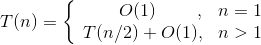
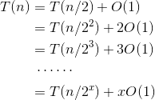
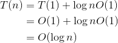
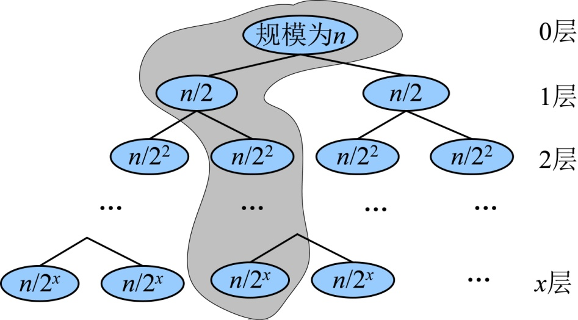

### 3.2.6　算法解析与拓展

#### 1．算法复杂度分析

（1）时间复杂度：首先需要进行排序，调用sort函数，进行排序复杂度为O(nlogn)，如果数列本身有序，那么这部分不用考虑。

然后是二分查找算法，时间复杂度怎么计算呢？如果我们用T(n)来表示n个有序元素的二分查找算法时间复杂度，那么：

+ 当n=1时，需要一次比较，T(n)=O(1)。
+ 当n>1时，特定元素和中间位置元素比较，需要O(1)时间，如果比较不成功，那么需要在前半部分或后半部分搜索，问题的规模缩小了一半，时间复杂度变为T(n/2)。


+ 当n>1时，可以递推求解如下。


递推最终的规模为1，令，则。


二分查找算法的时间复杂度为O(logn)。

（2）空间复杂度：程序中变量占用了一些辅助空间，这些辅助空间都是常数阶的，因此空间复杂度为O(1)。

#### 2．优化拓展

在上面程序中，我们采用BinarySearch（int n，int s[]，int x）函数来实现二分搜索，那么能不能用递归来实现呢？因为递归有自调用问题，那么就需要增加两个参数 low 和 high来标记搜索范围的开始和结束。

```c
int recursionBS (int s[],int x,int low,int high) 
{
    //low指向数组的第一个元素，high指向数组的最后一个元素
    if(low>high)              //递归结束条件
        return -1; 
    int middle=(low+high)/2;  //计算middle值(查找范围的中间值) 
    if(x==s[middle])          //x等于s[middle]，查找成功，算法结束
        return middle; 
    else if(x<s[middle])      //x小于s[middle]，则从前半部分查找
             returnrecursionBS (s[],x, low, high-1) 
           else               //x大于s[middle]，则从后半部分查找
             returnrecursionBS (s[],x, middle+1, high) 
}

```

在主函数main()的调用中，只需要把BinarySearch（n，s，x）换为recursionBS（s[]，x，0，n−1）即可完成二分查找，递归算法的时间复杂度未变，因为递归调用需要使用栈来实现，空间复杂度怎么计算呢？

在递归算法中，每一次递归调用都需要一个栈空间存储，那么我们只需要看看有多少次调用。假设原问题的规模为n，那么第一次递归就分为两个规模为n/2的子问题，这两个子问题并不是每个都执行，只会执行其中之一。因为我们和中间值比较后，要么去前半部分查找，要么去后半部分查找；然后再把规模为n/2的子问题继续划分为两个规模为n/4的子问题，选择其一；继续分治下去，最坏的情况会分治到只剩下一个数值，那么我们执行的节点数就是从树根到叶子所经过的节点，每一层执行一个，直到最后一层，如图3-8所示。


<center class="my_markdown"><b class="my_markdown">图3-8　递归求解树</b></center>

递归调用最终的规模为1，即n/2<sup class="my_markdown">x</sup>=1，则x=logn。假设阴影部分是搜索经过的路径，一共经过了logn个节点，也就是说递归调用了logn次。

因此，二分搜索递归算法的空间复杂度为O(logn)。

那么，还有没有更好的算法来解决这个问题呢？

