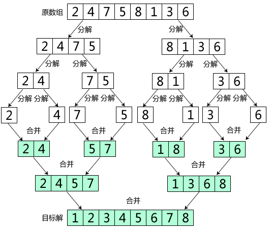

### 3.3　合久必分，分久必合——合并排序

在数列排序中，如果只有一个数，那么它本身就是有序的；如果只有两个数，那么一次比较就可以完成排序。也就是说，数越少，排序越容易。那么，如果有一个由大量数据组成的数列，我们很难快速地完成排序，该怎么办呢？可以考虑将其分解为很小的数列，直到只剩一个数时，本身已有序，再把这些有序的数列合并在一起，执行一个和分解相反的过程，从而完成整个数列的排序。

<b class="my_markdown">图3-9　合并排序</b>

